# VMSDK - DSL Lab 1

Visual Studio Modeling SDK

## Introduction

### Objective of this Lab

The objective of this Lab is to create a domain-specific language (DSL) by using the Modeling SDK (MSDK), and to customize it by writing code. The MSDK is especially beneficial when you want to create a vertical language that is suitable for your business, and from the models that the language manipulates, generate the code for your business framework. Nevertheless, because it is difficult to ensure that everyone who takes this training knows the professional tasks that are addressed by the targeted business framework, we will settle for a horizontal (that is, technical) DSL that lets us learn how to use different aspects of MSDK.

In addition to providing training, this document also shows an approach to DSL design.

### Prerequisites

Before you start this Lab, ensure that you have these tools installed on your computer:

- Visual Studio 2022/2026 (any edition)
- Workload **Visual Studio extension development** workload (includes **Visual Studio SDK** and **Text Template Transformation**)
- Optional component **Modeling SDK**
- Optional component **Class Designer**

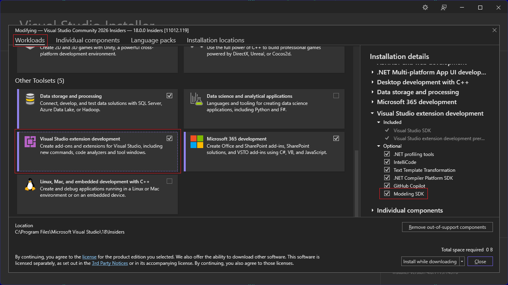

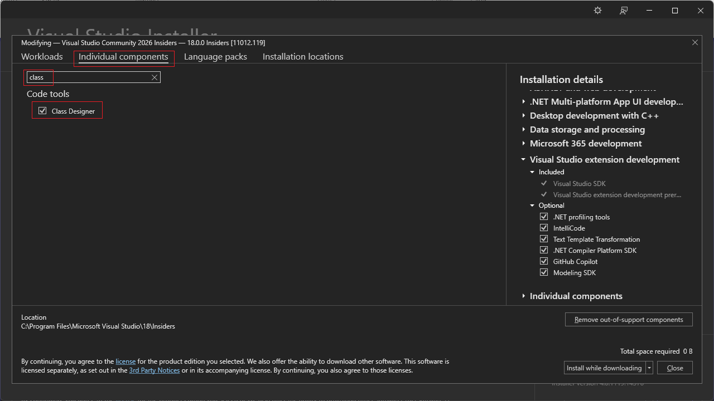

Other resources:

- [Modeling SDK for Visual Studio](https://learn.microsoft.com/en-us/visualstudio/modeling/modeling-sdk-for-visual-studio-domain-specific-languages?view=vs-2026)
- Book **Domain-Specific Development with Visual Studio DSL Tools**  Steve Cook, Gareth Jones, Stuart Kent, Alan Cameron Wills ISBN **978-0-321-39820-8**, 2007
- Book **Domain-Specific Languages** Martin Fowler ISBN **978–0–321–71294–3**, 2010

### Plan

1. Creation of a DSL from an “Empty” DSL model.
2. Creation of a metamodel for finite-state automata: this metamodel includes the StateMachine, State, and Transition concepts. For now, we will assume that the states do not have substates.
3. Specification of graphical notation with our DSL.
4. Test of our DSL in the Experimental Instance of Visual Studio.
5. Improvement of the MMI of the DSL.
6. Addition of consistency rules to the model.
7. Addition of validation rules to the model.
8. Creation of a code generator that targets a Framework for implementation of finite-state automata.
9. Test of our DSL on a few amusing examples.
10. Addition of a setup to distribute our DSL.

### Acknowledgements

The principal author of this lab is [Jean-Marc Prieur](https://blogs.msdn.com/jmprieur/). Many thanks to all the people who contributed to this Lab, especially to those who have used it and have given us feedback.

## Let’s go

### Creating a DSL

#### Using the DSL creation wizard

- In Visual Studio, create a project. **File -> New -> Project**. The **Create a new project** dialog box Appears.
- In the search field type **domain**
- Click **Domain-Specific Language Designer**, and then click **Next**.

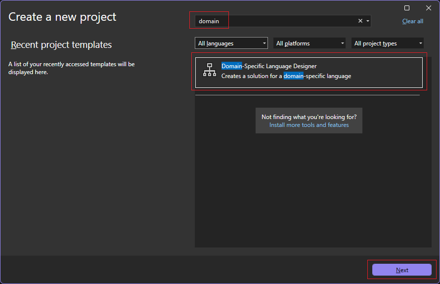

Note: Because this template creates a complete solution containing more than one project, you must start the New Project dialog from the File menu. You cannot add a new project to an existing solution.

- Configure your new project. Give it the Project name: **LanguageSm**.

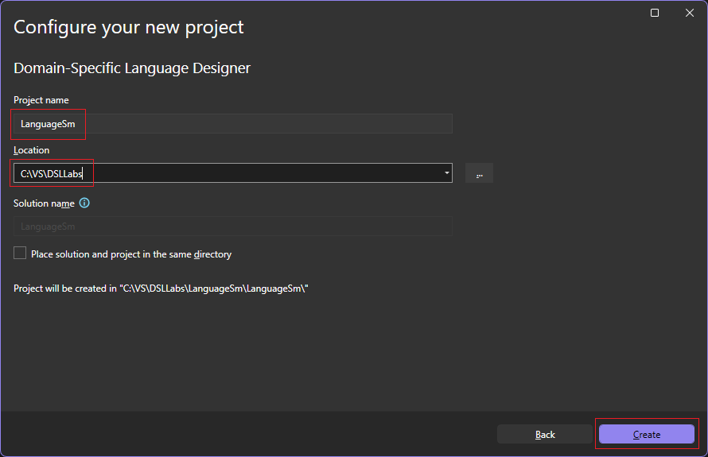

- Finally, click **Create**.

The wizard lets you create a DSL by using one of the DSL models. It offers you several models, including:

1. **Class Diagrams** constitute a diagram of the diagram type UML classes.
1. **Component Models** lets you create designers to assemble components from sub-components using interconnected ports.
1. **Minimal Language** is a language that includes a single concept. It is a virtually empty language just to let you get started.
1. **Task Flow** creates a language of the type of UML status-activity diagrams.
1. **DslLibrary** lets you to export common user’s DSL-types between domain languages.
1. **Minimal WinForm Designer**- a complete small example of a Windows Forms-based DSL.
1. **Minimal WPF Designer**- a complete small example of a Windows Presentation Foundation based DSL.

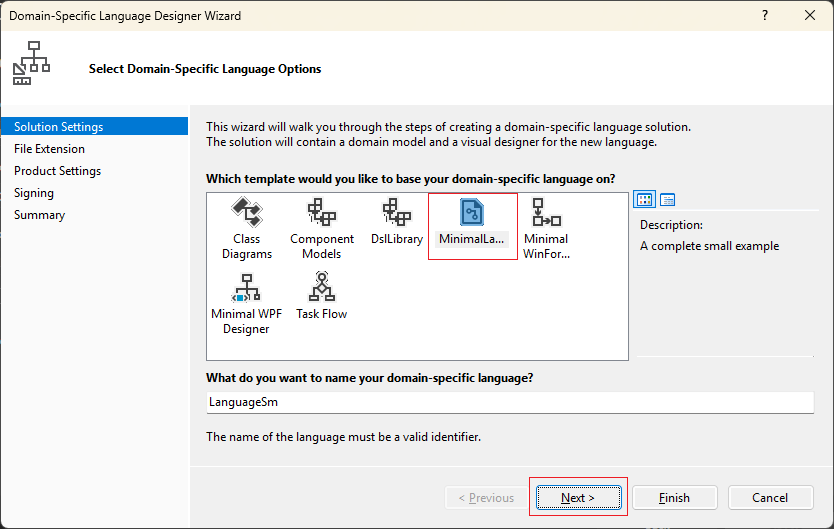

- Choose the **Minimal Language**
- and click **Next**

The next step consists in giving a file name extension for the files that will contain the concepts of your language. A check is carried out to find out if the extension is already used by other DSLs.

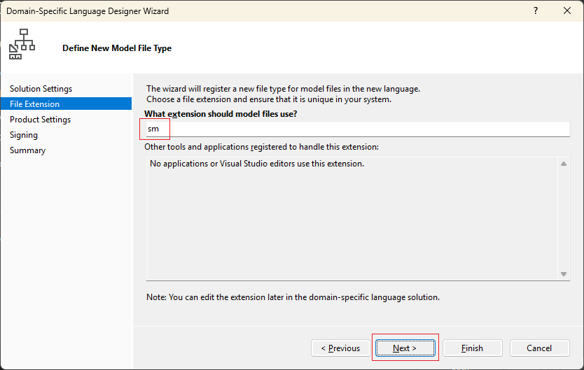

- Choose **sm** as an extension for our model and click **Next**.

The following dialog box lets us specify the **name of the DSL** and the **name of your company**. By default, the concatenation of the two gives the namespace in which the code that comprises the DSL will be generated.

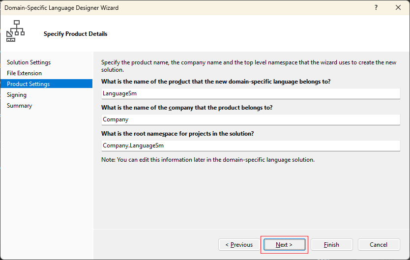

- Accept the suggestion by clicking **Next**

The assistant will generate two compilations for your DSL. As these are parts of a **Visual Studio Package**, they must be signed (they will go elsewhere in the GAC). The following step consists, therefore, of supplying a key for signing the compilations, or letting the assistant create one.  

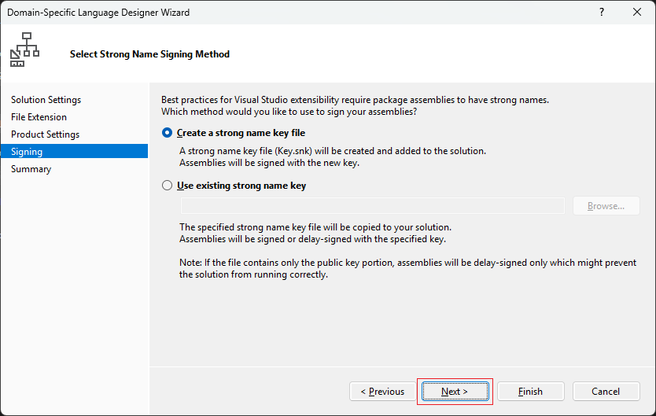

- Let the assistant generate a key and click **Next**

The wizard summarizes your choices, and you can change them if you like (click Previous for it). (Which is not advised if you want your experiment to be consistent with the results of this Lab).

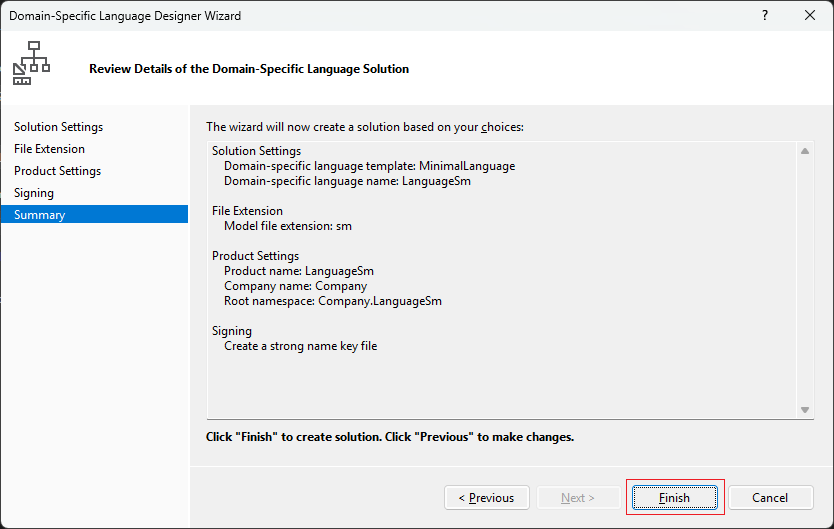

Click **Finish**

Once the wizard has finished, a Visual Studio solution is created. It consists of two projects:


- **Dsl**, which contains the customized code by freely using the partial class mechanism.
- **DslPackage**, which contains the code that enables our DSL to be hosted and to interact with Visual Studio. A part of its code is also generated from the file **DslDefinition.dsl**.

Be sure the startup project is **DslPackage**.

A great deal of code is, as we have seen, generated automatically from the DSL description file by applying a **Custom Tool** called **TextTemplatingFileGenerator** to the files in **T4** format (a textual language that resembles ASP). **T4** files have the file name extension **.tt**.


Note on the window above:

- the **toolbox** (1) is associated with the file extension **.dsl**. It also contains the  omain elements and domain relationships of the metamodel and their graphical representations. In case of toolbox is hidden choose **View/Toolbox**  (Ctrl+Alt+X) to show it up.
- The **domain model** (2) is manipulated by using the concepts of:
  - **Domain Class**, which represents the concepts handled in our language. There is also a current specialization of Domain Class that bears the name: **Named Domain Class**
  - There are three types of **domain relationships**:
        1. Aggregation (**Embedding Relationship**), to specify that a concept has a lifespan included in that of another.
        1. simple association between two concepts (**Reference Relationship**),
        1. and the inheritance relationship (**Inheritance**)

    We note that **Domain Class**, like **domain relationships**, has Properties (5). In the metamodel of the DSLs, the relationships are thus attributed (attributes carriers), which constitutes a difference compared to the [MOF](https://en.wikipedia.org/wiki/Meta-Object_Facility) (basic metamodel for UML).

    The **graphical notation** (2b) is specified by the following concepts:

    - **Geometry Shape**, which represents a concept, in the form of a geometrical figure (rectangle, rectangle with rounded corners, ellipse, etc.)
    - **Image Shape**, which represents a concept in the form of an image
    - **Compartment Shape**, which represents a concept in the form of a geometrical shape that has compartments
    - **Connector**, which represents a relationship (in the form of a line that connects the shapes)

    Moreover:

    - the connectors can be forced to return to the shapes under the **Port shapes** (small shapes that are positioned along the edges of other shapes)
    - the shapes themselves may be forced to be placed in the water lanes (**Swimlane**), just like in a swimming pool!

    Finally, the relationship between a Domain Class and a shape (or a relationship and a connector) is specified by the concept of **Diagram Element Map** (in fact, by their specializations, **ShapeMap** and **ConnectorMap**).

    Representation of the metamodel (2a), of the graphical notation (2b), and the element map (2c).

The **Output** (3) window, which shows the result of the transformation of the templates. At the time the solution is created, C# files are automatically generated from the **.dsl** file. This is the summary of the result of this transformation, which is seen in the Output window, in the **Transform text templates** tab.

---

### DSL diagram view customization

#### Zoom

Ctrl+Mouse Wheel


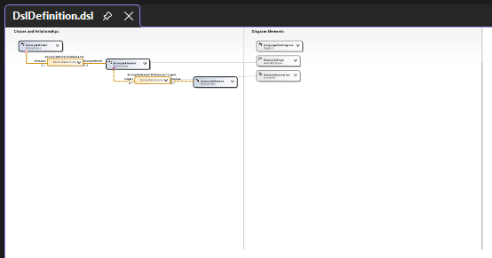

#### Expand/Collapse model nodes and node properties

Use ports “+” and “-” to expand and collapse model nodes:  


#### Expand/Collapse entity details

Also, you can expand and collapse properties of the model element, using Expand Collapse Decorator:  


#### Move Up/Down

You can move *Diagram Elements items* up and down. Right click the item and use command **Move Up/Down**:


---
The **"Transform All T4 Templates"** command, which enables all of the solution Custom Tools to be applied (this function was automatically applied when the project was loaded). This command can be run any time from **Build/Transform All T4 Templates** menu item:


The **Property** window (5) contains all properties of the selected diagram element. On the picture above the diagram (**Classes and Relationships**) itself has been chosen:


The tree called **"DSL Explorer"** (4) shows all the concepts in the .dsl file (I’m showing you the main concepts here. Certain advanced concepts will be tackled later on):


- The domain concepts:
  - *ExampleModel* is called root concept. This concept is represented by the Designer itself.
  - *ExampleElement* is THE model concept.
- The relationships:
  - The *ExampleModelHasElements* aggregation
  - The *ExampleElementsReferencesTargets* reference
- The *ExampleShape* **shape** (a geometrical shape)
- The **connector** (*ExampleConnector*)
- The **ShapeMap** that describes how *ExampleShape* represents *ExempleElement*.
- The **ConnectorMap** that describes how *ExampleConnector* represents the reference relationship *ExmapleElementsReferencesTargets*.
- The designer’s **toolbox**, which enables the *ExampleElement* to be dropped, and the *ExampleRelationship* on the designer surface.

## First run of the DSL

Run your DSL from the application - **Debug/Start Without Debugging** (Ctrl+F5).


This is compiled and a third project created by the Modeling SDK assistant (a **Debugging** application) is shown in its own application, which is launched in the **Experimental Instance** of Visual Studio.


There we find in particular:

- A **Sample.sm** file that contains an example of your DSL.
- The **.xsd** that describes our **.sm** files.
- Two **.tt** files that contain the artifact generators (here enabling you to generate HTML files that document the Sample.sm model). These files are both in T4 format but the code used to describe them is **C#** in the first case and **Visual Basic** in the second case.

Open the **Sample.sm** file (by double-clicking it in the solution explorer). The corresponding diagram appears. Note in particular the toolbox and the model browser.

- Select **ExampleElement2** element and show up property of it (Right Click/Properties).
- Show up the **Error List** window (View/Error List).

Play around a little with the model: add a box, and connections, and look at the model browser and the properties of the boxes and connections. Save your model. In a moment, we will look at all this again from the metamodel perspective. The following figure shows the example of result of experimentation:


From the solution explorer, right-click the *LanguageSmReport.tt* file and select the contextual command **“Run Custom Tool”**.  Say **OK** on Security Warning. The file *LanguageSmReport.txt* is generated.

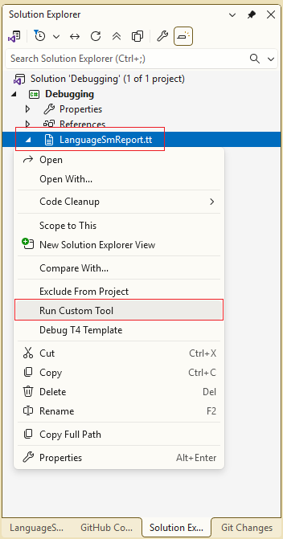

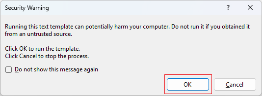

Expand the *LanguageSmReport.tt* node; *theLanguageSmReport.txt* node appears. Double-click above to view the contents:

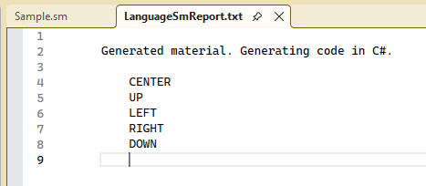

Close the version of **Visual Studio** that contains the **Debugging** application.

We are now going to look at the structure of the DSL that is generated by the Modeling SDK wizard, from the code generator.

## Understanding

At the start of the Lab we created a DSL (very modest) without coding anything. We then experimented by creating three shapes and three connectors, and then generated a .txt file that has content that corresponds to the model.

 We are now going to gain a greater understanding of what was generated by the DSL Tools assistant. The metamodel has just these few concepts:

- the metamodel
- the graphical notation
- the connection between the metamodel and the graphical notation
- the persistence of the model and the diagram
- the artifacts generator

In the following chapter, we will develop the metamodel of our DSL to be able to model simple **state machines**.

### Understanding the metamodel

In the version of Visual Studio that contains the *LanguageSm* application, look at the content of the description of the DSL: the *DslDefinition.dsl*. file. It is, in a sense, a “DSL for creating DSLs”.

The DSL has two parts (which are in two Swimlanes):

- the metamodel, (or Domain Model) in the left section called “Classes and Relationships”
- the graphical notation, in the right section called “Diagram Elements”

The connection between the Domain Model and the graphical notation is represented in the form of connectors that link the classes or relationships, in shapes or connectors.

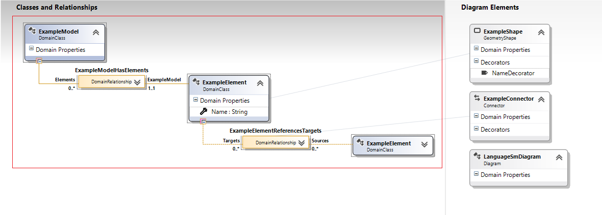

The Domain Model has **two concepts**:

- ExampleModel which is the Root concept, that is, the concept that is associated with the Designer (LanguageSmDiagram). This concept will not be shown in the form of a box, but rather, in the shape of the **diagram itself**.
- ExampleElement, which is the only true concept of the model. ExampleElement possesses a Name property of the String type.

We also find **two domain relationships** here:

- an embedding relationship called ExampleModelHasElements that links an ExampleModel to (see the cardinality 0..*) ExampleElement whose function is to serve as the Elements of the ExampleModel. The ExampleModel is a sample of the ExampleElement (above the cardinality 1..1)
- A single reference relationship called ExempleElementReferencesTargets that links two ExampleElements. An ExampleElement has as its image, through the relationship of several ExampleElements whose functions are to be the Targets, for several precedent ExampleElements, whose function is to serve as the Sources of the relationship.


Select the relationship between *ExampleModel* and *ExampleElement* and look at its properties. This relationship is an *Embedding*, and is called *ExampleModelHasElements*.

It is important to understand that, in the generated DSL, the relationship will be carried out in two ways:

- by the **functions** Elements in ExampleModel and ExampleModel in ExampleElement.
- by a C# *ExampleModelHasElements* class (there will be as many instances as there are instances of the relationship) whose characteristics are defined in the categories of “Definition” and “Code” properties. Note that it is possible to specify whether we can have two instances of the relationship between the same concepts (*Allow Duplicates*, which must not be True here, because it is the case of an embedding relationship). We can also have a basic relationship with the relationship. The “Code” category specifies the visibility of the class, and specifies (by *GeneratesDoubleDerived*) whether we can generate two classes (*ExampleModelHasElementsBase* that contain any implementation, and *ExampleModelHasElements* in the partial classes in which we can alter the implementations generated), or a single one of them.

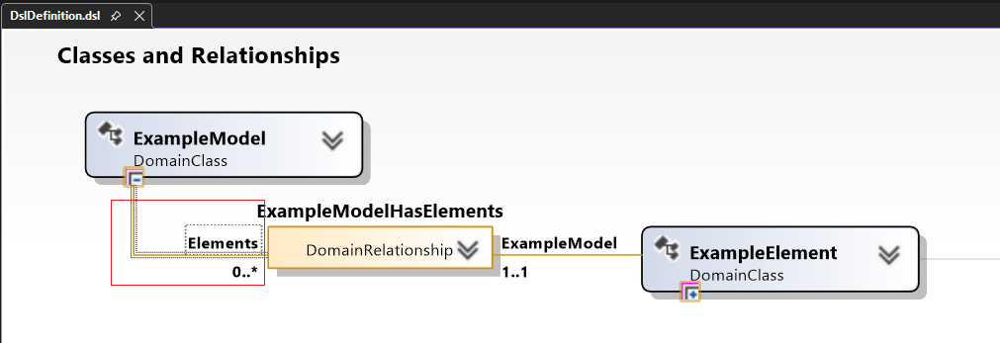

Now select the Elements function of ExampleModel in the aggregation.

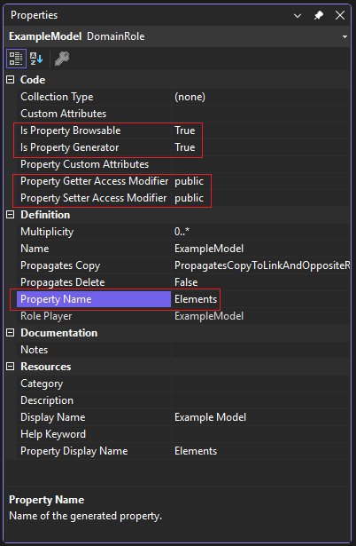

The function of the *ExempleElement* in the relationship is to serve as the elements of the ExampleModel. There are several of them because the cardinality shows (0..*). In the properties of the “Definition” category, we will note in particular:

- The PropertyName property (being Elements). This is the name that we have chosen. This property defines the name
(because the property “IsPropertyGenerator” is True), of the property of the class ExampleModel and its type is a collection of ExampleElement.
- The Property Name (in this case, ExampleModel) defines the name of a property of the class that implements the
relationship (ExampleModelHasExampleElements). Therefore, the type will be an ExampleModel.
- Is property generator means that in the class ExampleModel, a property Elements will be generated, whose type is a collection of ExempleElement. Property Getter Access Modifier and Property Setter Access Modifier informs us that this property will have public settings and will obtain accessors. Is property Browsable indicates that the property will be visible in the properties window of the ExampleModel instances.

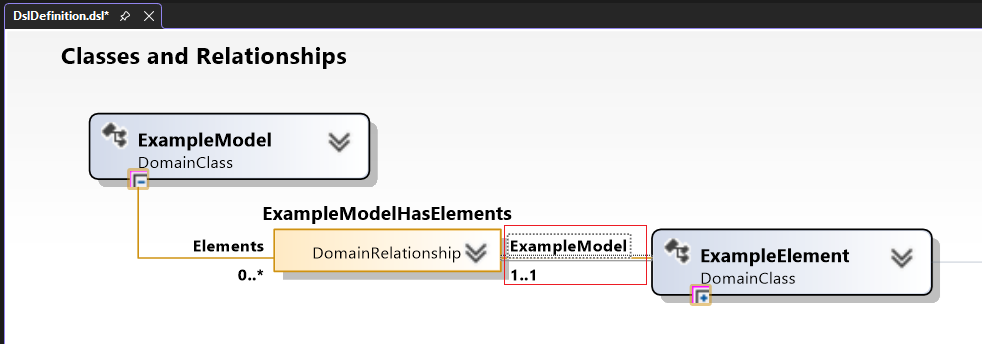

Select the opposite function in the relationship (called ExampleModel). Look at its properties.

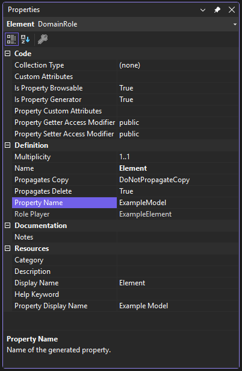

Now select the other relationship (*ExempleElementReferencesTargets*) and its functions (*Targets* of multiple cardinality and also *Sources* of multiple cardinality).

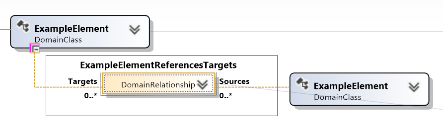

Make sure that the property **Name** of the *Targets* function is called *Source*: this function will be generated in the form of a *Targets* collection from *ExempleElement* in the *ExempleElement* class, but also in the form of a *Source* property of the *ExampleElement* type in the class that implements the (*ExampleElementReferencesTargets*) relationship.

The same is true for the Sources function.

> [!INFO]
> At this stage, we have looked at the metamodel that was created. We will now see what the classes that are generated from this metamodel look like.

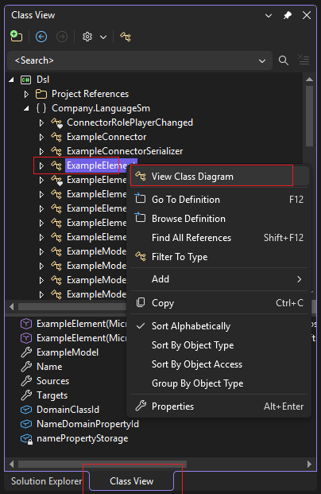

1. **"Transform All T4 Templates"** first.
1. Open **Class View** tab (Ctrl+Shift+C).
1. Right Click **ExampleElement** class.
1. **View Class Diagramm**

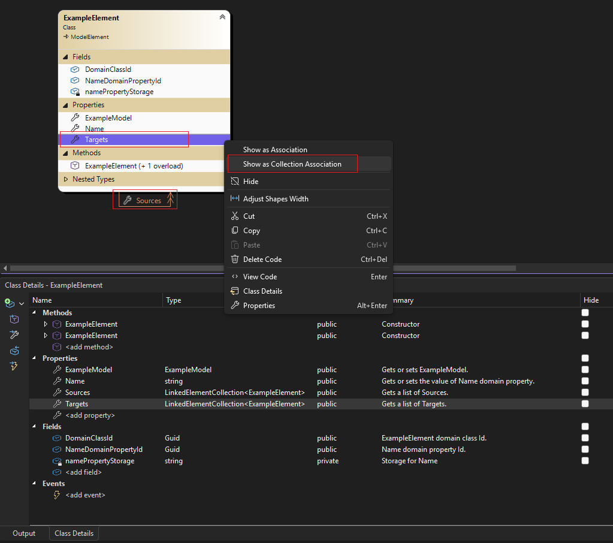

Look at the **ExampleElement** class.

Here we find:

- public fields that are the GUID. The metamodel is such that the associations are bi-directional (for example, if by program we
add an ExampleElement e1 to the Targets property (which is a collection from ExampleElement) from another ExampleElement e2, then automatically e2 will be found in the Sources collection of e1). The GUIDs appear in the implementation of this functionality. We will also find them in the validation rules in Lab 2.
- of the private fields that store the properties of the class (namePropertyStorage)
- of properties that correspond to the attributes of the meta-class and the functions that are navigable from this class
- the builders.

1. Right click **Sources** and **Targets** properties and *Show as Collection Association*.
1. Do the same with **ExampleModel** class.
1. Right click **ExampleModel** property and *Show as Association*.

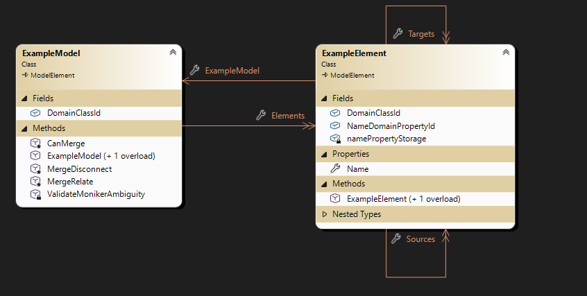

Here we see that an *ExempleModel* is in relationship with the *ExampleElement* by way of the *Elements* function. An *ExampleElement* is linked to just one *ExampleModel* (*ExampleModel* function). One *ExampleElement* is in relationship with other *ExampleElements* (two functions *Targets* and *Sources*).

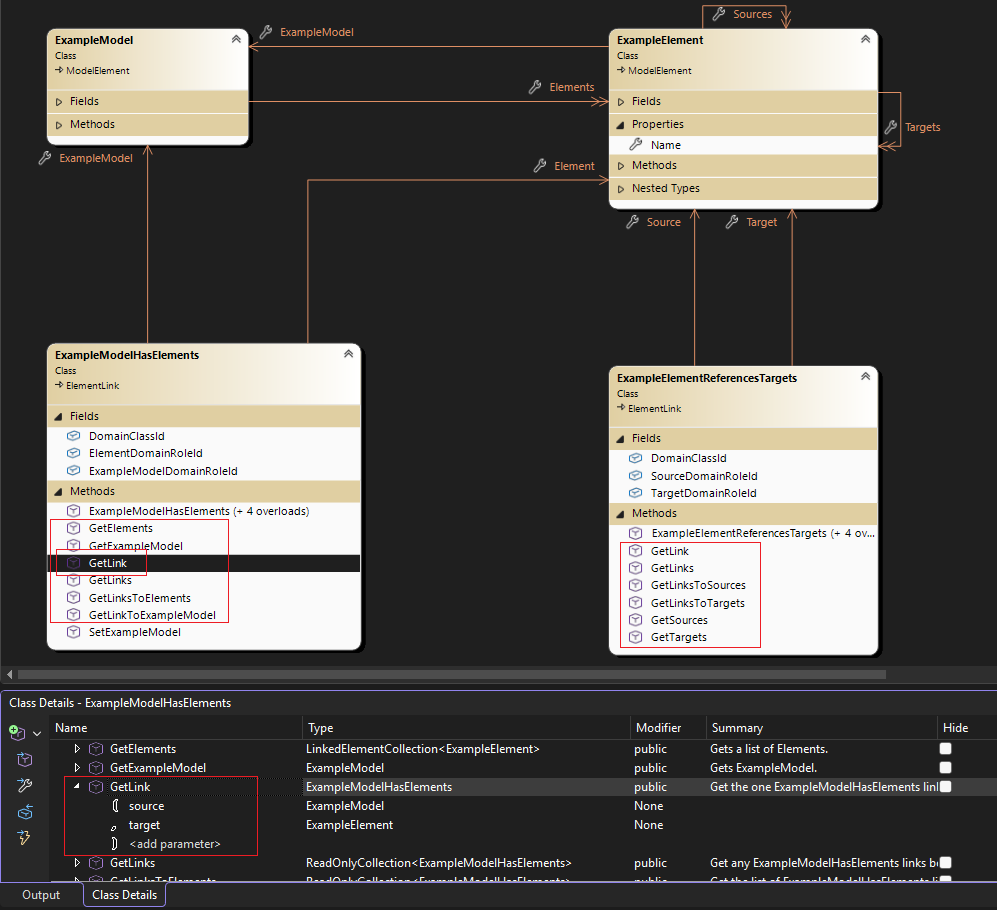

Elsewhere the model contains the domain relationships themselves (*ExampleModelHasElements* and *ExampleElementReferencesTargets*). This enables access to the two players in the relationships. Add these classes onto diagram.

After a little work (hiding the compartments of the fields), transforming the properties in associations, you will obtain the diagram above.

It will be very useful for us to have such a model of the classes at hand when we write our code generators, or look at the model.

In the diagram above, note that the ExampleModelHasElements class possesses, in addition to the builders, static methods that enable us to find:

- all of the instances of Element in relationship with an ExampleModel, that is one which plays the **role** of its elements: GetElements(ExampleModel).
- all of the instances of ExampleModel in relationship with an Element by means of this relationship: GetExampleModel(ExampleElement).
- all of the instances of the relationship from an ExampleModel, an ExampleElement, or both: they are the *GetLink()* and *GetLinks()*, *GetLinksTo…()* methods.

Note that the names of these methods are generated automatically by the DSM Tools code generators, from the names of the functions in the relationship, and we therefore give very typical access, including in the case of reflexive relationships (as is the case for the ExampleElementReferencesTargets relationship that links two ExampleElements and whose reading meaning is determined uniquely by the names of the functions).

To summarize, with all these methods, we can obtain the relationships between the elements in both directions, through domain relationships which is interesting because the relationships are attributed (carriers of properties) in the DSL Tools metamodel wby using methods that get the links (instances of domain relationships), sources, and targets.

### Let’s understand graphical notation

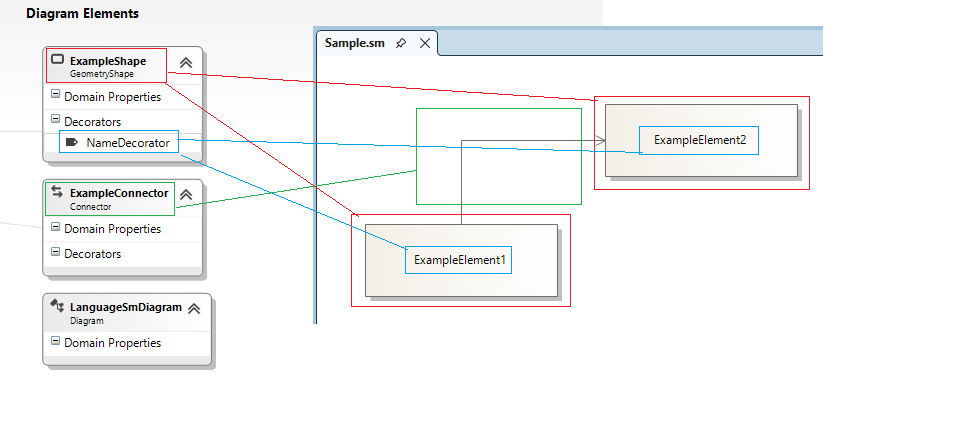

Graphical notation is also explained in the *DslDefinition.dsl* file. It introduces:

- A shape (*ExampleShape*) that is a geometrical shape (here a beige rectangle). This geometrical shape has a textual decorator (NameDecorator). This does not appear on this diagram, but the *NameDecorator* shows and enables entry of the Name property of the *ExampleElement* that is represented by the *ExampleShape*.
- A connector (*ExampleConnector*) is gray line with arrow. It is a link that connects the shapes. In this case, it does not have decorators (but could have them).

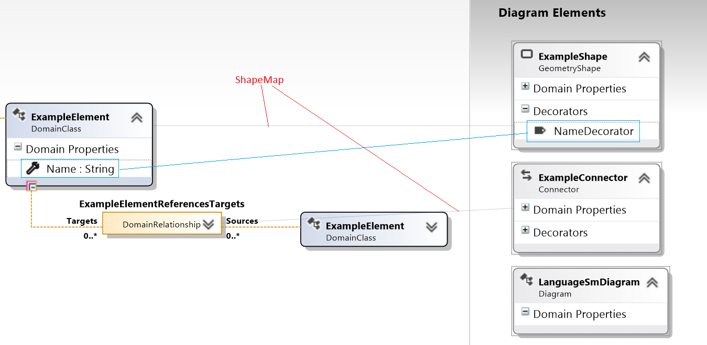

- The gray link connects shape to shape representing the notion of **ShapeMap**: the relationship between the two
- The diagram itself (*LanguageSmDiagram*) houses all the shapes and connectors.

#### Let's make new look

Click the shape *ExampleShape* and note the properties of this shape.

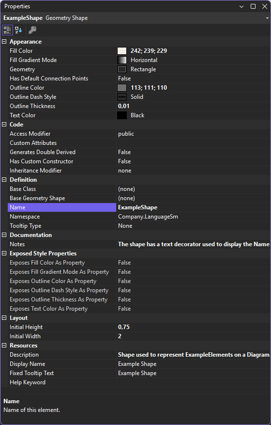

In particular: the graphical characteristics of this geometrical shape:

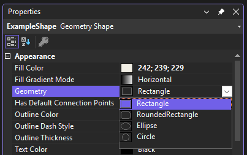


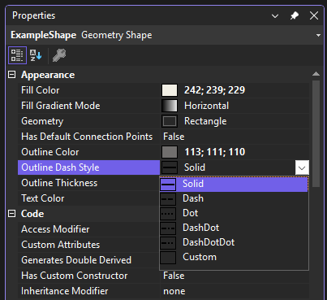

Also note that there are several properties that let you create more sophisticated behaviors (for example Has
Default Connection Points, Has Custom Constructor, etc.). If these properties are moved to true, the DSL designer should devise certain methods (in the partial classes of those generated) for supplying, for example, particular connection points, etc.

Now click the connector *ExampleConnector* and look at its properties.

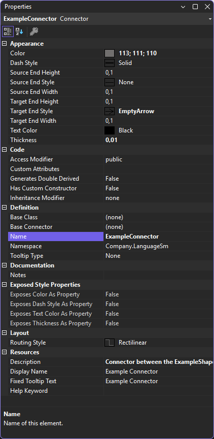

Among the configurable graphics properties, we see the style of the ends of the connector:

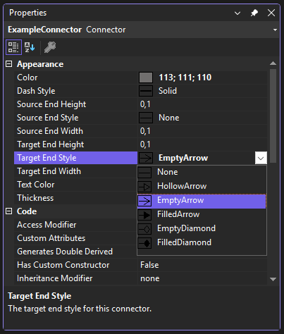

And the routing style of the connectors (whether they will go in a straight line or horizontally and vertically).

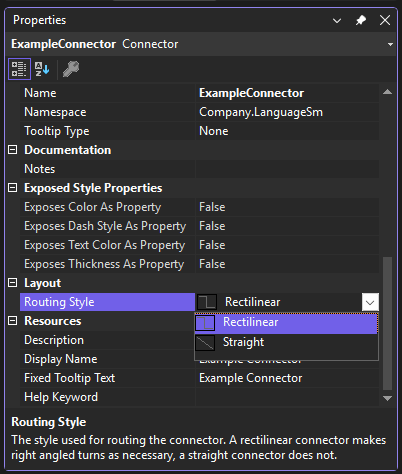

Open the “Exposed Style Properties” category if it is not already open.

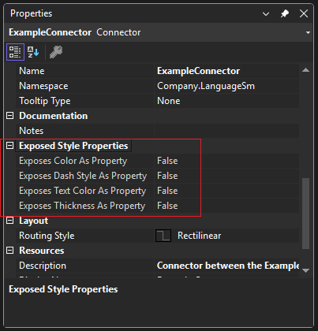

They are in gray!
(Elsewhere we could have done the same thing with the preceding shape.)

This means that the graphical characteristics of the connector are fixed, and cannot be modified by the program (they are not displayed).

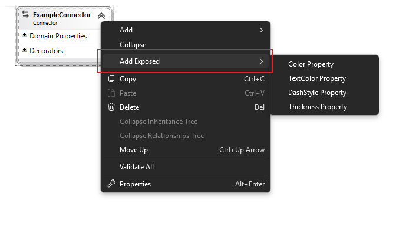

Right-click the shape “ExampleConnector”, and open the submenu **Add Exposed**. Here you find the commands that let you display the graphical style properties, shaded if necessary.

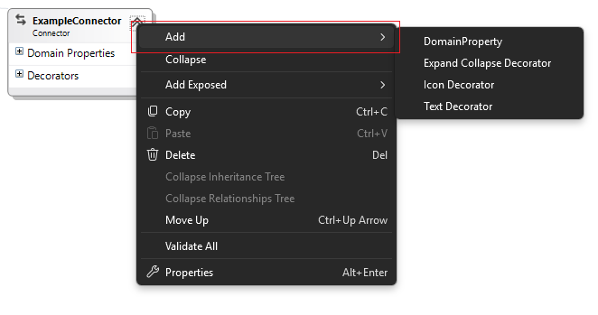

Right-click the “ExampleConnector” shape, but this time open the submenu **Add**. Here we find the commands that let you add:

- A specific property of the shape.
- A decorator that lets you unfold/re-fold the shape.
- A decorator in the form of an icon.
- A textual decorator.

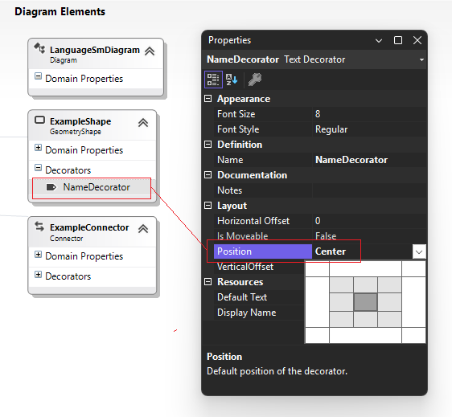

In the shape “ExampleShape”, **click the decorator “NameDecorator”** and notice its properties.

The decorators only show the graphical properties, and especially the position. A decorator may be positioned inside or outside a shape (here in the center), above, below, to the right, to the left, or in the middle/center. Elsewhere, compared to a position of reference, we can supply offsets (shown in **inches**).

We have seen the textual decorators for shapes.

We would have similar properties for the iconic decorators, and also for the connector decorators (in particular, with a
movement from one side to the other of the connector, above or below )

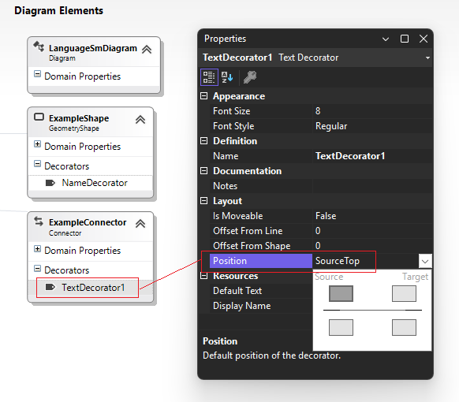

### Understanding the connection between the metamodel and the graphical notation

The **domain elements of the domain model** are represented graphically by **shapes**. The domain **relationships** are represented by **connectors**. Likewise, the **decorators** are represented by the **properties** of the domain elements and domain relationships. The textual decorators display the property values and let you edit them. The icon decorators display the icons.

Textual and icon decorators can be either displayed or not displayed, depending on the property values.

This representation, and this configurability for the display of decorators are described in the ElementMaps (ShapeMap and ConnectorMap).

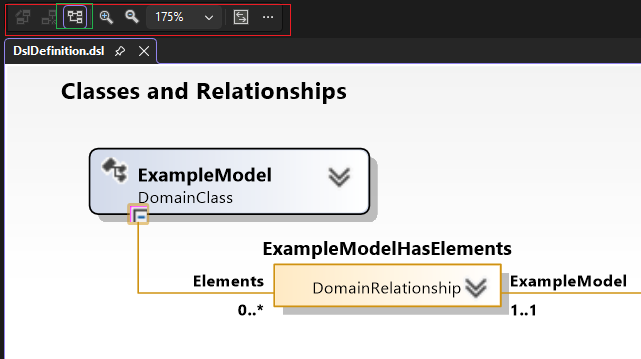

Make sure that the links between the boxes that represent the concepts, and the boxes that represent the shapes are correctly displayed. If this is not the case you have to request display by clicking the **“show map lines”** button on the **“Dsl designer”** toolbar.

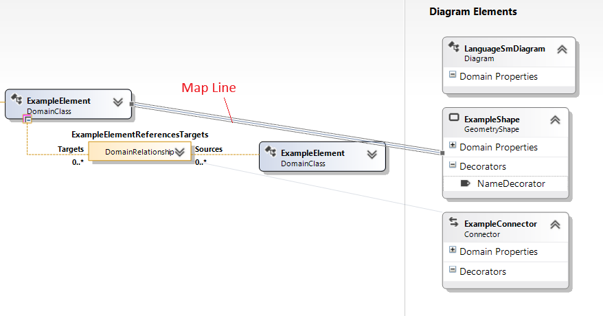

Click the "map line" that links the “ExampleElement” box to the “ExampleShape” shape. This "map line" represents the ShapeMap.

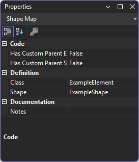

Look at the properties of this ShapeMap in the properties window. The properties of the “Code” category correspond to the advanced aspects.

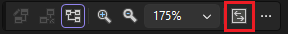

Now look at the **“DSL Details”** window. If it is not displayed, you can request its display by clicking the **“DSL details”** button on the **“Dsl designer”** toolbar.

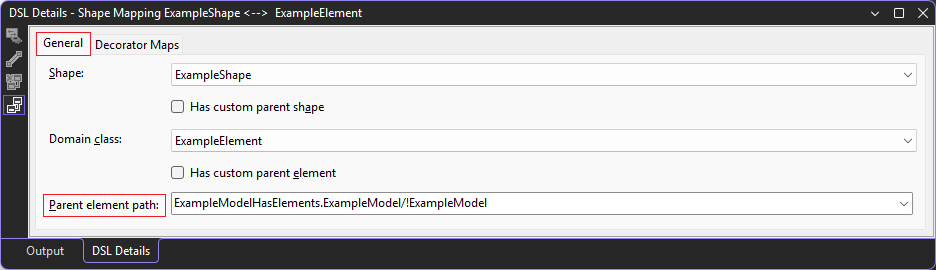

This window has two tabs - *General* and *Decorator Map*. The **General** tab effectively concerns the connection between concept and shape. The “Parent element path” expresses the relationship that will receive a new instance of *ExampleElement* during creation of an *ExampleShape*: here, we specify that we are adding the *ExampleElement* to the function next to ExampleModel in the *ExampleModelHasElements* relationship.

Click the **Decorator Maps** tab. It describes the relationship between the properties and the decorators:

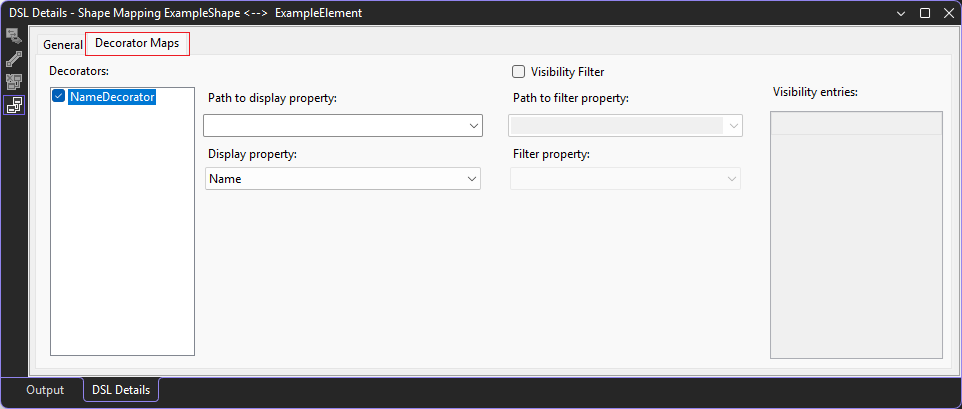

Here, the *NameDecorator* is associated with the Name property (of *ExampleElement*). It would also be possible to create a visibility filter, and specify for which values (“Visibility entries”) of which property (“Filter property”) the decorator is displayed. We will revisit all of this in detail in other chapters. Putting aside the typical image shapes, compartments (which we will revisit after this Lab), ports, and swimlanes, we have looked at all of the present standard graphical possibilities of the DSL Tools. It is also possible to specify more sophisticated behaviors such as:

- the end control of the connections (when you can create a connector).
- control of integrity constraints during deletion of a concept.

All this will be seen at a later stage.

### Understanding serialization of the model and the diagram

The model that you are completing is serialized; we defined it during the creation of our DSL, in a .sm file. We will see in this paragraph:

- How the **model** is serialized (in particular the XML diagram (*.xsd*) that is created by the DSL Tools for our attention).
- How the **diagram** (the graphical layout of it) is serialized.
- How we can **manage serialization** by using the DSL browser.

#### Serialization of the model

Run the *Experimental Instance of Visual Studio*: **Debug/Run without debugging** (Ctrl+F5).

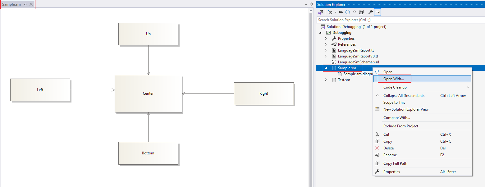

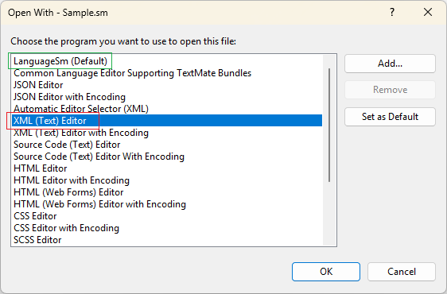

Open the *Sample.sm* model that we created previously, by using the contextual command “Open with …” in Sample.sm, and choosing “XML (Text) Editor”, instead of our DSL specialized editor *LanguageSm (Default)*.

``` XML
<?xml version="1.0" encoding="utf-8"?>
<exampleModel xmlns:dm0="http://schemas.microsoft.com/VisualStudio/2008/DslTools/Core" dslVersion="1.0.0.0" Id="0fab674c-e72d-49ef-9f67-121d9195a7b3" xmlns="http://schemas.microsoft.com/dsltools/LanguageSm">
  <elements>
    <exampleElement Id="e614dda0-49f8-4788-9795-e33951a9f07e" name="Left">
      <targets>
        <exampleElementMoniker name="/0fab674c-e72d-49ef-9f67-121d9195a7b3/Center" />
      </targets>
    </exampleElement>
    <exampleElement Id="89c19955-40be-429f-8d86-43d2ac7e171d" name="Center" />
    <exampleElement Id="4f979b98-2f1b-4c6b-8258-c4949960d3cf" name="Right">
      <targets>
        <exampleElementMoniker name="/0fab674c-e72d-49ef-9f67-121d9195a7b3/Center" />
      </targets>
    </exampleElement>
    <exampleElement Id="5b0b2895-0989-4992-a82c-6b25252386ca" name="Bottom">
      <targets>
        <exampleElementMoniker name="/0fab674c-e72d-49ef-9f67-121d9195a7b3/Center" />
      </targets>
    </exampleElement>
    <exampleElement Id="dc513f57-9c36-4bbd-91e3-7e6b6974211b" name="Up">
      <targets>
        <exampleElementMoniker name="/0fab674c-e72d-49ef-9f67-121d9195a7b3/Center" />
      </targets>
    </exampleElement>
  </elements>
</exampleModel>
```

Examine the serialized form of your model. It is relatively easy and comprehensible. Here we find the ExampleModel, and the 2 ExampleElements. Notice that the elements of the models have a unique identifier that we call a moniker, which is used in the relationships.

Also notice that the XML tag corresponding to the ExampleElement. **Left** contains this, corresponding to **Center**. We  will take a closer look at the exampleElement, and will see the references between them.

The .sm files are XML files that follow an XML diagram that is generated by the DSL Tools, and installed with Visual Studio when we install the DSL (Modeling SDK), or when we develop it. Look at the XML Schema **$(SolutionDir)\Dsl\GeneratedCode\LanguageSmSchema.xsd**.

**Now open the Sample.sm.diagram** model (which is located as subordinate to Sample.sm) by using, as in the previous case, the contextual command “Open with …” on *Sample.sm.diagram*, and choosing “XML (Text) Editor”, instead of our DSL specialized editor *LanguageSm (Default)*.

Examine the serialized form of the diagram of your model. It is also relatively easy and comprehensible. We find the monikers of the Examples here.

``` XML
<?xml version="1.0" encoding="utf-8"?>
<languageSmDiagram dslVersion="1.0.0.0" Id="dcca9dd7-1a05-4b50-abd8-ad7428fb33be" absoluteBounds="0, 0, 11, 8.5" name="Sample">
  <exampleModelMoniker Id="0fab674c-e72d-49ef-9f67-121d9195a7b3" />
  <nestedChildShapes>
    <exampleShape Id="daf60a88-34f7-4127-b1b7-3359d7e249eb" absoluteBounds="0.75, 2.375, 2, 0.75">
      <exampleElementMoniker name="/0fab674c-e72d-49ef-9f67-121d9195a7b3/Left" />
    </exampleShape>
    <exampleShape Id="484ab975-100d-4acf-8b7c-a76f04b7d22c" absoluteBounds="4.25, 2.25, 2.25, 1.25">
      <exampleElementMoniker name="/0fab674c-e72d-49ef-9f67-121d9195a7b3/Center" />
    </exampleShape>
    <exampleConnector Id="7116826d-35aa-4e9a-b0cf-96a111eed69f" edgePoints="[(2.75 : 2.75); (4.25 : 2.75)]" fixedFrom="NotFixed" fixedTo="NotFixed" TargetRelationshipDomainClassId="07d93d21-a85a-401b-be31-d75bea95b093">
      <nodes>
        <exampleShapeMoniker Id="daf60a88-34f7-4127-b1b7-3359d7e249eb" />
        <exampleShapeMoniker Id="484ab975-100d-4acf-8b7c-a76f04b7d22c" />
      </nodes>
    </exampleConnector>
    <exampleShape Id="43f6eaf3-ba5c-4d8c-9520-f685c1101cdf" absoluteBounds="8.25, 2.5, 2, 0.75">
      <exampleElementMoniker name="/0fab674c-e72d-49ef-9f67-121d9195a7b3/Right" />
    </exampleShape>
    <exampleShape Id="9e492bc2-8775-4b7f-a805-c1c85c2f58b3" absoluteBounds="4.375, 4.5, 2, 0.75">
      <exampleElementMoniker name="/0fab674c-e72d-49ef-9f67-121d9195a7b3/Bottom" />
    </exampleShape>
    <exampleShape Id="1fd5c3d8-cb1c-4247-a8d0-0a84952c3431" absoluteBounds="4.375, 0.5, 2, 0.75">
      <exampleElementMoniker name="/0fab674c-e72d-49ef-9f67-121d9195a7b3/Up" />
    </exampleShape>
    <exampleConnector Id="6da77441-1daf-4961-b196-f454fe29334d" edgePoints="[(5.375 : 1.25); (5.375 : 2.25)]" fixedFrom="NotFixed" fixedTo="NotFixed" TargetRelationshipDomainClassId="07d93d21-a85a-401b-be31-d75bea95b093">
      <nodes>
        <exampleShapeMoniker Id="1fd5c3d8-cb1c-4247-a8d0-0a84952c3431" />
        <exampleShapeMoniker Id="484ab975-100d-4acf-8b7c-a76f04b7d22c" />
      </nodes>
    </exampleConnector>
    <exampleConnector Id="2f1d59a4-4c52-4e42-9391-60cae3723bb9" edgePoints="[(8.25 : 2.875); (6.5 : 2.875)]" fixedFrom="NotFixed" fixedTo="NotFixed" TargetRelationshipDomainClassId="07d93d21-a85a-401b-be31-d75bea95b093">
      <nodes>
        <exampleShapeMoniker Id="43f6eaf3-ba5c-4d8c-9520-f685c1101cdf" />
        <exampleShapeMoniker Id="484ab975-100d-4acf-8b7c-a76f04b7d22c" />
      </nodes>
    </exampleConnector>
    <exampleConnector Id="ca0922c7-6df3-4b89-8bad-b87bb9e23e79" edgePoints="[(5.375 : 4.5); (5.375 : 3.5)]" fixedFrom="NotFixed" fixedTo="NotFixed" TargetRelationshipDomainClassId="07d93d21-a85a-401b-be31-d75bea95b093">
      <nodes>
        <exampleShapeMoniker Id="9e492bc2-8775-4b7f-a805-c1c85c2f58b3" />
        <exampleShapeMoniker Id="484ab975-100d-4acf-8b7c-a76f04b7d22c" />
      </nodes>
    </exampleConnector>
  </nestedChildShapes>
</languageSmDiagram>
```

Now look at the LangageSm application, the DSL Explorer, and more specifically, the nodes under “Xml Serialization Behavior”. Here we find all of the domain elements, domain relationships, shapes, and, connectors, together with their properties and the way in which these properties will be serialized in the form of elements or XML attributes.

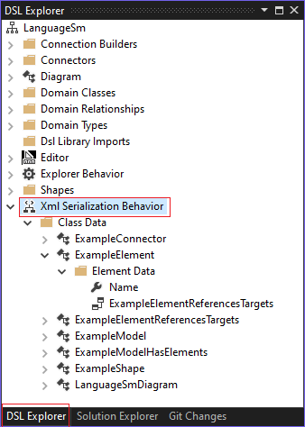

#### Understanding the artifact generators (Text Transformation templates)

We complete our study of the generated DSL, with the artifact generation templates.

Run the *Experimental Instance of Visual Studio*: Debug/Run without debugging (Ctrl+F5).

The following page shows the generated documentation.

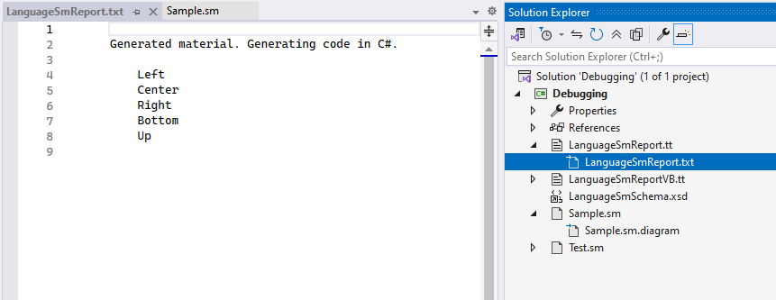

From the browser window of the *Debugging* application, open the file *LanguageSmReport.tt*:

``` T4
<#@ template inherits="Microsoft.VisualStudio.TextTemplating.VSHost.ModelingTextTransformation" #>
<#@ output extension=".txt" #>
<#@ LanguageSm processor="LanguageSmDirectiveProcessor" requires="fileName='Sample.sm'" #>

Generated material. Generating code in C#.

<#
  // When you change the DSL Definition, some of the code below may not work.

  foreach (ExampleElement element in this.ExampleModel.Elements)
  {
#>
 <#= element.Name #>
<#    
  }
#>
```

 Let's take a closer look at the structure of *LanguageSmReport.tt*.

- **<#@** : Opens a directive for the T4 processor
- **#>** : Closing the opened directive
- The **output** directive lets us specify the output file name extension.
- The code generator will be a .NET class that inherits from *ModelingTextTransformation* and is generated just in time.  Next directive defines the name of a class that makes the link between our model and the T4 engine (*LanguageSmDirectiveProcessor*), the file that contains the model that will be loaded to generate the artefact (*Sample.sm*), and the name of the property from which our model will be accessible (Property ExempleModel which type is ExampleModel which is the name of the concept that is associated with the graphical designer).
- In this file the text outside of T4 directives is the text that will be generated as is. **Generated material. Generating code in C#.**, for example. The C# code inside the T4 directives is control code that acesses the model.
  - **foreach (ExampleElement element in this.ExampleModel.Elements)** - all model's elements traversing.
  - **element.Name** - the Name (text value) of the element.
  - **{** and **}** - C# artifacts generation
  - **//** - C# comments

Close the *Experimental Instance of Visual Studio*.

This concludes the first phase of the Lab.
In the next phase of the Lab, we will see how to create and modify the metamodel for creating a StateMachine, and how to specify its graphical notation.
