# VMSDK - DSL Lab 2

Visual Studio Modeling SDK

## Preface

In part 1 of this Lab, we showed you how to create a DSL by using the Modeling SDK, and we experimented with this DSL and explained what was generated.

We can now continue by modifying the DSL that is generated by the Modeling SDK, to create a DSL of finite state automata. We will first modify the DomainModel, then the graphical notation.

## Modifying the metamodel

In this second stage of the Lab., we will modify the metamodel to adapt it to the concept of finite state automata.

The finite state automata that we wish to create are similar to those of the UML (Harel automata). They consist of:

- **states**
- **transitions**, which move from one state to another

Some states are a little different: the **initial** state (represented by a disk in UML) and the **end state** (represented by a disk surrounded by a circle in UML).

All of the states may have:

- **entry in the state actions**. They are executed from the moment you enter the state, whatever the transition taken to enter them.
- **exit from the state actions**. They are called from the moment you exit the state by any transition.

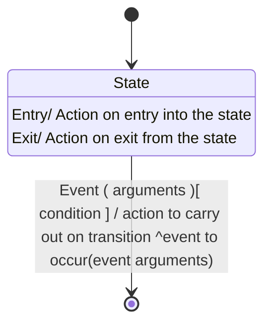
```mermaid

stateDiagram-v2
direction TB
State1: State
State1: Entry/ Action on entry into the state <br> Exit/  Action on exit from the state


    [*] --> State1 
    State1 --> [*] : Event ( arguments )[ condition ] / action to carry out on transition ^event to occur(event arguments)

```

Transitions may consist of:

- An **event** name, which corresponds to the event that triggers the transition (for example, sending an impulse from the remote control of an automatic portal).
  - Some transitions (this is the case particularly with the transition which, in our example, goes from the initial state to the “State" state) do not have an event name. These are called automatic or **implicit transitions**. They are carried out (subject to validation of the possible condition that maintains it) from the moment the actions in the state are complete.
  - The transitions may also have **arguments**. These are the arguments of a method that triggers events.
- A possible **condition** is one that should be checked when the event occurs, so that the transition is in fact completed.
- An **action** (also optional) is to be carried out during the transition.

### Creation of the metamodel

1. Change the name of the Root concept *ExampleModel* to **StateMachine**. Notice that:
    - The embedding relationship ExampleModelHasElements has been automatically renamed to StateMachineHasElements,
    - The *ExampleModel* shape has been automatically renamed to *StateMachine*.  
1. Change the name of the *ExampleElement* concept to **State**. You can do this by clicking either of the two appearances of this concept. 
1. Click the *Elements* role (to the left of the *StateMachineHasElements* relationship), and change the label of this role from *Elements* to **States**. Notice that the embedding relationship *StateMachineHasElements* has now been renamed to **StateMachineHasStates**. 
1. Click the role that has been renamed as StateMachine, (to the right of the relationship) and, in the Properties window, change its Name property from *Element* to **State**.
1. Change the name of the concept *ExampleElement* to **State**.
  
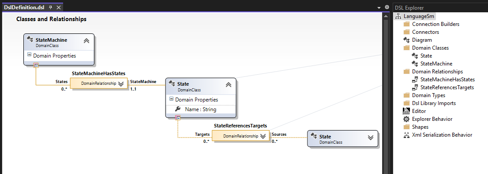

6. Change the name of the relationship that links the *State* to the *State* (which was called *StateReferencesTarget*) to **Transition**.
7. Change the name (property "PropertyName") of the *Targets* role to **Successors**.
8. Change the value of the property *Name* of this role to **Predecessor**.
9. Change the name (property "PropertyName") of the *Sources* role to **Predecessors**.
10.  Change the value of the property *Name* of this role to **Successor**.  

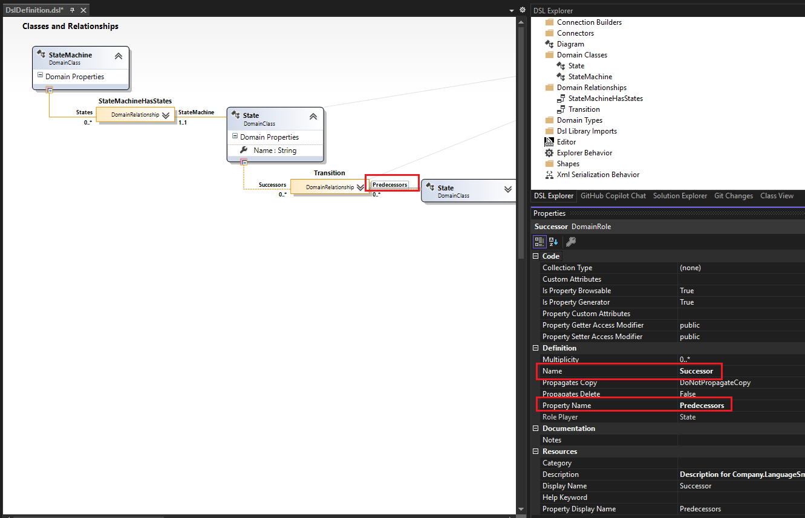 

*Predecessors* is the name of a property of the *State* class (and the type *Collection of State*).
While *Successor* is the name of a property of the *Transition* class (and *State* type)

## A note about role names

It is easy to be confused about the names of roles and relationships, especially since some of them can be automatically derived from others. There are several names associated with each relationship:

- The relationship name, shown on top of the orange relationship box – for example StateMachineHasStates, or Transition. You can also see it in the properties window when you select the relationship box. In the generated program code, the relationship name becomes the name of a class.
- Each role (that is, each side of the relationship) has two names:
  - Property Name. This is the name that is displayed as a label on the role – for example, **states**, **Successors**, **StateMachine**, **Predecessors**. When you select the role – that is, the line between the relationship and a class – the Property Name can also be seen in the properties window.
  In the generated program code, each class can have a property that you can use to navigate the relationship. For example, the class StateMachine has a property called states, with the type **IEnumerable<State>**. Class State has a property called StateMachine, with type StateMachine.
  - Name. When you select a role, the Name of the role can be set in the properties window. In the generated code, the role Name is used to navigate from an instance of the relationship to the element at one end. For example, StateMachineHasStates has a role named state, with type State. The result is always a single element of the role-playing class.
  The Name of the role is typically related to the Property Name on the opposite role. This is because the Property Name is used to navigate from the class at one side to the class at the other, while the role Name is used to navigate from the relationship. For example, when you select the left role of StateMachineHasStates, the Property Name is **states** and the role Name is **StateMachine**.
- In addition, there are Display versions of the Property Name and role Name, used in the user interface. By default, some of these names are derived from each other – they are *tracking properties*:
  - Each role Name is tracks the name of its class. If you change the class name, the role changes automatically.
  - Each Property Name tracks the role Name at the *opposite* role.
  - The relationship name tracks the property names.
If you change one of these names directly, it is disconnected from its derivation. To restore tracking, right-click the property 
and click Reset.
In the case of a role with multiple cardinality (0..* or 1..*), the derived Property Name is the pluralized form, in English, of the opposite role Name. For example if you set a role Name to "state", the opposite Property Name becomes "states". It is entertaining to try a variety of nouns including "man", "cactus", "datum" and "schema" ; but disappointing to try "child".

11. Add a Domain Property **Event** to the *Transition* relationship (retain its String type, suggested by default). To do this, right-click the "Transition" relationship, and ask to add a DomainProperty.
12. Likewise, add the Condition, Action, and Label properties of the String type. After typing the name of each one, press RETURN to add the next.


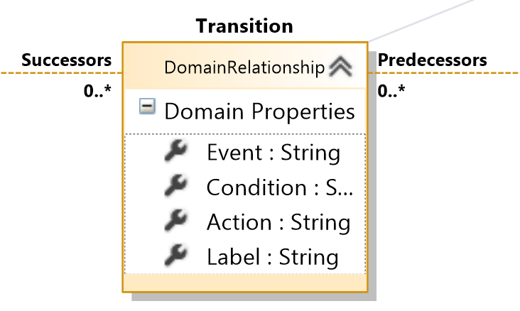

In the **DSL Explorer** set **Use Full Form** property to the *True* for XML Serialization Behavior/Class Data/State/Transition:

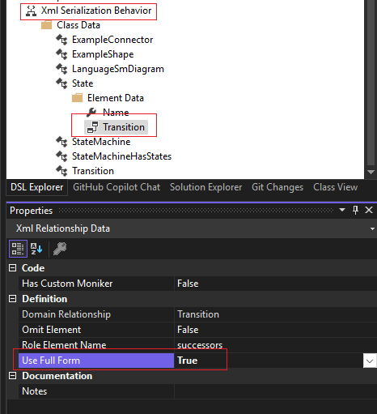

Notice that if the *“DSL Explorer”* is not automatically displayed when you open a .dsl file extension, you can display it by using the command **“View/Other Windows/Dsl Explorer“**.

13. In “DSL Explorer”, right-click the DSL root LanguageSm, and request **“Add New Domain Enumeration”**:

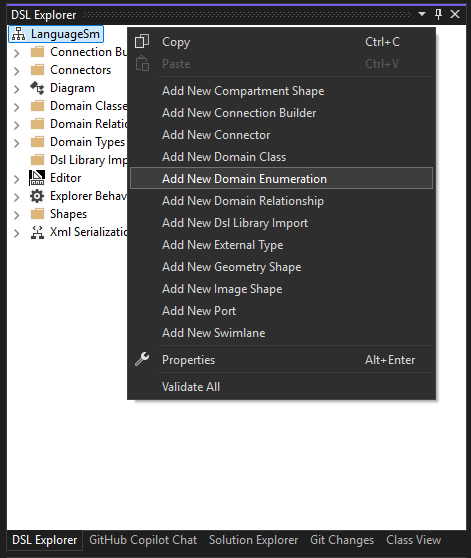

14. In the properties window, complete the properties with regard to our listed type:
    - Change the **Name** property of this new external type to **StateKind**.
    - Add a comment in the **Notes** property if you wish.

The **Domain Types** node of DSL Explorer now contains our *StateKind* listed type, which from now on will be available next to the basic types, for the *Domain Properties* types.

15. Add three Enumeration literals to our new domain enumeration (by using the contextual command **Add New Enumeration Literal**) on the StateKind enumeration. The names of these literals should be:
    - Normal
    - Initial
    - Final
  
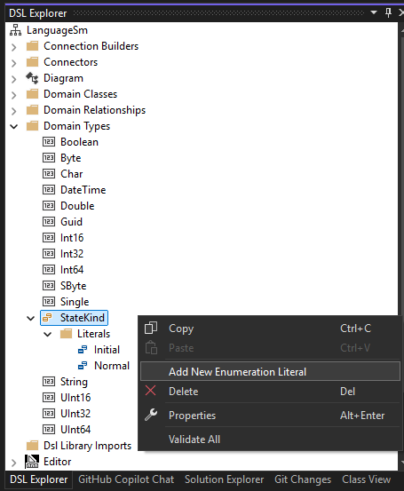

Notice that you must always right-click the StateKind enumeration to add a literal. You cannot add another literal by right-clicking the Literals node.

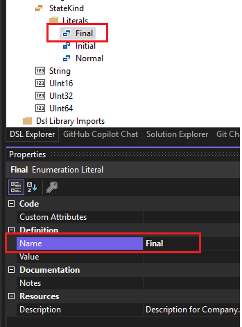

In the next step, we add a *Kind* field of *StateKind* type in the State concept to use our new enumeration.

16. Add a **Kind** Domain Property to the State class (by using the contextual command **Add Domain Property** on the *Domain Properties* node).

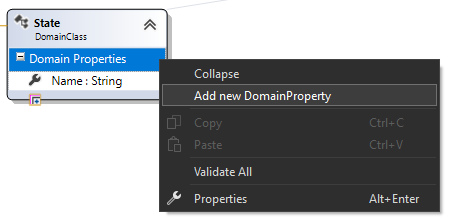

In the Properties window, set the Type of this property to StateKind.

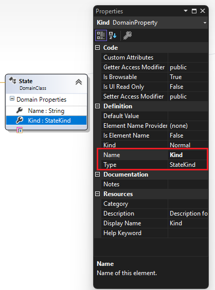

17. Add an **Action** concept to our model. To do this:
    - Click the *Domain Class* icon in the toolbox, and drag it across the surface of Design (outside of any shape or connector).
    - Rename the **DomainClass1** concept created in this way in **Action**.
    - Add to *Action* two properties called **Label** and **Code**, both of the *String* type.


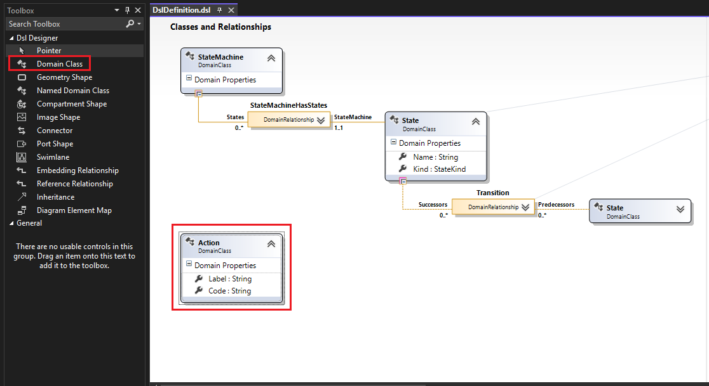

18. Add an **EntryAction** concept that is derived from Action. To do this:
    1. On the toolbar, add a new DomainClass, and name it EntryAction.
    2. Click the inheritance icon in the toolbox, and release the mouse button.
    3. Click in the shape that represents the *EntryAction* concept (derived concept) and release the mouse button.
    4. Click the shape that represents the *Action* concept (basic concept) and release the mouse button.

Note: In place of steps 3 and 4, you can also click and hold *EntryAction*, and drag it to the Action base concept.

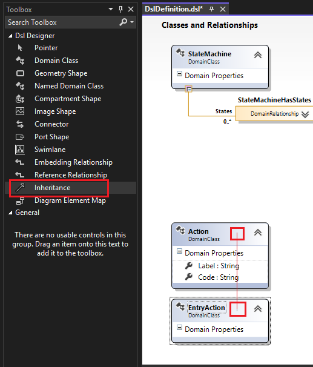

Do likewise for the new domain class **ExitAction**.

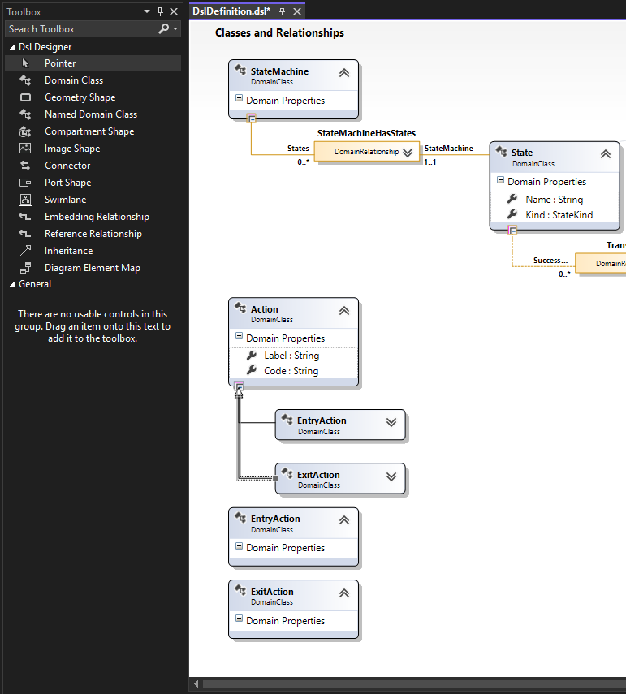

## Discussion:

The last figure shows the same concepts (EntryAction and ExitAction) in several places on the Design surface, which is worrisome at first. But we can put the definition of a concept in place of an image. (For example, right-click the image of the *EntryAction* concept that is located below the inheritance icon, and request the command **Bring Tree Here**.

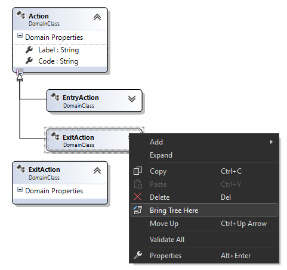

Do likewise for *ExitAction*.)

Reverse command is **Split Tree**.

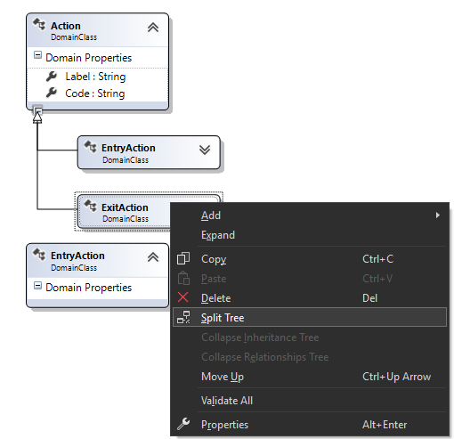

19. Now add an embedding relationship between *State* and *EntryAction*. To do this:
    1. In the toolbox, click the **Embedding Relationship** tool in toolbox.
    2. Click the *State* concept.
    3. Click the *EntryAction* concept.
    
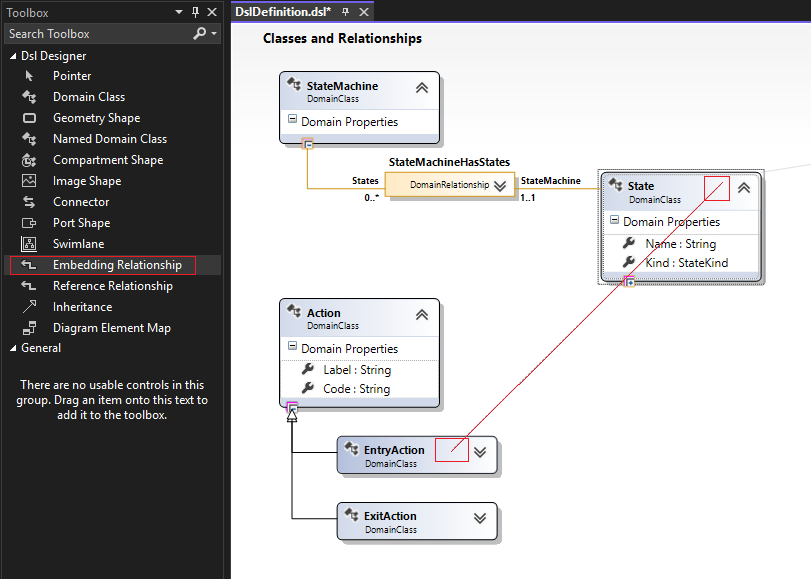

    The embedding relationship is created.

20. In the same way, create an embedding relationship between *State* and *ExitAction*.

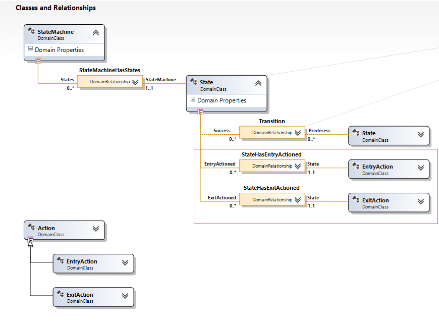

21. In DSL Explorer, expand **Xml Serialization Behavior/Class Data/State/Element Data** and select **Transition**. In the Properties window, set **Use Full Form** to **True**.

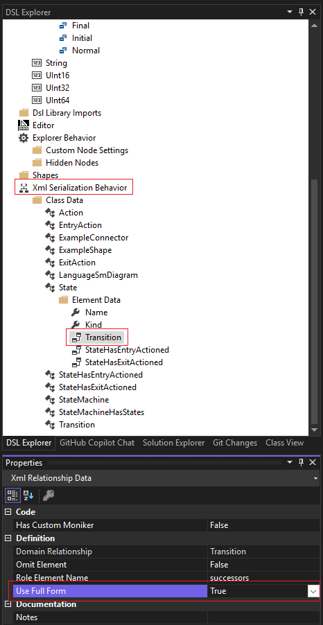

Alternatively you can choose to use *SerializeId = true* earlier in the **State** property.

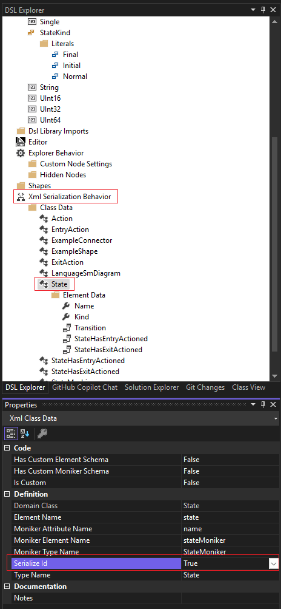

Both methods allow the relationship to be uniquely identified.

## Discussion (\todo - out of lab context!)

At this point, we would like to say that a state (State) possesses entry actions and exit actions (which will be Actions). The first thing that comes to mind to achieve this **would be** to create a metamodel like the following:

This would be entirely possible by creating two embedding type relationships and changing:

- The names of the roles on the right side of these relationships are **EnteredState** and **ExitedState** and not State as given by default. Actually, if the role name were the same for both relationships, two properties with the same name would be created in the State class, and this would not compile. Validation of the DSL is therefore not authorized.

- The cardinalities of the right side which must be **0..1** and not 1..1 as given by default (an Action is not inevitably an EntryAction, because this should be the case if the cardinality were 1..1 in the *StateHasEntryActioned* relationship, this may also be an ExitAction!). Notice nevertheless that by setting the two roles to 0..1, we would consider an Action which is not linked to any state.

On the other hand, if you complete this model, you will have a validation error: « Class CompanyName.LanguageSm.State has more than one Element Merge Directive with the same Index class CompanyName.LanguageSm.Action. This means that if you drop a shape that represents an Action into a shape that represents a State, it will be impossible to decide whether the action it to be added to the collection of EntryActions, or to ExitActions.

It would also be possible to avoid this; for this purpose you would have to delete at least one “Element Merge directive” from the State concept in DSL Explorer (in fact, you could delete both of them), by pressing the Del key, or by using the shortcut command

But in fact we are going to do otherwise here and take advantage of this situation in order to introduce the notion of inheritance. This decision is somewhat due to our teaching goal, and a possible simplification of the code generation. (We will talk about this later on.)

Note:

If you have already entered the model shown in the previous figure, don’t panic … just use Undo, until the two embedding relationships disappear and your are back to the figure from step 17; then resume the Lab: you will have found the Undo/Redo Command, which, in passing, is also available in your own DSLs without your having to code it!

### Generating the code from the metamodel

We will now generate the code that describes our metamodel, from the content of *DslDefinition.dsl*. Then we will look at the metamodel that is generated in the class diagram, which will be very useful when we write a code generator.

22. Request “**Transform All T4 Templates**” in VS Build menu.

Notice that alternatively you can right-click the *DomainClasses.tt* file and *DomainRelationships.tt* in the Solution Explorer (**Dsl/Generated Code** node) and request the “*Run Custom Tool*” command to generate the template.

If you have changed all the templates, the project should compile without any problems.

23. Right-click the DomainClasses.cs and DomainRelationships.cs files that were generated from DslDefinition.dsl through the DomainClasses.tt and DomainRelationships.tt templates; request View Class Diagram.

24. Simplify the diagram (by hiding the fields and methods boxes), and do a little formatting. Your metamodel, in the form of class diagrams, is as follows. It will be very useful to us later on.

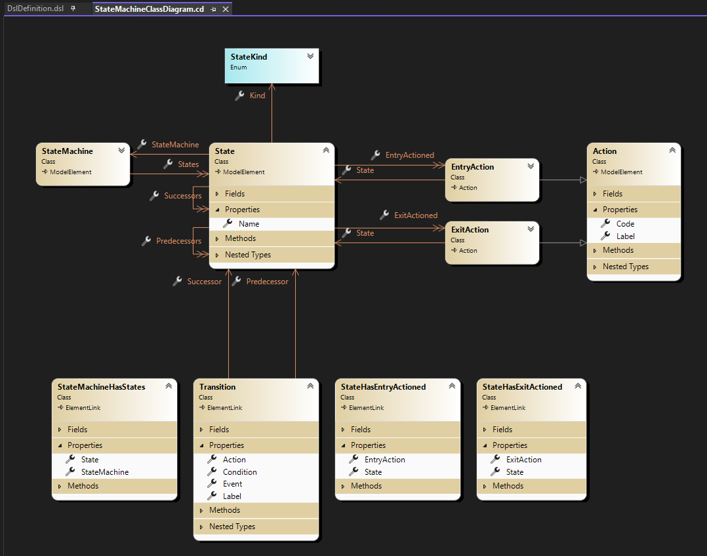

## Specifying a graphical notation

Now that we are satisfied with our metamodel, we will specify the graphical notation that we wish to give our DSL. For this step, we are going to use the right-hand section of the .dsl diagram (the “Diagram Elements” section).
We are going to:

- Create a shape **with compartments** to represent the states. This shape will have a textual decorator that shows the name of the state, and will enable an icon to be displayed, depending on the state type. The compartments will display the entry and exit actions in the state.
- Modify the **connector** to have a textual decorator that displays the relationship Label.
- Modify the **icons and toolbox texts** of our DSL to create these shapes.

### Shape with compartments representing the state

For this step, we are going to use the right-hand section of the .dsl diagram:

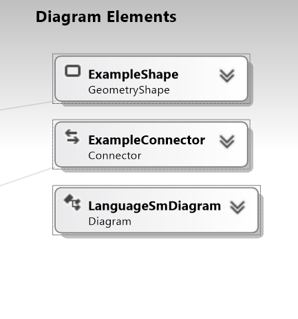

1. Rename ExampleConnector as **TransitionConnector**. Change its Thickness property to 0.01.
2. On the DSL toolbox, drop a shape of type *Compartment Shape* into the “Diagram Elements” swimlane and call it *StateShape*.
3. Change its *Geometry* property to *RoundedRectangle*, and *FillColor* to *LightBlue*.
4. Delete the *ExampleShape* shape, which is no longer of any use to us (by pressing the Del key).

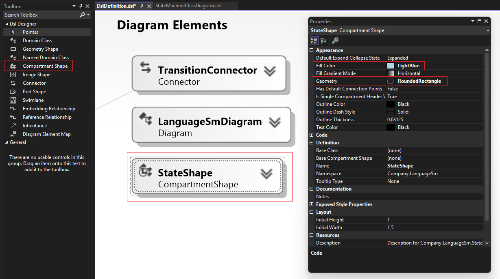

Note: you can move *Diagram Elements items* up and down. Right click the item and use command **Move Up/Down**:

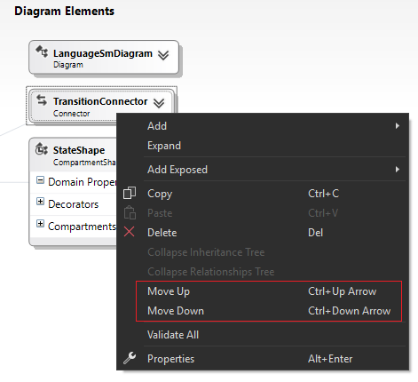

#### Now that we have added a compartment shape, we should **add the compartments** to it

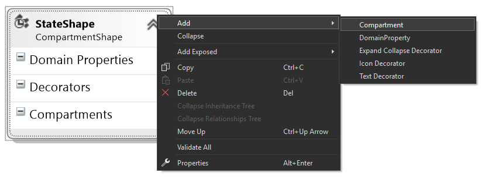

5. Add the first **compartment**. Name it **EntryActions**, and set its *Title* property to **Entry Actions** and *TitleFillColor* to *LightBlue*

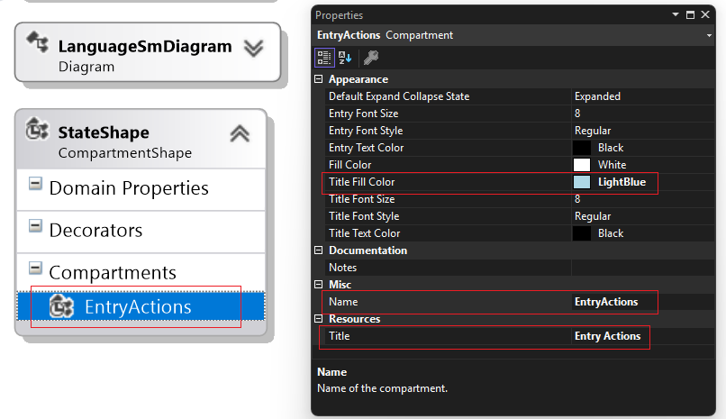

6. Add another compartment. Name it **ExitActions**, and set its *Title* property to **Exit Actions** and *TitleFillColor* to *LightBlue*.

#### We will now add the decorators.

7. Add an **Expand Collapse Decorator** so that the shape that represents the state can be expanded and collapsed. Set its *Position* property to *InnerTopRight*.

8. Add a **Text Decorator**, which you will call **NameDecorator** and whose *Position* property will be set to *InnerTopCenter*.

9. In the Resources directory of the Dsl project, add two *Start.emf* and *Stop.emf* images, which are found in the Visual Studio SDK to represent the states and transitions. These files are located in the following directory (Visual Studio 2022):

```
%ProgramFiles%\Microsoft Visual Studio\2022\Preview\Common7\IDE\Extensions\Microsoft\DSL SDK\Designer Wizard\17.0\SolutionTemplates\TaskFlow\Dsl\Resources
```

After you have copied the images in Windows Explorer, add them to Dsl\Resources in Solution Explorer, using Add Existing Item.

10. Add an **Icon Decorator** to StateShape which you will call **StartIconDecorator**; assign its *Default Icon* property as the image **Start.emf** in the Resources directory. Click […] and then, in the dialog, select the icon from the drop-down list.
    
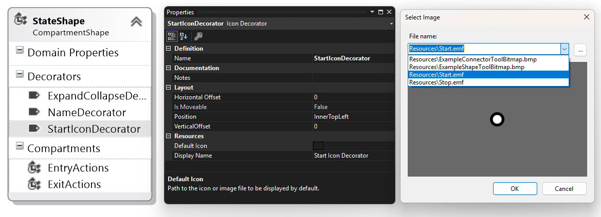

11. Add a second Icon Decorator, which you will call **StopIconDecorator**; assign its Default Icon property as the image **Stop.emf** from the Resources directory.

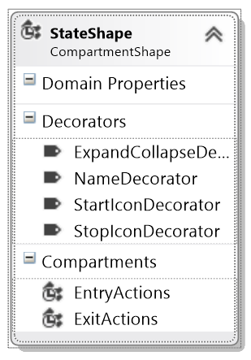

12. We will now link the StateShape shape to the Shape concept: To do this:
    - Click **Diagram Element Map** on the DSL toolbar
    - On the shape that represents the *State* concept,
    - And finally on the one that represents the *StateShape* shape.

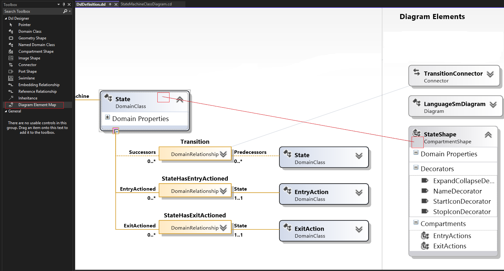

You have just created a *Shape Map*. You must now specify in which collection to add a *State* when you create a *StateShape*, and associate the compartments with their functions and the decorators with their properties.

13. Look at the “DSL Details” window.

Note: If this window is not displayed, you can make it appear by using **View/Other Windows/Dsl details**. Make sure the Shape Map is selected.

This window contains information about our Shape Map. Specifically, in the “General” tab, we find the collection in which the States will be added when a new *StateShape* is created. It is the opposite function to the StateMachine in the StateMachineHasStates relationship. Because it is the only an embedding relationship, the DSL has found it all by itself!

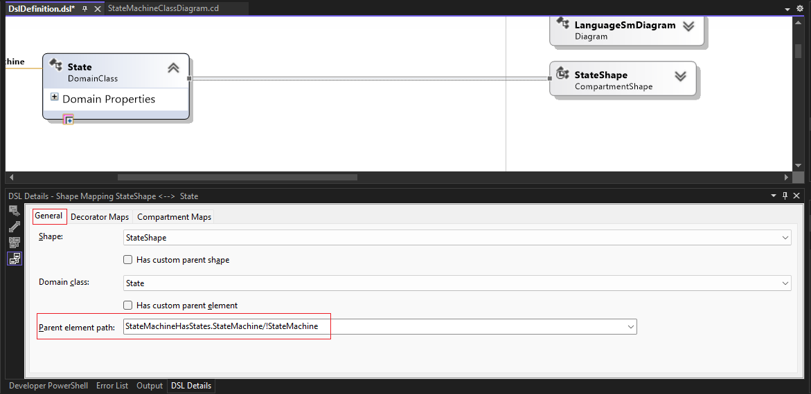

**StateMachineHasStates.StateMachine/!StateMachine**

Note the particular syntax specifying that the parent of the state is a StateMachine that we reach by the StateMachine function from the StateMachineHasStates relationship (it is therefore read from right to left).

14. The **Decorator Maps** tab lets us specify which property will be displayed in which decorator. For the moment, we will associate with the *NameDecorator*, the *Name* property of the State concept. To do this:
    - Click the **Decorator Maps** tab.
    - Click the **NameDecorator** check box.
    - In the combobox **Display property** choose the **Name** property.

That’s it!

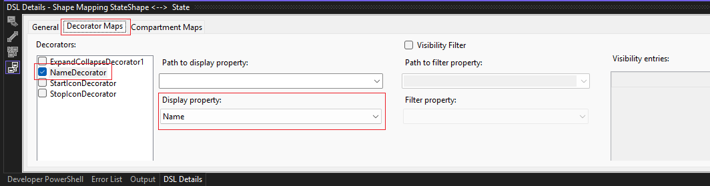

15. We will now specify that the *StartIconDecorator* decorator is only visible if the *Kind* property equals **Initial**.
    To do this:
    - Click in the box in front of *StartIconDecorator* (this selection, at the same time the decorator in which we view the properties in the fields to the right of the decorator list) and check the box.
    - Click the **“Visibility Filter”** box to specify that we want the decorator displayed under certain conditions.
    - Choose Kind as **“Filter property”**.
    - In **“Visibility entries”**, choose **Initial**.
  
  Done!

16. Likewise, specify that the *StopIconDecorator* decorator is only visible if the Kind property equals *Final*.

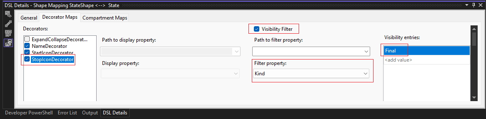

Try to validate the model. To do this:

- Right click on the model out of any classes and relationships and command **Validate All** in contextual menu.

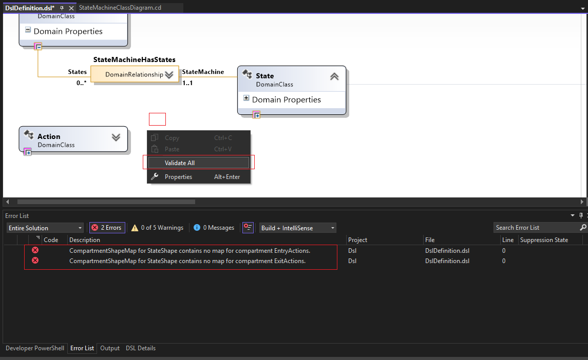

As you can see, there are two errors associated with *Compartment shape map* for compartments *EntryActions* and *ExitActions*.

17. The **Compartment Maps** tab lets us specify which multiple cardinality function is associated with which compartment:
    - Click the **“Compartment Maps”** tab.
    - In the “Compartments” list, click EntryActions, and **check** the corresponding box.
    - In the “Displayed elements collection path” field, use the path editor as shown: This is the *EntryActions* collection from the *StateHasEntryActioned* relationship, and it is an *EntryAction*, hence the path (**StateHasEntryActioned.EntryActioned/!EntryAction**).
    - In the combo-box “Display property”, choose **Label** to specify that the items from the list will be shown by their Labels.

Done!

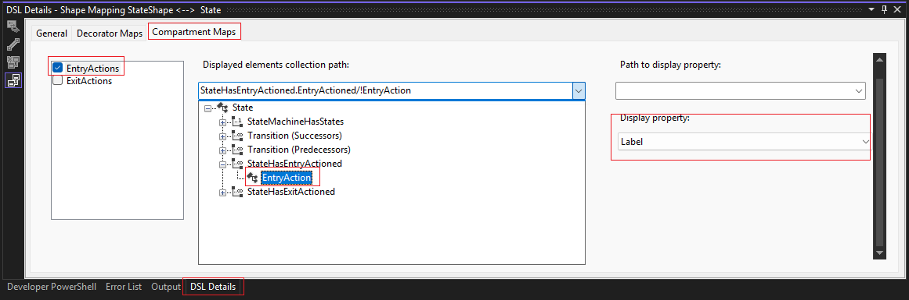

18.  Do the same for the second compartment (but with Exit actions).
  
Try to validate the model again. Successful:

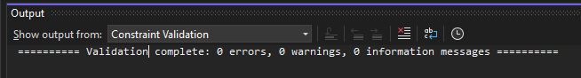

### Connector representing a transition

19. Edit the properties of the connector *TransitionConnector* to have a solid line, **DashStyle = Solid**.
20. Add a textual decorator to the connector, which you will call **LabelTextDecorator**. Set its *Position* property to *TargetTop*.
21. Click the line that links the relationship *Transition* to the connector *TransitionConnector*. This line represents the *Connector Map*.
22. In the “Decorator Maps” tab of the DSL details window, associate the decorator that you have just created with the property Label of the relationship (as you did in the Shape Map).

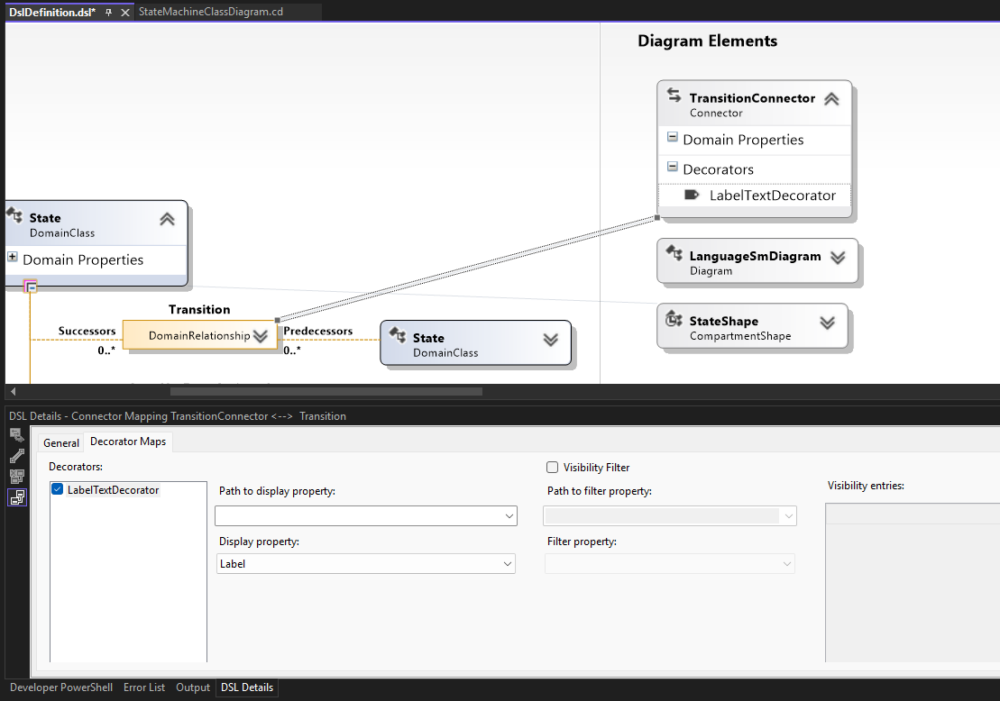

### Toolbox icons

23. In the Resources directory of the .Dsl project, add two files **Tasktool.bmp** and **FlowTool.bmp** images, which are in the Visual Studio SDK to represent the states and transitions. In the current SDK distribution, these files are located in the following directory (Visual Studio 2022): 

```
%ProgramFiles%\Microsoft Visual Studio\2022\Preview\Common7\IDE\Extensions\Microsoft\DSL SDK\Designer Wizard\17.0\SolutionTemplates\TaskFlow\Dsl\Resources
```

After copying the files in Windows Explorer, add the files to the Dsl\Resources folder in Solution Explorer.

24. In the **DSL explorer**, expand the **Editor/Toolbox Tabs/LanguageSm/Tools** nodes, and click the *ExampleElement* node.
25. Change its properties:
     - *Name* to **State**
     - *Caption* to **Transition**
     - *Tooltip* to **Create a State**
     - And change **Toolbox Icon** by selecting it from: **Resources\TaskTool.bmp**
     - *Help Keyword* = **CreateStateClassF1Keyword**

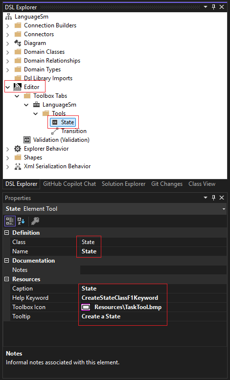

26. Likewise, choose the ExampleRelationship node and change its properties:
    - *Name* to **Transition**
    - *Caption* to **Transition**
    - *Tooltip* to **Create a Transition**
    - And change *Toolbox Icon* by selecting it from: **Resources\FlowTool.bmp**
    - *Help Keyword* = **ConnectTransitionRelationF1Keyword**

27. Click **Transform All T4 Templates** to generate all of the code from the metamodel and the designer.

All of the transformations are carried out correctly.

28. Run the test of your DSL by using **Debug/Start Without Debugging** (Ctrl+F5).

If, during the previous step, you had left Sample.sm open when you left the test version of Visual Studio, you would have a blank page, and several warnings. This is because the metamodel changed completely between the two steps. As a result, the Designer cannot re-read it (the ExampleElement concepts no longer exist etc.) But you can still add new items.

Your DSL is there, ready to use!


## Testing and assessing our DSL

In this step, we will attempt to use our DSL just as it is, “without hand coding” and to discover the faults and flaws in order to improve it in the following steps.

In addition, a DSL offers many advantages in cases where the models enable management of the code for a Framework. In this step we will also get to know the Framework that is used to implement the finite state automata. And as a result we will also examine our model with the idea of removing the code from it.

1. Add a state. Rename "State1" in Off.
From a code generation perspective, we will have to:

- Check that the name of a state can be an identifier (for this we will use a validation rule).
- While we are there, we should also take note and remember that, to generate the code, the name of the states should be unique. They will have to be checked by a validation rule

2. **Change** the value of the Kind in Initial property.
   The corresponding decorator (a black disc) is displayed.

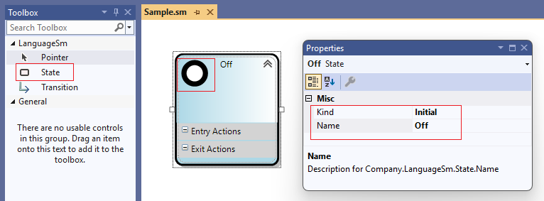

3. **Add** a second state **On**.
4. **Add** an **entry** action called **SwitchOn** (Label prop), the **Code** for which is **driven.SwitchOn()**;
5. **Add** an exit action called **SwitchOff** (Label prop), the **Code** for which is **driven.SwitchOff()**;
   Here we have to make sure that the action Code is not empty. Strictly speaking, we also have to ensure that the code is correct (but this will be outside the framework of this Lab.)

   We should note that here we have calls for methods *SwitchOn()* and *SwtichOff()* from a parameter called *driven*, which is the object managed by the finite-state machine, the type of which we should specify in a new *StateMachine* property.

6. Add a transition between *Off* and *On*. In the *Label* property (or the textual decorator under the transition), type **Click [!OutOfOrder]**.
7. Also add a transition (**Click**) between *On* and *Off*.

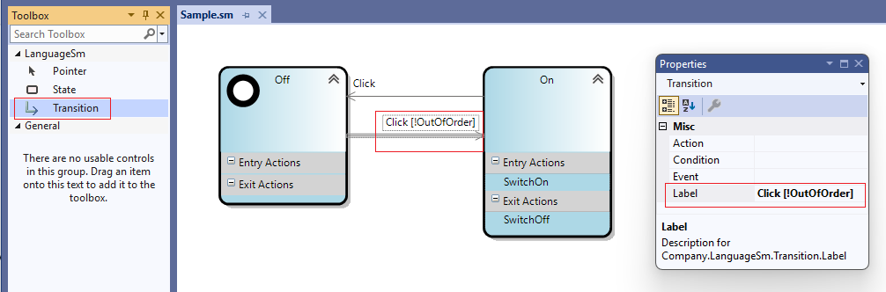

We should note that we would like the properties Event, Condition, and Action to be completed automatically when we modify the Label, and vice versa:

```
Label = Event [Condition] / Action
```

(like the Harel automata in UML)

These properties appear again in the properties box, in the “Misc” category. We would prefer "Transition".
Likewise, the Label property does not need to be visible in the properties box!

This completes Part 2.
In the next part, we will see how to improve our DSL by customizing its user interface even more. We will also allow the user to validate the model.
