# VMSDK - DSL Lab 3

Visual Studio Modeling SDK

## Preface

In the previous parts, we showed how to create a DSL by using the DSL Tools wizard (part 1), and then modify it to create our own metamodel and graphical notation (part 2) for a finite-state machine. At the end of chapter 2, the user interface (UI) still remains to be improved. In addition, a good DSL must validate the model entered by the user « just in time ». These are the two improvements that we are going to deal with in this third part.

## Improving the UI of the DSL

We created a “State Machines” DSL by using the *Modeling SDK*, and we are already able to enter basic diagrams. We are now going to improve the UI:

- The name of our DSL toolbox is LanguageSm; we are going to change it to “State Machine”.
- For a good user experience, the properties must have a description and form part of a category. We are going to add these items.
- Our DSL’s explorer should also be called “State Machine Explorer” and we will customize some of the wording of the nodes and add some icons to them. 
  
### Name of the tab that corresponds to the language in the toolbox

In the toolbox, the section concerning our DSL is called *LanguageSm*. We would like to call it *State Machine*. To do this:

1. **Open the** *DslDefinition.dsl* **diagram** if this is not already open. We actually have to access the DSL Explorer, which is only displayed when the current Visual Studio document is a *.dsl*.
2. In the “DSL Explorer”, select the **LanguageSm/Editor/Toolbox Tabs/LanguageSm** node and change the value of its **Tab Text** property to **State Machine**.

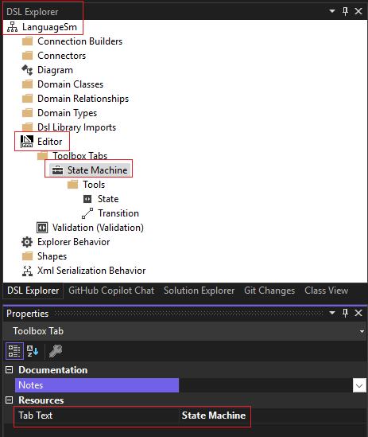

The name of the selected node changes to *“State Machine”*.

### Description and category of the properties

“Misc” is the default category in which the properties that we have added are stored. But this name has no semantic importance.
The properties should have a comment (which will be shown below the properties window in such a way as to assist the DSL user), and a category (to group the properties).

3. Select the *Transition* relationship and change its *Description* property to **“Transition from one state to another”**.
4. In the *Transition* relationship, select the four properties *Event, Condition, Action, Label* and give the *Category* property the value **Transition**. You can set them all at the same time.
5. If you have time, for each of the properties of each of the concepts, complete the *Category*, as well as the *Description* property (which will enable help for the user).

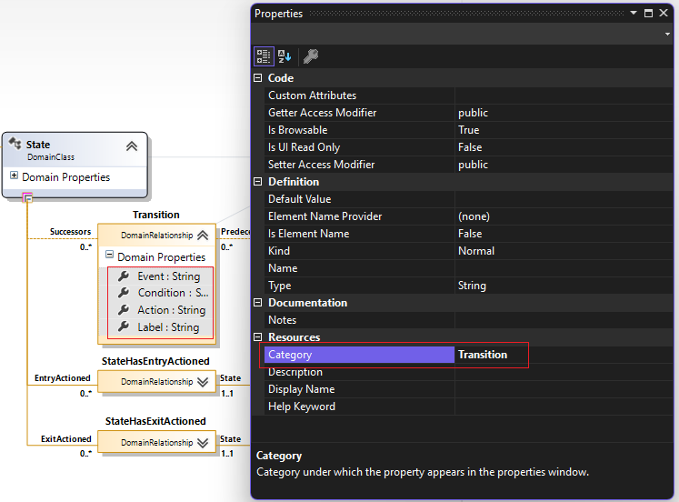

### Personalization of the State Machines explorer

Our DSL explorer is called “LanguageSm Explorer”: we are going to rename it.
Elsewhere, the entry and exit actions in the state appear in the tree under the name “Entry Action”. Instead we’re going to display their Label. We will also assign an icon to the State, and delete “(State)” which is located after the name of the state.

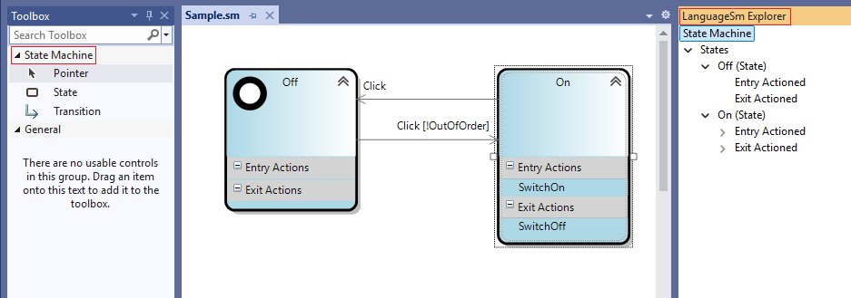

6. In DSL Explorer, click the node “Explorer Behavior”, and then change the *Title* property to **“State Machine Explorer”**.

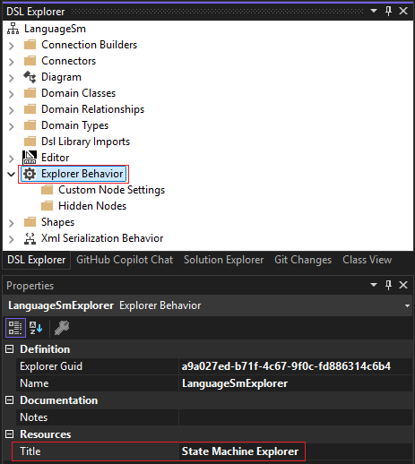

We may wonder why it is that, in the State Machine explorer, the *States* are displayed in the form of their names followed by “(State)”, while the *EntryActions* and *ExitActions* are displayed as “Entry Action” and “Exit Action”?

Actually, the difference stems from the fact that the *States* have one of their Domain Properties (in the *Name* instance), whose property *“Is Element Name”* is *true*.

In the *Action* class, select the *Label* domain property. In the Properties window, change *“Is Element Name”* to *true*.

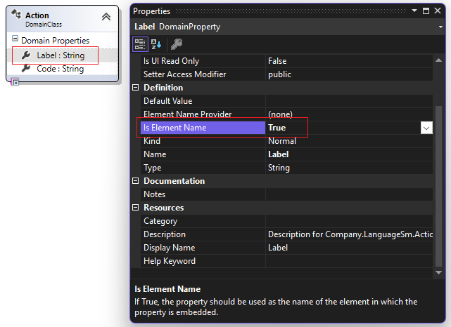

We are going to assign an icon to the State concepts in the “State Machine” explorer.
7. In “Explorer Behavior”, choose the contextual command **“Add New ExplorerNodeSettings”**.

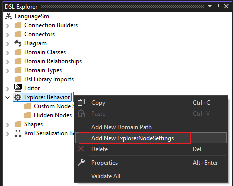

An ExplorerNodeSettings is created. Select it.

8. In the properties of the new ExplorerNodeSettings, change:

- The *Class* property, to indicate *State*.
- The *Icon To Display* property to use *TaskTool.bmp*.

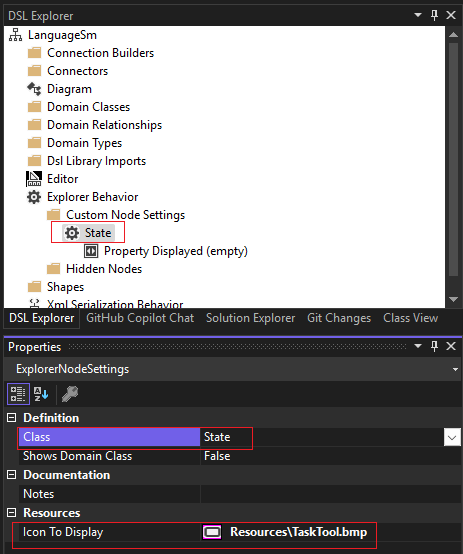

You have just changed the icon associated with a *State* in the explorer.

### Testing the results

9. Click the menu **Build/Transform All T4 Templates**.
10. Recompile the DSL completely (by using **Build/Rebuild Solution**) so that you can see your new toolbox.
11. Run the DSL (**Debug/Start without debugging**, or **Ctrl+F5**).

The properties of the transitions are now in a “Transition” category and they have a description.

The toolbox does in fact contain a **“State Machines”** tab.

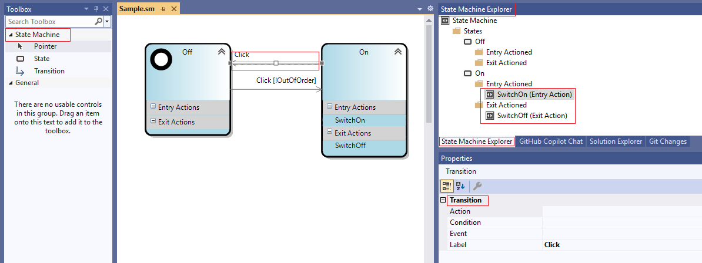

## Keeping your model consistent

We have, up until now, improved the user experience in terms of the visual aspect. We will now add constraints and validations.
The DSL Tools, as we have seen, generate the metamodel and the designer for us without us having to write the slightest bit of code, and we can go quite far this way.

From now on, we are going to tackle the advanced aspects of the DSL Tools, by writing personalized code:

- For the **constraints** of the model.
- For **validation** of the model.
- For the **generation** of codes or documentation.
- For **behaviors** specific to our Designer (Drag & Drop, for example).
- For much greater integration with Visual Studio.
- For specific Property editors.
- etc.

The DSL Definition diagram allows us to specify the syntax of the DSL. But in most DSLs, there are more subtle constraints that you would like to observe. For example:

- No state should have an empty name.
- The state chart should have exactly one node with Kind==Initial.

These are examples of *soft constraints*. That is, we do not mind if the user temporarily creates a state chart in which they are contravened. But we would prefer that they are fixed before the user saves the model. To help with this, VSSDK provides a Validation framework. You can specify constraints that are checked, for example, when the user wants to save the model.

There is also a category of hard constraints: that is, constraints that we want always to be observed. For example, we would like the *Label* property of a Transition always to show a combination of its other property values, in the form: **Event [Condition] / Action**. Conversely, we would like that when the user edits the Label, the other properties are automatically updated. VSSDK provides a range of features that are designed to let you propagate changes from one part of the model to  another.

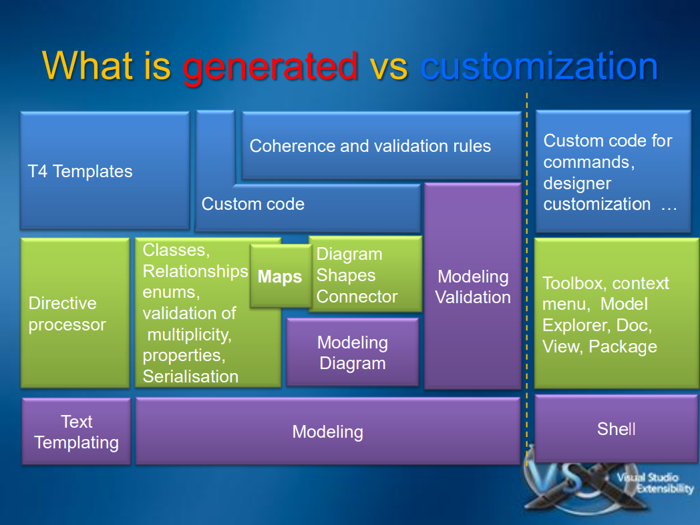

## Validating our model

We are now going to tackle validation of the model; that is the return of information to the user when the model that he enters is not correct in terms of the semantics of the metamodel.
With regards to validation of the model, I will distinguish between:

- Validation on request
- Interactive constraints

### Validation on request

In this paragraph, we will learn how to validate our model. Validation is an operation that may be carried out at different times:

- When a model is **loaded**.
- When a model is **saved**. The DSL user is asked for confirmation if the model is not valid. If the user specifies “No” obviously the code generation will not be done either.
- When the user explicitly requests to validate the model (by using a “Validate” contextual command).

But what do we validate? It is actually the semantics of the model that must be validated. In our example, we have to check, for example, that:

- The state-machine must have one and only one state whose property *Kind* is *Initial*.
- The states whose property *Kind* is *Final* should not have an exit transition.
- The entry and exit actions of the states must have a non-blank code.
- Names of the states must not be blank.
- Names of the states must be identifiers that are validated in C#.
- Names of the states must be unique in the state-machine.
- etc.

To validate the model, the Modeling SDK provide a **Validation framework**. Contrary to the rules of validation (which are, as we have seen in the previous paragraph, separate classes that derive from the *Rule* class and are activated by the *RuleOn* attribute), validation is done by using the methods (usually private) from the classes of the domain-model in question (domain element or domain relationship). In practice, we will write partial classes.

There methods are special in two ways:

- They are designated as validation methods by preceding them by a **ValidationMethod** attribute. In this attribute, it will be possible to explain when to request this method.
- The validation methods have, a parameter of type **ValidationContext**; this validation context possesses the methods *LogError()*, *LogMessage()*, and *LogWarning()*, making it possible to send errors, warnings, or messages 
in the Visual Studio error list. From the 3rd argument of these methods, it is possible to supply information about the model (domain elements or domain relationships) that will enable selection of these elements in our DSL itself when the user selects a message in the ErrorList.

The diagram of the following classes shows the **ValidationContext** and the **ValidationMessage**:

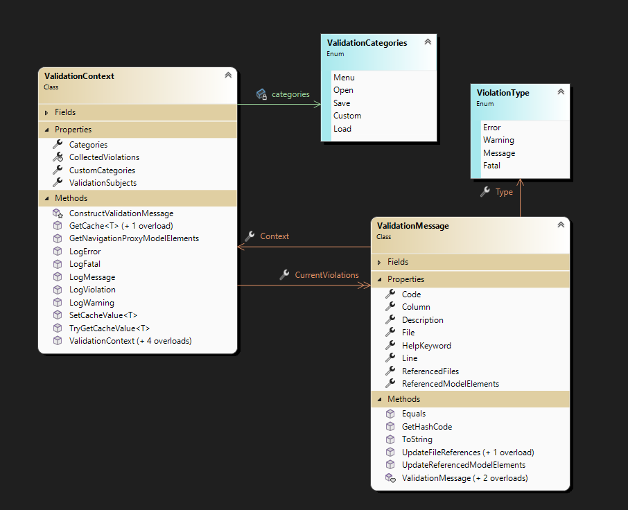

Now let’s write the validation code!

1. Add a **“CustomCode“** directory to the *Dsl* project. To do this, right-click the project, and request **“Add/New Folder”**.

In the *CustomCode* directory of the *Dsl* project, create a *Validation* sub-directory.

2. Add a new **partial class** *State* in this directory.

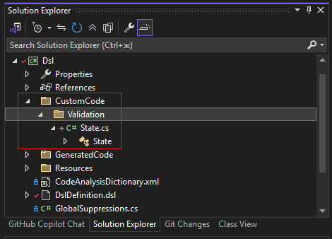

**Watch out**

Notice that when you add the C# file that contains this code, the namespace that will be offered to you by default is: 

```
CompanyName.LanguageSm.CustomCode.Validation 
```

You need to delete the last two components (CustomCode.Validation) of this namespace.
3. Change the namespace so that it is the same as the other parts of the code that is generated by the Modeling SDK:
   
**CompanyName.LanguageSm**

4. Add a using directive:

```C#
using Microsoft.VisualStudio.Modeling.Validation;
```

1. Add *partial* in front of the class declaration.
1. Add a **ValidationState** attribute in front of the class **[ValidationState(ValidationState.Enabled)]** to declare that the concept will participate in the validation.

The source code of *State.cs* must at this point be the following:

```C#
using Microsoft.VisualStudio.Modeling.Validation;

namespace Company.LanguageSm
{
    [ValidationState(ValidationState.Enabled)]
    public partial class State
    {

    }
}

```

Now we’re going to write the validation methods.

The first rule will check that each state has a correct name (not blank). If this rule is not valid, we must write an error message (which will be visible in the Task List). This error message will be included in the resources to facilitate internationalization if we wish.

7. In the *Validation* directory, create a ValidationResources.resx resources file (by right-clicking it **Add/New Item** and choose **Resource File**);
add a string type resource whose name is *EmptyStateNameError* and whose value can be *“This state has an empty name”*.
8. Save this resource file.
9. Elaborate the code of the method so that it checks that the Name field of the state is not blank. If this is not the case, write an error in the validation context. The text of this error is obtained from the resource that we just created.

Notice that:
o You add validation methods to the classes of the elements you want to validate. You must add a ValidationState attribute to the class.
o Each validation method needs a ValidationMethod attribute.
o It does not matter what the methods are called.
o Each validation method is invoked on each element in the model that belongs to its type. There is no specified order in which the elements are validated.
o You can place validation methods in base classes. Any number of validation methods can apply to each element.
o If a validation method finds an error, it should invoke LogError in the context.

```C#
using Microsoft.VisualStudio.Modeling.Validation;

namespace Company.LanguageSm
{
    [ValidationState(ValidationState.Enabled)]
    public partial class State
    {
        /// <summary>
        /// Warning method to ensure that the Name of a state is :
        /// - not empty
        /// - a valid C# identifier
        /// </summary>
        /// <param name="context"></param>
        /// <remarks>
        /// 1. This validation method will be called when the model is loaded or saved, and also when the user invokes validation explicitly.
        /// 2. When the user double-clicks the corresponding item in the error list, this state will be selected in the diagram.
        /// </remarks>
        [ValidationMethod(ValidationCategories.Open | ValidationCategories.Save | ValidationCategories.Menu)]
        private void ValidateAttributeNameAsValidIdentifier(ValidationContext context)
        {
            if (string.IsNullOrWhiteSpace(Name))
                context.LogError(CustomCode.Validation.ValidationResources.EmptyStateNameError, "StateMachine 01", this);
        }

    }
}
```

While we are there, we can go further: because the states give us the C# identifiers following code generation, we can check that the *Name* property of the state is a correct C# identifier. (Another strategy would have been to generate a correct  identifier during code generation; but we are here in Visual Studio! We can have models that represent the code, in a more abstract way, and we can guide the users just in time!

10. Add a new *string* type resource in *ValidationResources.resx*. Call it **InvalidStateIdentifierError** and assign it the following text: **«The property Name of the state '{0}' is not a valid C# identifier.»**.
11. Add to our *State* class a static field of type: **CSharpCodeProvider** (namespace *Microsoft.CSharp*).
12. Add the identifier validation code.
13. Bonus exercise: Write in the same way a rule to check that the final states do not have exit transitions (create a resource string called **FinalStateShouldNotHaveOutgoingTransitions** and whose text could be **“State '{0}' is final and therefore should not have any outgoing transition“**, and validate that a state does not have both Kind set to *StateKind.Final*, and *Successors.Count > 0*).

The following code shows the class thus modified:

```C#

using Microsoft.CSharp;
using Microsoft.VisualStudio.Modeling.Validation;

namespace Company.LanguageSm
{
    [ValidationState(ValidationState.Enabled)]
    public partial class State
    {
        /// <summary>
        /// CSharp code provider to verify identifiers.
        /// </summary>
        private static CSharpCodeProvider csharp = new CSharpCodeProvider();

        /// <summary>
        /// Warning method to ensure that the Name of a state is :
        /// - not empty
        /// - a valid C# identifier
        /// </summary>
        /// <param name="context"></param>
        /// <remarks>
        /// 1. This validation method will be called when the model is loaded or saved, and also when the user invokes validation explicitly.
        /// 2. When the user double-clicks the corresponding item in the error list, this state will be selected in the diagram.
        /// </remarks>
        [ValidationMethod(ValidationCategories.Open | ValidationCategories.Save | ValidationCategories.Menu)]
        private void ValidateAttributeNameAsValidIdentifier(ValidationContext context)
        {
            if (string.IsNullOrWhiteSpace(Name))
                context.LogError(CustomCode.Validation.ValidationResources.EmptyStateNameError, "StateMachine 01", this);
            // Name is a valid C# identifier
            else if (!csharp.IsValidIdentifier(Name))
            {
                string error = string.Format(System.Globalization.CultureInfo.CurrentUICulture,
                CustomCode.Validation.ValidationResources.InvalidStateIdentifierError, Name);
                context.LogError(error, "StateMachines – State - 02", this);
            }
        }

        /// <summary>
        /// Validation method to ensure that a final state has no outgoing transitions
        /// </summary>
        [ValidationMethod(ValidationCategories.Open | ValidationCategories.Save | ValidationCategories.Menu)]
        private void ValidateFinalStateHasNoOutgoingTransitions(ValidationContext context)
        {
            if ((Kind == StateKind.Final) && (Successors.Count > 0))
            {
                string error = string.Format(System.Globalization.CultureInfo.CurrentUICulture,
                CustomCode.Validation.ValidationResources.FinalStateShouldNotHaveOutgoingTransitions, Name);
                context.LogError(error, "StateMachines – State - 03", this);
            }
        }
    }
}

```

14. Now tell the DSL that you wish to carry out validations, and which ones. To do this:

    - **Open the** *DslDefinition.dsl* diagram of the project if this has not already been done.
    - In **Dsl Explorer**, click the **Editor / Validation** node and display its properties.
    - Set the named properties *Uses Menu*, *Uses Open* and *Uses Save* to **true**.
    - Save the *DslDefinition.dsl* file

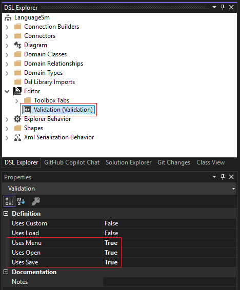

15. Regenerate the code of your designer by clicking **Build/Transform All T4 Templates** in the VS menu.
16. Run your DSL by using **Debug / Run without debugging**.
17. Test your validation rules. To do this:

    - Give a blank name to a state.
    - Give a name that consists of a space for a state.
    - Create an exit transition from a final state.
    - Try to save all of this!
    - When you see an error message, double-click it. Notice that the offending elements are selected in the diagram.

### Interactive constraints

#### The principle

Above we created a validation method that enabled us specifically to ensure that an end state has no exiting transitions. This is a soft constraint: the user can still save his model. In any case, it will be useful if the model can be created programmatically. There is another approach, which consists of preventing the user from creating transitions from a final state as he attempts to do so – an interactive constraint.

This is what we are going to see here:

During the first step of this Lab, we saw that the concepts of the model could be represented by *Shapes* and the relationships by *Connectors*. There is an additional class for creating the connectors, which are the *ConnectorBuilders* that verify that we can actually connect the shapes. In particular, they have overridable methods *CanAcceptSource()*, *CanAcceptTarget()*, *CanAcceptSourceAndTarget()*, and *Connect()*, all very useful for what we want to do.

#### Understanding

1. Above the Class View of your project (which you can, if required, display by using the **View / Class View** command), there is a text field that lets you filter the classes or members to be viewed. Enter **TransitionBuilder**, because here we are interested in the *ConnectorBuilder* for a *Transition*.
2. Double-click the *CanAcceptSource()* method in the list of members that are under the tree of types in this Class View. The code editor opens, and shows the *TransitionBuilder* class, at the level of the *CanAcceptSource()* method. Study this method.
3. Likewise look at the *CanAcceptSourceAndTarget()* method.


#### Customized creation of a TransitionBuilder

4. Open the DslDefinition.dsl file if it is not already open.
5. In the Dsl Explorer, select the node:
 **LanguageSm / Connection Builders / TransitionBuilder / Link Connect Directives / Transition**

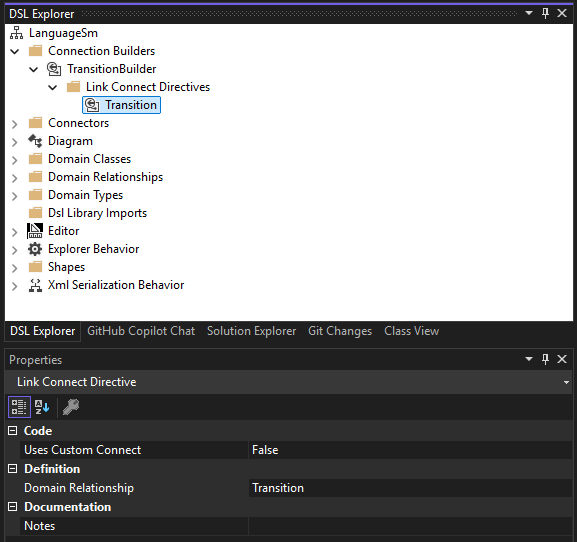

6. If the DSL Details window is not visible, display it, (by using the command **View / Other Windows / DSL Details**).

7. In the “DSL Details” window, click the **check box Custom accept** in connection with the **Domain Class** *State* in the **Source role directives** tab for the **Relationship** *Transition*. You have just asked the DSL Tools to let you decide whether a State can be the source of a Transition.

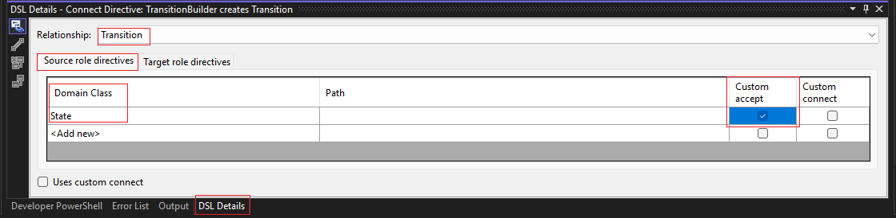

8. Click the **Build / Transform All T4 Templates** command to regenerate the code.

9. Ask your DSL to recompile by using **Build / Build Solution**. You will have compilation errors, which is expected !
10. Double-click the first error in the Error List, and notice that the DSL Tools have left you a message between comments. The message tells you that you must add the method *bool CanAcceptStateAsSource(State candidate)* into the Custom Code yourself, and that this method should be *private static*.


11. In the *CustomCode / Validation* directory of the Dsl project:

    - Add a TransitionBuilder class.
    - Check that its namespace is correct (*CompanyName.LanguageSm*).
    - Precede it with **static partial**.
    - Add the **private static bool** *CanAcceptStateAsSource(State)* method.
    - Code the main part of this method to return **false** when the *StateKind* is *End*.

14. Likewise add the *CanAcceptStateAndStateAsSourceAndTarget(State, State)* method, which delegates to *CanAcceptStateAsSource(State)*. The code will be as follows:

```C#
namespace Company.LanguageSm
{
    public static partial class TransitionBuilder
    {
        /// <summary>
        /// Only accept a candidate as source if it is not a Final State
        /// </summary>
        private static bool CanAcceptStateAsSource(State candidate)
        {
            return ((candidate != null) && (candidate.Kind != StateKind.Final));
        }

        /// <summary>
        /// Source state should be acceptable to accept source and target
        /// </summary>
        private static bool CanAcceptStateAndStateAsSourceAndTarget(State sourceState, State targetState)
        {
            return CanAcceptSource(sourceState);
        }
    }
}
```

15. Test it by running your DSL.

When you try to create a transition from a state whose Kind is Final, the pointer changes to show that this is prohibited. It works!

Notice, however, that you might have to change the property *AllowDuplicates* to true in *Transition* in order to do all the tests you want because, by default, it is false, and therefore, the DSL tools ensure a strong constraint on relationship, which is only one Transition between 2 states.

## Applying Hard Constraints

Hard constraints are used to maintain the internal consistency or coherence of a model. Whenever a value in the model changes, rules fire that make corresponding changes in another part of the model. Your DSL already uses rules to maintain consistency between the model elements and their presentation as shapes on the diagram. You can add your own.

### The transitions label

16. In the **Dsl** project, in the **CustomCode** directory create a **Coherence** sub-directory. We will use it to put together the constraint rules.
17. Add a new class *TransitionLabelRule* in this directory (by right-clicking in the *Coherence* directory, and requesting **Add / Class** type).
 
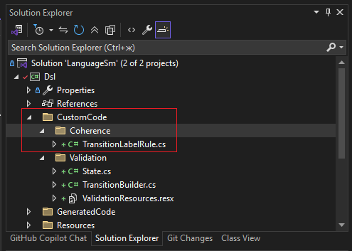

```C#

using System;
using System.Collections.Generic;
using System.Linq;
using System.Text;
using System.Threading.Tasks;

namespace Company.LanguageSm.CustomCode.Coherence
{
    internal class TransitionLabelRule
    {
    }
}

```

 **Watch out**

Notice that when you add the C# file that contains this code, the namespace that will be offered to you by default is: *CompanyName.LanguageSm.**CustomCode**.Coherence*.
You need to delete the last two components (CustomCode.Coherence) of this namespace.

We want to trigger a rule whenever the Transition properties are modified. The Modeling SDK framework contains a base class for such rules. It is called **ChangeRule**.

The figure opposite shows the **ChangeRule** class and its **Rule** superclass (basic class for all of the validation rules), and also the **TimeToFire** listed type. **TimeToFire** lets you specify when to trigger the rule. Actually, with any modification of the model being carried out in a transaction, there are several possibilities for the rule to be triggered (either immediately, during the *Commit* of the innermost transaction, or during the *Commit* of the outermost transaction).

The **ChangeRule** class has a virtual method: *ElementPropertyChanged*.

When this method is requested by the framework, it gives as an argument an instance of a class (which is derived “loosely” from **System.EventArgs**) that specifies what the modifications of the model field are: specifically, its **ElementPropertyChangedEventArgs**.

Nevertheless, as we are in the process of writing the code for a metamodel, we can access not only:

* The (**ModelElement**) modified concept,
* and more particularly the field values whose modification triggered the (*NewValue* and *OldValue*) rule,
* but also the meta-information that concerns this concept (*MetaClass*) and this field (*MetaAttribute*).

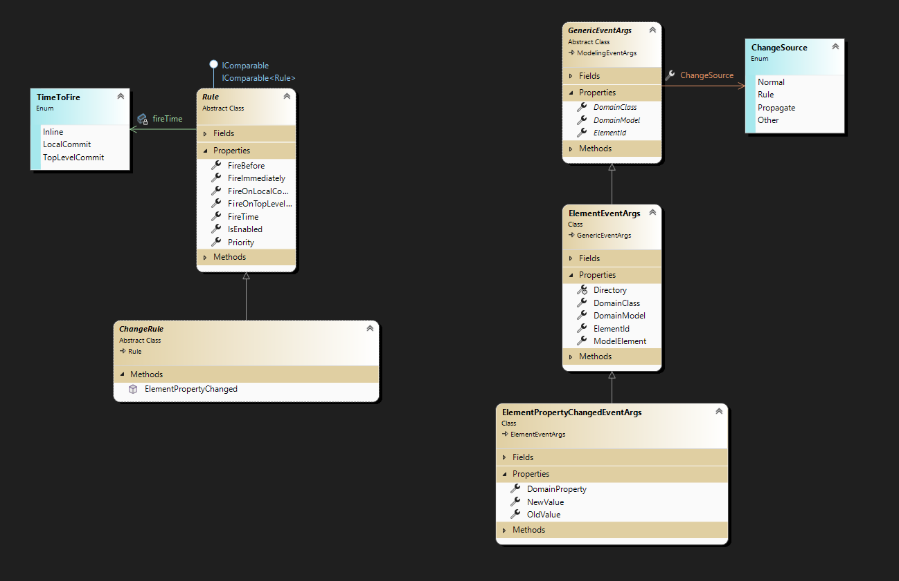

We are now going to put all of this into practice:

18. Make the **TransitionLabelRule** class of **ChangeRule** inherit the content of the namespace: **Microsoft.VisualStudio.Modeling**. Precede the definition of the class of the **RuleOn** attribute in which we specify the class of the metamodel to which the rule applies, and when this must be activated (here **Transition**).

The code that you are going to write should look like this:

```C#
using Microsoft.VisualStudio.Modeling;

namespace Company.LanguageSm
{
    /// <summary>
    /// When the event / condition / action changes the label is recomputed and vice versa
    /// </summary>
    [RuleOn(typeof(Transition))]
    public sealed class TransitionLabelRule : ChangeRule
    {

    }
}

```

19. Override the single virtual method *ElementPropertyChanged(ElementPropertyChangedEventArgs e)*. The body of our method should compare the modified meta-attribute with the different meta-attributes of the domain element that the rule involves (here a **Transition**, but it could very well be an abstraction such as **ModelElement**, the basic class of all of the concepts!), and make the validation decisions that must be applied: when *Events*, *Conditions*, or *Actions* are modified, recalculate the summary (*Label*). And when *Label* is modified, re-parse its value to remove it from *Event*, *Condition*, and *Action*.

The code that you are writing could look like the following:

```C#
/// <summary>
/// When the event / condition / action changes the label is recomputed and vice versa
/// </summary>
[RuleOn(typeof(Transition))]
public sealed class TransitionLabelRule : ChangeRule
{

    /// <summary>
    /// This method is called whenever any attribute of a Transition changes. It processes
    /// the validation Label = Event + "["+Condition+"] / "+Action
    /// </summary>
    /// <param name="e"></param>
    public override void ElementPropertyChanged(ElementPropertyChangedEventArgs e)
    {
        
        Transition t = e.ModelElement as Transition;
        // Compute Label when Event changes
        if (e.DomainProperty.Id == Transition.EventDomainPropertyId)
            t.Label = ComputeSummary(e.NewValue as string, t.Condition, t.Action);
        // Compute Label when Condition changes
        else if (e.DomainProperty.Id == Transition.ConditionDomainPropertyId)
            t.Label = ComputeSummary(t.Event, e.NewValue as string, t.Action);
        // Compute Label when Action changes
        else if (e.DomainProperty.Id == Transition.ActionDomainPropertyId)
            t.Label = ComputeSummary(t.Event, t.Condition, e.NewValue as string);
        // Compute Event, Condition, Action when Label changes
        else if (e.DomainProperty.Id == Transition.LabelDomainPropertyId)
            ComputeProperties(e.NewValue as string, t);
        
    }
}
```

The methods used to apply the constraint are provided below (they depend on the problem to be dealt with). There is nothing special here, but I’m giving the code to complete the example, and the step (reusable in cases such as the latter) through the use of regular expressions.

So the following line, then, should be added at the start of the file:

```C#
using System.Text.RegularExpressions;
```

Also, the following static methods in the main part of the **TransitionLabelRule** class:

```C#
        /// <summary>
        /// Computes the summary label from the event name, condition, and action
        /// </summary>
        private static string ComputeSummary(string eventName, string condition, string action)
        {
            // Event
            string eventString = "";
            if (eventName != "")
                eventString = eventName;
            // Condition
            string conditionString = "";
            if (condition != "")
            {
                conditionString = " [ " + condition + " ]";
                if (eventString != "")
                    conditionString = " " + conditionString;
            }
            // Actions
            string actionString = "";
            if (action != "")
                actionString = " / " + action;
            string newSummary = eventString + conditionString + actionString;
            return newSummary.Trim();
        }
        
        /// <summary>
        /// Regular expression for parsing “event() [condition] / Action()”
        /// </summary>
        public static Regex eventLabelRegEx = new Regex(@"^(?<EventGroup>(?<EventName>[a-zA-Z_]?\w+)\s*((?<EventSignatureGroup>\((?<EventSignature>[^\)]*)\)))?)?\s*(?<ConditionGroup>\[(?<Condition>[^\]]*)\])?\s*(?<ActionGroup>\/\s*.*)?", RegexOptions.IgnoreCase | RegexOptions.Compiled);
        
        /// <summary>
        /// Computes the event, condition and action from label
        /// </summary>
        private static void ComputeProperties(string label, Transition t)
        {
            
            // Parses the label
            System.Text.RegularExpressions.Match match = eventLabelRegEx.Match(label);
            // and sets other properties
            if (match.Success)
            {
                t.Event = match.Groups["EventGroup"].Value.Trim();
                t.Condition = match.Groups["Condition"].Value.Trim();
                string actionWithSlash = match.Groups["ActionGroup"].Value.Trim();
                if (actionWithSlash.StartsWith("/"))
                    t.Action = actionWithSlash.Substring(1).TrimStart();
                else
                    t.Action = actionWithSlash;
            }
            
        }
```

**Just a brief comment:**
The modifications of the model may be carried out here because, when you are in the process of applying the rule, you are **in a transaction**. This transaction mechanism, ensures that you will be able to “undo” an action by also undoing all of its consequences.

In the next Lab, we will see that, in order to modify the model outside of a rule, we should create a transaction explicitly and validate it.

The rules are triggered when the values are actually modified: Here when we modify *Event*, for example, this results in a modification of *Label*, which triggers once again the rule for modifying *Event*, *Condition*, *Action*, all of which remain unchanged (if the two methods are well written), and so we stop there! If the double transformation is not the identity transform, we could get stuck in a loop.

20. We now have to **make our rule known in connection with the rules Framework**; otherwise it will never be triggered. To achieve this, we must alter the **Type[] GetCustomDomainModelTypes()** method in the class **LanguageSmDomainModel** in the **Dsl** project. To do so, add to the *CustomCode/Validation* directory a **Rules.cs** file that
will contain the portion of the **LanguageSmDomainModel** class that is used to state the rules:

```C#
using System;
using System.Collections.Generic;
using System.Linq;
using System.Text;
using System.Threading.Tasks;

namespace Company.LanguageSm
{
    public partial class LanguageSmDomainModel
    {
        protected override Type[] GetCustomDomainModelTypes()
        {
            /// <summary>Returns the rules that should be taken into account</summary>
            return new Type[]
            {
                 typeof(TransitionLabelRule),
            };
        }
    }
}

```

If you have other rules about the metamodel, add them in the **Dsl** project and register them by way of a new entry in the **Type** table, which is returned by the *GetCustomDomainModelTypes()* method.


You can also have rules about notation; the Modeling SDK themselves generate a *GetGeneratedDomainModelTypes()* method in the file GeneratedCode\DomainModel.cs for the shape creation validation rules. But we should be careful not to add our rules to this file, because it is regenerated every time the custom tools are run (by expansion of the *DomainModel.tt* template).

21. **Test your validation rule** by running your DSL: when you open Sample.sm, something impressive will take place: the *Event* and *Condition* fields of your transitions will complete themselves!


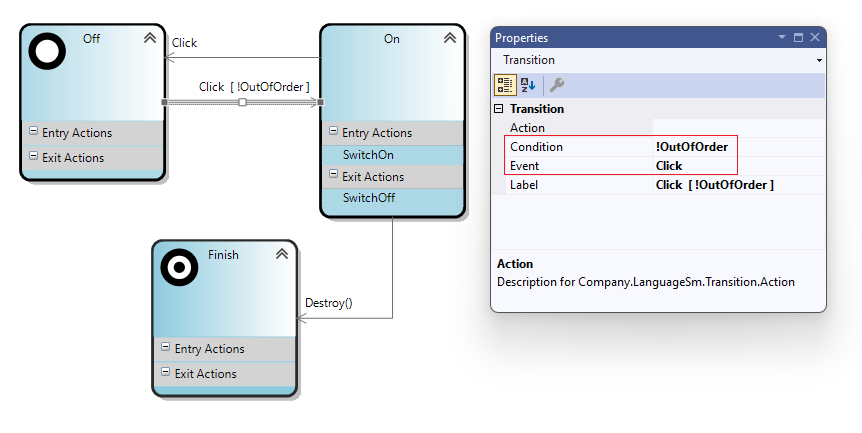

### Finding out more about validation
There are several kinds of rules, depending on when you want to apply the constraint.
- *AddRule*: when you add a concept (deriving from *ModelElement*) or a relationship (deriving from *TransitionLink*, which is itself a sort of *ModelElement*). Particularly, when you add a connector, a transition is created, which you can become aware of with an *AddRule*).
- *DeletingRule*: before deleting an instance of a domain element or domain relationship (we can also prevent it).
- *DeleteRule*: when you have already deleted an instance of a domain element or domain relationship.
- *ChangeRule*: when a property of a domain element or domain relationship has been modified. This is what we have used up until now. On the other hand, it is not the rule that is requested when we change a function (even if a function is implemented in the form of a property).
- *RolePlayerChangeRule*: When you modify a function (but not when you create or delete an instance of a relationship).
- *RolePlayerPositionChangeRule*: When a target is moved in a multiple cardinality function.
- *TransactionBeginningRule*: When you start a transaction.
- *TransactionCommitingRule*: When you validate a transaction (Commit).
- *TransactionRollingBackRule*: When you cancel a transaction (Abort).

We have seen how to ensure the semantic validation of our model, particularly when we modify a property. We are now going to see if it is also possible to respond when we modify/add/delete a function.

### Property / role validation … the initial State is unique, and Initial type
In our model, we have states (*State*) whose property *Kind* lets us specify that they are initial, final, or normal. So a *StateMachine* must have **one and only one initial state** (without which we do not know where to start). This is a constraint of the metamodel. Faced with this constraint, we could choose to just validate that the constraint is being respected (by the validation mechanism described in the previous section), but we can also offer a better user experience by means of rules. 


Elsewhere, by jumping ahead a bit to part 4, we can anticipate that for code generation we have to know the initial state of the *StateMachine*. It would therefore be beneficial to add a **property** to the *StateMachine*, which supplies the initial state (therefore a *State*). So, because *State* is one of the concepts of the models (and not an *External Type*), we must observe that such a property is in fact **the implementation of a 0..1 cardinality role** of a *StateMachineHasOneInitialState* relationship between *StateMachine* and *State*. So we are going to add such a relationship, and thus ensure a contraint between the target and this role, and the property *Kind* of the different states.

22. Add a reference type relationship between *StateMachine* and *State*, which you will call **StateMachineHasOneInitialState**. The *StateMachine* will be in relationship with one and only one state called **InitialState**. The opposite role will not be generated (for this reason, its property *IsPropertyGenerator* will be set to *false*). Note that this role is displayed in “non bold” text. Its cardinality should be 0..1.

23. Click the **Build/Transform All T4 Templates** menu to regenerate the code.

Now we want to write the rules that make it possible:
- To ensure that the *InitialState* function of *StateMachine* is updated when:
  - A state sees its property *Kind* become *Initial*.
  - A state has a *Kind* property set to *Initial*, and it becomes *Normal* or *Final*.
- To ensure the *Kind* property of a state:
  - Losing its *Kind = Initial* while the *InitialState* function of *StateMachine* is changed to another state or set to (none) (that is *null*, in terms of code).
  - Gaining a *Kind = Initial* when the *InitialState* function takes as its value the reference to this state (from another state or from (none)).


### How do we handle this constraint?
2. When the triggering mechanism is the change of property *Kind*, we will use a *ChangeRule* on the State class, to bring the *InitialState* function of *StateMachine* up to date.
3. When the *InitialState* property of *StateMachine* changes from null to a state reference, this has to do with the creation of an instance of *StateMachineHasOneInitialState*, and we must therefore manage this change by using an *AddRule* that focuses on the *StateMachineHasOneInitialState* relationship.
4. When the *InitialState* property of *StateMachine* changes from a state reference to null, it is concerned with the deletion of an instance of *StateMachineHasOneInitialState*, which must be handled by *RemovingRule* focusing on the class *StateMachineHasOneInitialState*.
5. When the *InitialState* property of StateMachine changes from a reference that has an S1 state to a reference that has an S2 state, we are concerned with a change of value of role which we will deal with by using a *RolePlayerChangeRule*.

As a result:

24. In the *CustomCode/Coherence* directory, add an **InitialStateCoherence.cs** file, which will contain the following four classes (to be written):
- A *ChangeRule* called **StateKindImpliesInitial**.
- An *AddRule* called **StateMachineInitialStateAddImpliesStateKind**
- A *DeletingRule* called **StateMachineInitialStateNulledImpliesStateKind**
- A *RolePlayerChangeRule* called **StateMachineInitialStateChangeImpliesStateKind**

*Note: This step is a little complex, but very instructive. Put in some effort before looking for possible help.*

25. Consider listing these rules in **Rules.cs** to take them into account.


Test your work in the test version (fortunately, if you have done things correctly, the *InitialState* role of *StateMachine*, although new, updates itself automatically when you open your model!). Alternatively, change the *StateKind* of two states, and note the icons of the states on the diagram, and the property InitialState of *StateMachine* in the properties window.

A possible code for achieving this constraint is supplied below:
**Rules.cs**
```C#
using System;

namespace Company.LanguageSm
{
    public partial class LanguageSmDomainModel
    {
        protected override Type[] GetCustomDomainModelTypes()
        {
            /// <summary>Returns the rules that should be taken into account</summary>
            return new Type[]
                {
                // Validation between Label and Event + Condition + Action
                typeof(TransitionLabelRule) 
                // Validation between StateMachine.InitialState and state's Kind
                , typeof(StateMachineInitialStateChangeImpliesStateKind)
                , typeof(StateKindImpliesInitial)
                , typeof(StateMachineInitialStateAddImpliesStateKind)
                , typeof(StateMachineInitialStateNulledImpliesStateKind)
                };
        }
    }
}
```

**InitialStateCoherence.cs**

```C#
using Microsoft.VisualStudio.Modeling;
using System.Text.RegularExpressions;

namespace Company.LanguageSm
{
    /// <summary>
    /// When the event / condition / action changes the label is recomputed and vice versa
    /// </summary>
    [RuleOn(typeof(Transition))]
    public sealed class TransitionLabelRule : ChangeRule
    {
        /// <summary>
        /// This method is called whenever any attribute of a Transition changes. It processes
        /// the validation Label = Event + "["+Condition+"] / "+Action
        /// </summary>
        /// <param name="e"></param>
        public override void ElementPropertyChanged(ElementPropertyChangedEventArgs e)
        {
            
            Transition t = e.ModelElement as Transition;
            // Compute Label when Event changes
            if (e.DomainProperty.Id == Transition.EventDomainPropertyId)
                t.Label = ComputeSummary(e.NewValue as string, t.Condition, t.Action);
            // Compute Label when Condition changes
            else if (e.DomainProperty.Id == Transition.ConditionDomainPropertyId)
                t.Label = ComputeSummary(t.Event, e.NewValue as string, t.Action);
            // Compute Label when Action changes
            else if (e.DomainProperty.Id == Transition.ActionDomainPropertyId)
                t.Label = ComputeSummary(t.Event, t.Condition, e.NewValue as string);
            // Compute Event, Condition, Action when Label changes
            else if (e.DomainProperty.Id == Transition.LabelDomainPropertyId)
                ComputeProperties(e.NewValue as string, t);
        }

        /// <summary>
        /// Computes the summary label from the event name, condition, and action
        /// </summary>
        private static string ComputeSummary(string eventName, string condition, string action)
        {
            // Event
            string eventString = "";
            if (eventName != "")
                eventString = eventName;
            // Condition
            string conditionString = "";
            if (condition != "")
            {
                conditionString = " [ " + condition + " ]";
                if (eventString != "")
                    conditionString = " " + conditionString;
            }
            // Actions
            string actionString = "";
            if (action != "")
                actionString = " / " + action;
            string newSummary = eventString + conditionString + actionString;
            return newSummary.Trim();
        }

        /// <summary>
        /// Regular expression for parsing “event() [condition] / Action()”
        /// </summary>
        public static Regex eventLabelRegEx = new Regex(@"^(?<EventGroup>(?<EventName>[a-zA-Z_]?\w+)\s*((?<EventSignatureGroup>\((?<EventSignature>[^\)]*)\)))?)?\s*(?<ConditionGroup>\[(?<Condition>[^\]]*)\])?\s*(?<ActionGroup>\/\s*.*)?", RegexOptions.IgnoreCase | RegexOptions.Compiled);

        /// <summary>
        /// Computes the event, condition and action from label
        /// </summary>
        private static void ComputeProperties(string label, Transition t)
        {
            
            // Parses the label
            System.Text.RegularExpressions.Match match = eventLabelRegEx.Match(label);
            // and sets other properties
            if (match.Success)
            {
                t.Event = match.Groups["EventGroup"].Value.Trim();
                t.Condition = match.Groups["Condition"].Value.Trim();
                string actionWithSlash = match.Groups["ActionGroup"].Value.Trim();
                if (actionWithSlash.StartsWith("/"))
                    t.Action = actionWithSlash.Substring(1).TrimStart();
                else
                    t.Action = actionWithSlash;
            }
            
        }
    }
}

```

So we have just achieved coherence between a property and a 0..1 relationship, which is a fairly common usage, and which merits us spending time on it at least once.
We have dealt with consistency (there is at the most an initial state), but we have not, for the moment, verified that there was (at least one) initial state. That will be the subject of the validation, which we are going to examine in the following paragraph.


## Conclusion
You have just learned how to improve the user experience in your DSL:
- Through customization of the UI, particularly the enrichment of the properties.
- Through your model’s validation rules.
- Through the validation rules, whether on request or on the fly.
In the next part, we will move on to code generation; then we will see how to deploy our DSL.