# VMSDK - DSL Lab 4

Visual Studio Modeling SDK

In the previous parts of this Lab we showed you how to create a DSL by using the DSL Tools wizard (part 1), then we modified it to create our own metamodel and graphical syntax for a finite-state machine (part 2). We then improved it (part 3), first by customizing the UI, then by adding coherence rules and validation of the model.

In this part we will generate the code that corresponds to our model. In part 5, we will learn how to use our DSL.

## Code generation

Because we are in Visual Studio, our models are going to be used for things other than documentation or communication (already one factor in our favor). We will actually generate the code from our state-machine. And this code will be based on a framework. The following section shows us briefly the model/code connections, as well as the Framework.

### Generating the code for state machines

In this section we will:

- Give two approaches for code generation of state machines.
- Explain the basic examples that we will use for teaching purposes.
- Create a T4 template to generate a “simplistic” state-machine code by using the if-then-else type approach.

#### Introduction to the code to be generated

##### Two approaches

There are two approaches to code generation:

- The first approach is to generate the code by imitating the structure of the state-machines. This is a **switch / if-then-else** type of approach.
- The second approach is to complete a **model transformation**: we leave the state _machines_, to which you apply a design pattern called "_Pattern State_" that consists of linking a class to each state. The methods of these classes are then associated with the transitions. Only afterwards do we generate the code that is associated with this static model.

##### Representation of the transitions

When you want to generate code from a finite-state automaton, it is important to understand that the **transitions** will be implemented by the **methods**. In a _state machine_, you first notice states. During implementation in a language, you must first focus on the transitions. All of the transitions that have the same event signature _E(parameters)_ will be implemented by the same method that has this signature. Implicit transitions, not having a name, will be implemented by a method that can be named **Implicit()**, for example.

It is equally important to understand that during a transition, actions are carried out according to the following sequencing (if these actions exist):

- Exit actions of the state at which the transition originates.
- Action in the transition.
- Entry action in the destination state of the transition.

The code should ensure that entry, exit, and internal actions are implemented. Otherwise the semantics of the state machines would not be respected, and it is there that difficulties start and the performance of the code that is supposed to implement state-machine will deteriorate.

##### Representation of the states

The states are implemented differently according to the code generation type:

- In the _switch / if-then-else_ implementation (the most intuitive), the states are implemented in the form of a listed type whose listed values are the names of states. Particular attention must be given to the states (but that is beyond the scope of the Lab).
- In implementation that uses the state pattern, states are implemented in the form of classes that derive from a _BaseState_ class that has (virtual) methods that correspond to all of the possible events.

What changes between the _switch / if-then-else_ implementation and the pattern state application implementation is that in the first case, the signature transitions themselves will give rise to a single method of the class, while in the second case there will be virtual methods (different transition from initial states) for classes that represent the different states.

#### A few important points

There are a number of points during code generation corresponding to the final-state automatons:

- The actions on the transitions must be completed before you run the start actions in the destination state of the transition, so that the semantics are retained. In particular, if the actions on the transition result, whether directly or not, in the firing of another transition from the state-machine, this transition must not be handled before the first one is completed. This is what we call **"the atomicity of the transitions"**.
- The **transitions** exiting from a state "trigger" **execution "outside of this state"**. This is a mechanism that has to be understood in order to know how to read an automaton and to implement it correctly. In particular, implicit transitions are those transitions that (if the **conditions** that are keeping them are checked and are true) are systematically borrowed from a state. This may go from state to state as there are **implicit transitions** (in this case, you have instead states where you "do not wait for an event to occur", that is, **activities** in the sense of the UML). This must be taken into account during implementation.
- Time plays a part in some transitions. These are called _after_ (configured by duration), or _when_ (configured by date). They are called **temporal transitions**. Their implementation requires particular care.
- Harel automata also have more complex concepts, such as **sub-states, historic states** and **deep histories, internal transitions, deferred transitions, synchronization** states (Fork & Join), etc. Joint implementation of all of these possibilities also merits particular attention. But all that would go far beyond the scope of this Lab, which is to familiarize ourselves with the Modeling SDK!

### Realistic goals

Now that we have outlined the problem, let’s start by making a few basic assumptions. In fact, the important thing in this part of the Lab is to learn about the DSL Tools, and we must not let other complications distract us. This is why we are going to restrict ourselves to:

- An _if-then-else_ kind of implementation.
- We will ignore for now automatic transitions (transitions that are not triggered by events).

### Code generation by using the if-then-else approach

Later in this document, we are going to implement our state machines (relatively limited for now, because we are not considering for the moment that states may have sub-states) by using the **if-then-else** approach.

To fully understand code generation, let’s look at a basic example.

Let’s consider the interactive creation of a Line of the .NET Framework 3.5 in a WPF window.
The tool (named a LineCreator) creates a line. It has too properties to set the points of the line: P1 and P2, and is responding to Mouse events such as MouseUp(Point), PointDown(Point), MouseMove(Point).

The state machine is the following:

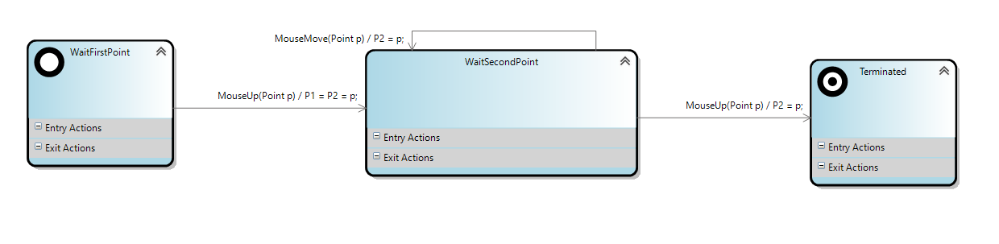

We are now going to create a test example.

#### Creating a test solution

Start the experimental instance of Visual Studio using the **Start without Debugging** command (Ctrl+F5) in the Debug menu from the LanguageSm solution.

> [!NOTE]
> Notice that all the code and diagrams in this part are added in the experimental instance of Visual Studio – not the main instance, in which you edit your DSL definition.

Your DSL definition can be used in the experimental instance, but not in the main instance – until you eventually install the DSL.
You are going to generate code from a state chart that is an instance of the DSL.

In the experimental instance of Visual Studio, use the menu command File/New/Project to create a new project of the type WPF Application. The Name of the project is **ShapesTest**.

In experimental instance of VS:

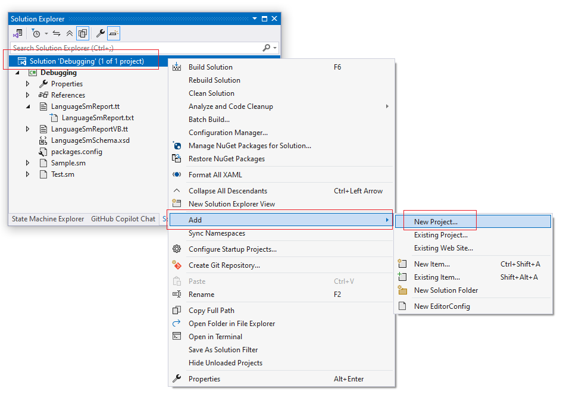


**Next/Next/Create**

The new project is created, and a file named _MainWindow.xaml_ is open. Set this project as Startup Project.

In the _MainWindow_ window, replace the Grid by a **DockPanel** that contains:

- One stack panel that itself contains only one **Button**, **“createLine”**, that will be used to start the creation of the line on the Click event on this button.
- A _Canvas_ named **canvas**.

``` XML
<Window
    x:Class="ShapesTest.MainWindow"
    xmlns="http://schemas.microsoft.com/winfx/2006/xaml/presentation"
    xmlns:x="http://schemas.microsoft.com/winfx/2006/xaml"
    xmlns:d="http://schemas.microsoft.com/expression/blend/2008"
    xmlns:local="clr-namespace:ShapesTest"
    xmlns:mc="http://schemas.openxmlformats.org/markup-compatibility/2006"
    Title="MainWindow"
    Width="800"
    Height="450"
    KeyDown="Canvas_KeyDown"
    KeyUp="Canvas_KeyUp"
    MouseLeftButtonDown="Canvas_MouseLeftButtonDown"
    MouseLeftButtonUp="Canvas_MouseLeftButtonUp"
    MouseMove="Canvas_MouseMove"
    mc:Ignorable="d">
    <DockPanel>
        <StackPanel
            Name="stackPanel1"
            Width="44"
            DockPanel.Dock="Left">
            <Button Name="createLine" Click="createLine_Click">Line</Button>
        </StackPanel>
        <Canvas Name="canvas" />
    </DockPanel>
</Window>

```

``` CSharp
using System.Windows.Input;
using System.Windows;

namespace ShapesTest
{
    /// <summary>
    /// Interaction logic for MainWindow.xaml
    /// </summary>
    public partial class MainWindow : Window
    {
        public MainWindow()
        {
            InitializeComponent();
        }

        private void createLine_Click(object sender, RoutedEventArgs e)
        {
        }

        private void Canvas_MouseLeftButtonDown(object sender, MouseButtonEventArgs e)
        {
        }

        private void Canvas_MouseLeftButtonUp(object sender, MouseButtonEventArgs e)
        {
        }

        private void Canvas_MouseMove(object sender, MouseEventArgs e)
        {
        }

        private void Canvas_KeyUp(object sender, KeyEventArgs e)
        {
        }

        private void Canvas_KeyDown(object sender, KeyEventArgs e)
        {
        }
    }
}
```

Add a new file of type Interface, which you will name IToolHost.cs, by using the shortcut menu command Add New Item in the project.

Enter the following interface:

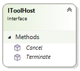

``` C#
namespace ShapesTest
{
    /// <summary> 
    /// Interface to be implemented by objects wanting to host tools 
    /// (Tools are for instance geometric shape creation tools) 
    /// </summary> 
    public interface IToolHost
    {
        void Cancel();
        void Terminate();
    }
}
```

Add a new file using the Class template named **Tool.cs**. This will be the base class for our LineCreator.

The class Tool will:

- Declare virtual methods that correspond to the keyboard and mouse events.
- Implement a virtual _Terminate()_ method that delegates to the host.
- Implement an _Cancel()_ method that delegates to the host.

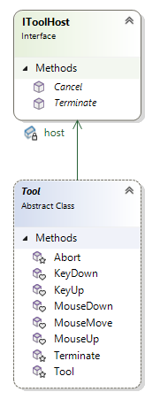

``` C#
using System.Windows.Input;
using System.Windows;

namespace ShapesTest
{
     /// <summary> 
     /// Base class for tools 
     /// </summary> 
     /// <intent>Tools are for instance shape creators, or the selection, or...</intent> 
     public abstract class Tool
        {
        /// <summary> 
        /// Host for the tool 
        /// </summary> 
        IToolHost host;

        /// <summary> 
        /// Chaining constructor, to initialize the host 
        /// </summary> 
        /// <param name="host"></param> 
        protected Tool(IToolHost host)
        {
            this.host = host;
        }

        /// <summary> 
        /// Event triggered when the host sends a Mouse (Left) Button Down event 
        /// </summary> 
        protected internal virtual void MouseDown(Point p)
        {

        }

        /// <summary> 
        /// Event triggered when the host sends a Mouse (Left) Button Up event 
        /// </summary> 
        protected internal virtual void MouseUp(Point p)
        {
        }

        /// <summary> 
        /// Event triggered when the host sends a Mouse Move event 
        /// </summary> 
        protected internal virtual void MouseMove(Point p)
        {
        }

        /// <summary> 
        /// Event triggered when the host sends a Key down event 
        /// </summary> 
        protected internal virtual void KeyDown(Key key)
        {
        }

        /// <summary> 
        /// Event triggered when the host sends a Key up event 
        /// </summary> 
        protected internal virtual void KeyUp(Key key)
        {
            if (key == Key.Escape)
                Abort();
        }

        /// <summary> 
        /// Allows the tool to notify the host that it has terminated 
        /// </summary> 
        protected void Terminate()
        {
            host.Terminate();
        }

        /// <summary> 
        /// Allows the tool to notify the host that it asks for abortion 
        /// </summary> 
        protected void Abort()
        {
            host.Cancel();
        }
    }
}
```

Add a new file using the Class template, named **LineCreator.cs**. This will:

- Inherit from _Tool_.
- Have a constructor that takes a _Line_ as argument and a _IToolHost_.
- Set the _Line_ in the constructor to the line member.
- Have two properties, _P1_ and _P2_, that get and set the extremities of the line.
- Be partial.

For the moment, it does not override the virtual methods of _Tool_. We’ll do that in a few minutes.

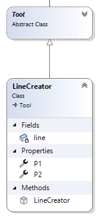

``` C#
using System.Windows;
using System.Windows.Shapes;
namespace ShapesTest
{
    /// <summary> 
    /// Creator for a Line 
    /// </summary> 
    partial class LineCreator : Tool
    {
        /// <summary> 
        /// Constructor 
        /// </summary> 
        /// <param name=”line”></param> 
        /// <param name=”host”></param> 
        public LineCreator(Line line, IToolHost host)
         : base(host)
        {
            this.line = line;
        }

        /// <summary> 
        /// Line to be constructed interactively 
        /// </summary> 
        Line line;


        /// <summary> 
        /// First point of the line 
        /// </summary> 
        public Point P1
        {
            set
            {
                line.X1 = value.X;
                line.Y1 = value.Y;
            }
            get
            {
                return new Point(line.X1, line.Y1);
            }
        }

        /// <summary> 
        /// Second point of the line. 
        /// </summary> 
        public Point P2
        {
            set
            {
                line.X2 = value.X;
                line.Y2 = value.Y;
            }
            get
            {
                return new Point(line.X2, line.Y2);
            }
        }
    }
}
```

Now let’s connect the events to the _LineCreator_. Update MainWindow.xaml.cs with the code below.

For this:

- _MainWindow_ will implement the IToolHost interface.
- MainWindow will have a private member, _currentTool_, of type Tool, and a member, _currentShape_, of type Shape.
- When the button is clicked, this will:
    a. Create a Line.
    b. Set _currentShape_ to this line.
    c. Set its color to Red.
    d. Add it to the children of the canvas.
    e. Create a _LineCreator_ that passes the line and the _Window1_ itself.
    f. Set this _LineCreator_ as the _currentTool_.
- The implementation of the _Abort()_ method only removes the _currentShape_ form the Children of the Canvas and call _Terminate()_.
- The implementation of the _Terminate()_ method only sets the _currentShape_ and _currentTool_ to null.
- The implementation of the Mouse or Keyboard event delegates to the _currentTool_ if it is not null.

At that point, your application should compile, but if you click the “Line” and then click the canvas, nothing happens.

``` C#
using System.Windows.Input;
using System.Windows;
using System.Windows.Media;
using System.Windows.Shapes;

namespace ShapesTest
{
    /// <summary> 
    /// Interaction logic for Window1.xaml 
    /// </summary> 
    public partial class MainWindow : Window, IToolHost
    {
        public MainWindow()
        {
            InitializeComponent();
        }

        Tool currentTool;

        Shape currentShape;

        private void createLine_Click(object sender, RoutedEventArgs e)
        {
            currentShape = new Line();
            currentShape.Stroke = Brushes.Red;
            canvas.Children.Add(currentShape);
            currentTool = new LineCreator(currentShape as Line, this);
        }

        private void Canvas_MouseLeftButtonDown(object sender, MouseButtonEventArgs e)
        {
            if (currentTool != null)
                currentTool.MouseDown(e.GetPosition(canvas));
        }

        private void Canvas_MouseLeftButtonUp(object sender, MouseButtonEventArgs e)
        {
            if (currentTool != null)
                currentTool.MouseUp(e.GetPosition(canvas));
        }

        private void Canvas_MouseMove(object sender, MouseEventArgs e)
        {
            if (currentTool != null)
                currentTool.MouseMove(e.GetPosition(canvas));
        }

        private void Canvas_KeyUp(object sender, KeyEventArgs e)
        {
            if (currentTool != null)
                currentTool.KeyUp(e.Key);
        }

        private void Canvas_KeyDown(object sender, KeyEventArgs e)
        {
            if (currentTool != null)
                currentTool.KeyDown(e.Key);
        }


        #region IToolHost Members 
        public void Cancel()
        {
            canvas.Children.Remove(currentShape);
            Terminate();
        }

        public void Terminate()
        {
            currentShape = null;
            currentTool = null;
        }
        #endregion
    }
}
```

Now add an item, **LineCreator-Behavior.sm**, using the **LanguageSm** file template, and enter the following model:


Now add a **LineCreator-Behavior.cs** C# file in which we’ll write the simplified implementation of the behavior for our LineCreator.  

The code is given on the following page (with comments on what the code does). However, try to implement it yourself before you look at the proposed implementation.

The whole purpose of this fourth part of the Lab will be to generate a LineCreator-Behavior.cs file that will have this content, generated from the LineCreator-Behavior.sm model and through the use of a T4 Template.

Our approach will be:

1. Create a specific example that works.
2. Pick out the parts of the example that we want to vary, depending on the DSL.
3. Convert the example to a text template, replacing the variable parts with expressions that read the state chart model.

**LineCreator-Behavior.cs**:

``` C#
using System.Windows;
namespace ShapesTest
{
    /// <summary> 
    /// Creator for a Line 
    /// </summary> 
    partial class LineCreator
    {
        // States of the tool 
        enum States
        {
            WaitFirstPoint,
            WaitSecondPoint,
        }

        /// <summary>current state</summary> 
        States state = States.WaitFirstPoint;

        protected internal override void MouseUp(Point p)
        {
            switch (state)
            {
                case States.WaitFirstPoint:
                    P1 = P2 = p;
                    state = States.WaitSecondPoint;
                    break;

                case States.WaitSecondPoint:
                    P2 = p;
                    Terminate();
                    break;
            }
        }

        protected internal override void MouseMove(Point p)
        {
            switch (state)
            {
                case States.WaitSecondPoint:
                    P2 = p;
                    break;
            }
        }
    }
}
```

Let's look at the code closer.

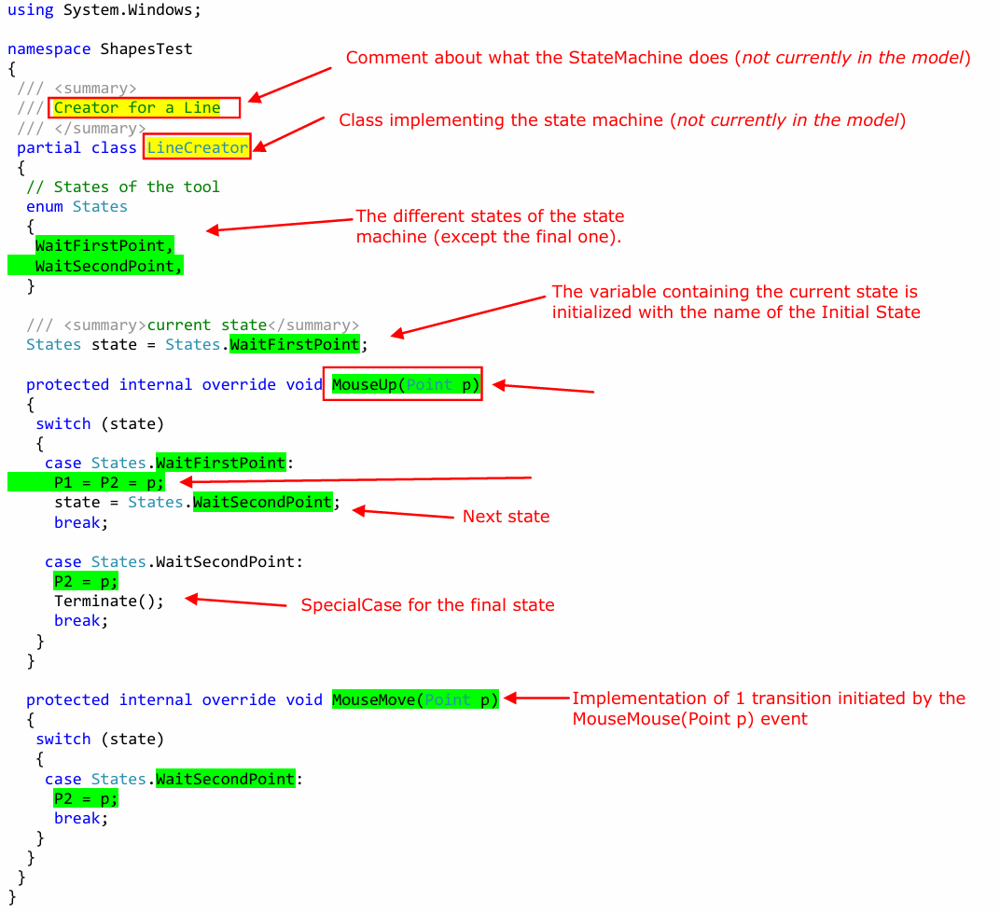

Highlighted in green is the information that is present in the model. Highlighted in yellow is some information that is not yet in the model, but is variable – so it would be good to have it in the model.

Compile your project, run and test it. Click the Line button, then click two points on the canvas.

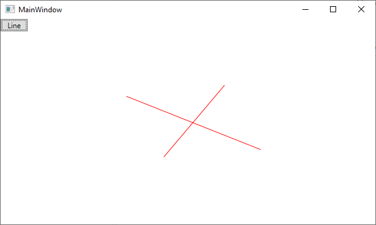

It now creates a line! :smile: Congratulations! You know nothing about T4, but you have created the Test!!!!

In Solution Explorer, change the filename of **LineCreator-Behavior.cs** to  **LineCreator-Behavior.tt** – that is, change the file name extension to .tt.

> [!NOTE]
> Notice that in the Properties window, the Custom Tool property of this file automatically changes to **TextTemplatingFileGenerator**.

At the start of the _LineCreator-Behavior.tt_ file, insert the following lines (which we have already seen in the first part of this Lab):

``` T4
<#@ template inherits="Microsoft.VisualStudio.TextTemplating.VSHost.ModelingTextTransformation"#>
<#@ output extension=".sm.cs" #>
<#@ LanguageSm processor="LanguageSmDirectiveProcessor" requires="fileName='LineCreator-Behavior.sm'" #>
```

Save _LineCreator-Behavior.tt_; the _LineCreator-Behavior.sm.cs_ file is automatically generated. Its content is the same as the old _LineCreator-Behavior.cs_ but it is, for the time being, hard-coded.

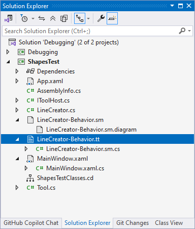

Recompile and test. Notice that we get the same result as earlier. The C# in the project is still the same, but the **LineCreator** class, in **LineCreator-Behavior.sm.cs**, is now generated from a text template.

The challenge is now going to be to derive it from the model!

#### Let’s create our code generator

Now that we have a test that works, we are going to create a code generator that supplies us with the code of **LineCreator** class from _LineCreator-Behavior.sm_. To do this:

- We have analyzed the LineCreator class code in order to understand which parts of it we want to be variable – that is, which parts should be derived from the model, such as the state names and the transitions.
- One variable aspect that is not yet in our model is the name of the state machine. We will therefore modify the metamodel to add to the StateMachine concept those properties that will be required for the code generator.
- We will add the values of these properties to our present model.
- We will modify the T4 template to generate the LineCreator-Behavior.sm.cs code.
- And then we will test it!

**What is missing in the model?**

As we saw, we can generate the behavior part, provided we add to the model:

- In yellow, the name of the StateMachine (the class implementing the state machine).
- The comment.

We will add them.

## Enhancing our metamodel

Close the experimental instance of Visual Studio (**Debugging** solution), so that you can update the DSL definition.
Open the DslDefinition.dsl file in your main Visual Studio instance (**LanguageSm** solution).

Add the following properties in _StateMachine_:

- Name (of the string type with a blank default value).
- Comment (of the string type with a blank default value).

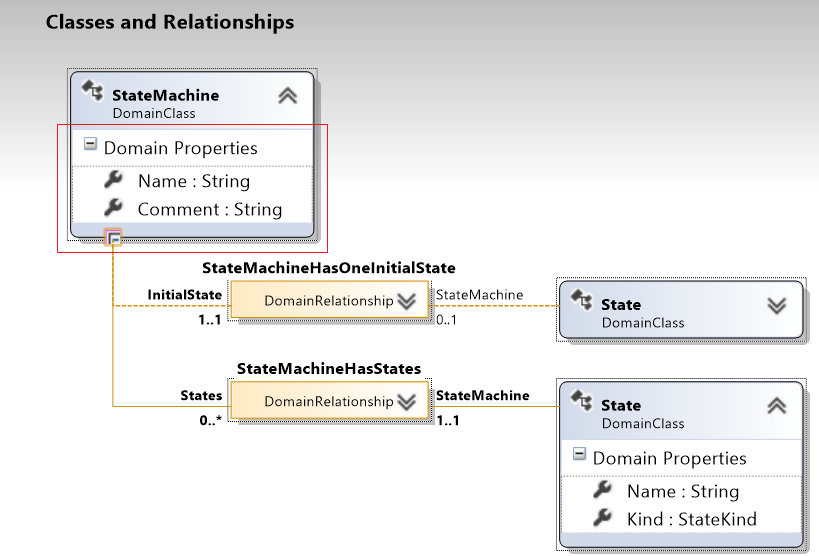

Transform All T4 templates.

Build and Start without Debugging (Ctrl+F5), to  open the Visual Studio experimental instance again.

In the experimental instance, open _LineCreator-Behavior.sm_.

Although we have modified the metamodel, the model we created previously is still readable.

In the model, set the following values to the StateMachine properties. To see these properties, you can either click a blank part of the diagram or click the root element in the State Machine Explorer:

- Name = LineCreator
- Comment = Creator for a line


Save the model.

> [!NOTE]
> Notice that this process of making the model and then parameterizing a template is a bottom-up approach that is nice in the sense that you control, at each step, what you do, and you start from some concrete solution and abstract it.

## Modifying the T4 template

### Configuring the T4 with the StateMachine properties

The text template  _LineCreator-Behavior.tt_ is still directly derived from the prototype code. We will proceed by progressively modifying our T4 template until _LineCreator-Behavior.tt_ is fully generic, so that the code it generates depends on LineCreator-Behavoir.sm. In fact, if we do not change the model LineCreator-Behavior.sm, the generated code will remain unchanged – it’s just that progressively more of its parts will be derived from the model instead of being fixed. Then, when we change the model, the code will change automatically.

In the _LineCreator-Behavior.tt_ T4 file, replace the name of the class from LineCreator by using: <#= StateMachine.Name #>, and the comment by using:  <#= StateMachine.Comment #>.

We have taken the first step towards making our code more generic.
However, we have not yet dealt with:

- The state **listed values**.
- The methods that correspond to the names of the **transitions**.

_LineCreator-Behavior.tt_ T4 file (fragment):

``` C#
    /// <summary> 
    /// <#= StateMachine.Comment #> 
    /// </summary>
    partial class  <#= StateMachine.Name #> : Tool
```

Save the T4 template.

_LineCreator-Behavior.sm.cs_ file (fragment):

``` C#
/// <summary> 
/// Creator for a line 
/// </summary>
partial class  LineCreator : Tool
```

The .sm.cs code is generated. Compile and run to check that everything is correct up to this point.

### Generating the state listed values

#### First try

To generate the listed values that correspond to the states, we must iterate on the collection of states (States collection) of the StateMachine. This does not pose any particular difficulty.

The first approach is to open the C# code that is to be iterated, and display each line with 3 spaces followed by the name of the state.

Replace the lines in the enum States block by control code iterating through the states, and displaying the value of each state name as we learned up to now.

_LineCreator-Behavior.tt_ T4 file (fragment):

``` C#
    /// <summary> 
    /// <#= StateMachine.Comment #> 
    /// </summary>
    partial class  <#= StateMachine.Name #> : Tool
    {
        // States of the tool 
        enum States
        {
            <# 
              foreach(State state in StateMachine.States) 
              { 
            #> 
                <#= state.Name #>,
            <#    
              } 
            #> 
        }

```

As you can see, this frequent switching between control and text mode is rather difficult to read and would be difficult to maintain.

_LineCreator-Behavior.sm.cs_ file (fragment):

``` C#
/// <summary> 
/// Creator for a line 
/// </summary>
partial class  LineCreator : Tool
{
    // States of the tool 
    enum States
    {
         
            WaitFirstPoint,
         
            WaitSecondPoint,
         
            Terminated,
         
    }

    // <...>
}

```

#### Improving the readability of the template

This is why we suggest instead that you use the members of a _TextTransformation_ basic class from our T4 transformation. You see, when you write a T4 template, you are actually writing a class that derives (indirectly) from _Microsoft.VisualStudio.TextModeling.TextTransformation_ and modifies the _TransformText()_ method so that its return string is built from the content of our .tt file. More details [here](https://learn.microsoft.com/en-us/dotnet/api/microsoft.visualstudio.texttemplating.texttransformation?view=visualstudiosdk-2022). This is the magic of T4!

Some of the more interesting members are:

- _PushIndent()_, and _PopIndent()_, indispensable when you are generating code. (You can even set the number of indentation spaces.)
- _Write()_ and _WriteLine()_, to avoid having to exit from the “C# code” mode with a #>, to re-enter it just as neatly with a <#=, as shown above on the line that follows _foreach_.

Replace the lines in the _enum States_ block by control code only using the WriteLine method of the template.

_LineCreator-Behavior.tt_ T4 file (fragment):

``` C#
// States of the tool 
enum States 
{
<# 
    PushIndent("   "); 
    foreach (State state in StateMachine.States) 
        WriteLine("{0},", state.Name); 
    PopIndent(); 
#>
}
```

> [!NOTE]
> Notice that we have to be very careful to distinguish the code being generated from <# the code that is generating#> !

_LineCreator-Behavior.sm.cs_ file (fragment):

``` C#
     // States of the tool 
     enum States 
     {
   WaitFirstPoint,
WaitSecondPoint,
Terminated,
     }
```

In that case, we might want to improve the code generation by first creating a list of literals (`List<string>`), and then generating them with the correct separators (a comma and a newline).

But to do that, we will use a generic List of type string. If we were writing C#, we would add one instruction at the top of the file:

``` C#
using System.Collections.Generic
```

To do the same thing in T4, you have to use the import directive, by adding this line after the current directives:

``` C#
<#@ Import Namespace="System.Collections.Generic" #> 
```

After all the directives at the beginning of the template, add the Import directive for System.Collections.Generic.

``` C#
<#@ template inherits="Microsoft.VisualStudio.TextTemplating.VSHost.ModelingTextTransformation"#> 
<#@ output extension=".sm.cs" #> 
<#@ LanguageSm processor="LanguageSmDirectiveProcessor" requires="fileName='LineCreator-Behavior.sm'" #>
<#@ Import Namespace="System.Collections.Generic" #>
```

Then, we can replace the code that generates the enumeration using the proposed scheme using the (`List<string>`).

Replace the code generating the enumeration using the proposed scheme. literal This lets us not generate a literal for the final state, which is not required.

``` C#
        // States of the tool 
        enum States 
        {
      <# 
        // Build the list of literals 
           List<string> literals = new List<string>(); 
           foreach (State state in StateMachine.States) 
            if (state.Kind != StateKind.Final) 
             literals.Add(state.Name); 
    
           // Generate it 
           PushIndent("   "); 
           Write(string.Join(",\r\n", literals.ToArray())); 
           PopIndent(); 
      #>
        }

```

_LineCreator-Behavior.sm.cs_ file (fragment):

``` C#
     // States of the tool 
     enum States 
     {
   WaitFirstPoint,
WaitSecondPoint        }

```

The result is now perfect. But our template is no longer very pure.

#### Improving both the readability of the template and the generated code

To improve the readability and maintainability of our template, we will create the template method _GenerateStateLiterals()_ at the end of the template in a section, and we will call it in the body of the _States_ enumeration. To do that, our method should be between **<#+** and **#>**, which specifies that it is a class feature control block.

The template now resembles the following. (Notice that we also initialized the _state_ variable to the initial state’s name, which does not present any difficulty.)

Extract the code that generates the enumeration literals into a template method.

``` C#
  // States of the tool 
  enum States 
  { 
   <# GenerateStateLiterals(); #>   
  } 
```

Generate the initialization of the state variable.

``` C#
    /// <summary>current state</summary> 
    States state = States.<#= StateMachine.InitialState.Name #>;
```

With all these changes, the template _LineCreator-Behavior.tt_ becomes:

``` C#
<#@ template inherits="Microsoft.VisualStudio.TextTemplating.VSHost.ModelingTextTransformation"#> 
<#@ output extension=".sm.cs" #> 
<#@ LanguageSm processor="LanguageSmDirectiveProcessor" requires="fileName='LineCreator-Behavior.sm'" #>
<#@ Import Namespace="System.Collections.Generic" #>

using System;
using System.Collections.Generic;
using System.Linq;
using System.Text;
using System.Threading.Tasks;

using System.Windows;

namespace ShapesTest
{
    /// <summary> 
    /// <#= StateMachine.Comment #> 
    /// </summary>
    partial class  <#= StateMachine.Name #> : Tool
    {
        // States of the tool 
        enum States 
        { 
        <# GenerateStateLiterals(); #>   
        }


        /// <summary>current state</summary> 
        States state = States.<#= StateMachine.InitialState.Name #>;

        protected internal override void MouseUp(Point p)
        {
            switch (state)
            {
                case States.WaitFirstPoint:
                    P1 = P2 = p;
                    state = States.WaitSecondPoint;
                    break;

                case States.WaitSecondPoint:
                    P2 = p;
                    Terminate();
                    break;
            }
        }

        protected internal override void MouseMove(Point p)
        {
            switch (state)
            {
                case States.WaitSecondPoint:
                    P2 = p;
                    break;
            }
        }
    }
}

 <#+ 
    void GenerateStateLiterals() 
    { 
       // Build the list of literals 
       List<string> literals = new List<string>(); 
       foreach (State state in StateMachine.States) 
               if (state.Kind != StateKind.Final) 
                    literals.Add(state.Name); 
 
       // Generate it 
       PushIndent("   "); 
       Write(string.Join(",\r\n", literals.ToArray())); 
       PopIndent(); 
    } 
#>

```

A reminder about modes in text templates:

- The text of your template is translated into an intermediate class, which has a Generate() method. To generate the resulting file, the T4 framework calls Generate()
- Ordinary text in your template is translated into a series of write statements in your Generate() method.
- <#...#> statements are inserted into the Generate() method
- <#= expr #> expressions are translated to write(expr)
- <#+ method definitions #> are added to the intermediate class outside the Generate() method.

For more information, see [Code Generation and Text Templates](http://go.microsoft.com/fwlink/?LinkId=188266).

### Generating the methods corresponding to the transitions

We will now generate the code that corresponds to the transitions. For this, we have to get:

- All the transitions, grouped by the name of their Triggering events (because we know that all the transitions that have the same event name will produce just one method).
- Then, for an enumeration of Transitions, group them by “previous state”. (Each of the “previous state” will produce a different case in the switch statement as a function of the current state.)

Because this is a query in the model, it is definitively a job for Linq! But this means we have to add a reference to Linq.

For this reason:

- Add a **<#@ Assembly Name="System.Core.dll" #>** directive to allow your template code to use _Linq_.
- Add a **<#@ Import Namespace="System.Linq" #>** directive to use _Linq_.
- Reference _System.Core_ in the project to get the IntelliSense in the template (if you use the T4 editor).

The beginning of the template _LineCreator-Behavior.tt_ should now be:

``` C#
<#@ template inherits="Microsoft.VisualStudio.TextTemplating.VSHost.ModelingTextTransformation"#> 
<#@ output extension=".sm.cs" #> 
<#@ LanguageSm processor="LanguageSmDirectiveProcessor" requires="fileName='LineCreator-Behavior.sm'" #>
<#@ Assembly Name="System.Core.dll" #>
<#@ Import Namespace="System.Collections.Generic" #>
<#@ Import Namespace="System.Linq" #>
```

Write new template methods by using Linq. Put them at the end of the template, following the GenerateStateLiterals(). You will write:

- _GetAllTransitions()_ returning `IEnumerable<Transition>`
- _GetAllTransitionsByName()_ returning `IEnumerable<IGrouping<string, Transition>>`
- _GetTransitionsGroupedByPredecessor()_ method that takes an `IEnumerable<Transition>` as an argument and returns a `IEnumerable<IGrouping<State, Transition>>`. The transitions will be ordered by condition in the **descending** order (so that an empty condition ends up at the end of the enumeration, which will be useful for code generation).

At the end of the template, we have new template methods:

``` C#

<#+ 
void GenerateStateLiterals() 
{ 
 // Build the list of literals 
 List<string> literals = new List<string>(); 
 foreach (State state in StateMachine.States) 
  literals.Add(state.Name); 
 
 // Generate it 
 PushIndent("   "); 
 Write(string.Join(",\r\n", literals.ToArray())); 
 PopIndent(); 
} 
 
/// <summary>Get all the transitions in the state machine</summary> 
IEnumerable<Transition> GetAllTransitions() 
{ 
 foreach (State s in StateMachine.States) 
  foreach (Transition t in Transition.GetLinksToSuccessors(s)) 
   yield return t; 
} 
 
 
/// <summary> 
/// Get all the transitions grouped by name 
/// </summary> 
IEnumerable<IGrouping<string, Transition>> GetAllTransitionsByName() 
{ 
    return from Transition t in GetAllTransitions() group t by t.Event; 
} 
 
/// <summary> 
/// For each transition name, get the states initiating a transition  
/// of this name, and the transitions of this name inited from this 
/// states. 
/// </summary> 
/// <returns></returns> 
IEnumerable<IGrouping<State, Transition>>  GetTransitionsGroupedByPredecessor(IEnumerable<Transition> transitions) 
{ 
    return from Transition t in transitions orderby t.Condition descending group t by t.Predecessor; 
}      
#>

```

Use the template methods you just created to generate the transition implementations. To do this, iterate on the result of _GetAllTransitionsByName_, and produce the prototype of the method from the key of the grouping. Provide some nice structuring by delegating the implementation of the body of the switch statement to a _GenerateCases_ template method to which you pass the enumeration of methods of the given Event.

``` C#
    /// <summary>current state</summary> 
    States state = States.<#= StateMachine.InitialState.Name #>; 
 
    <# 
      foreach (IGrouping<string, Transition> transitionsForName in 
    GetAllTransitionsByName()) 
      { 
    #> 
      /// <summary>Transition</summary> 
      protected internal override void <#=transitionsForName.Key#> 
      { 
       switch(state) 
       { 
    <#   GenerateCases(transitionsForName); #> 
       } 
      } 
    <#    
      } // foreach 
    #> 
     } 
    }
```

Implement the _GenerateCases_ method by iterating through the transitions, grouped by predecessor state. Each predecessor state will be generated by a case statement from the state name. Delegate the implementation of the Body of the case to a _GenerateCaseBody_ method to which you pass as an argument the transitions (of a given name), having this state as a predecessor.

The text template formatting is highlighted in green to remind you that this is a template method. What you really do is add this method to the existing block.

``` C#
 
  /// <summary> 
  /// Generates the body of the switch statement of the methods  
  /// implementing the Transitions 
  /// </summary> 
  void GenerateCases(IEnumerable<Transition> transitions) 
  { 
   foreach (IGrouping<State, Transition> transitionsFromState in  
                  GetTransitionsGroupedByPredecessor(transitions)) 
   { 
#> 
    case States.<#= transitionsFromState.Key.Name #>: 
<#+ 
   GenerateCaseBody(transitionsFromState); 
#> 
    break; 
     
<#+ 
   } 
  } 
#> 
```

Implement the GenerateCaseBody method by iterating though the transitions (which you know are sorted by Condition).

This method is not complex but because it tries to create compileable code it will produce if statements for the conditions, blocks when necessary, write the exit actions of the predecessor, write the action on the transition, if any, write the state change if the successor is not a final state (and write Terminate(); otherwise), write the entry actions of the successor.

``` C#
 <#+
 /// <summary> 
 /// Generate the body of the Case 
 /// </summary> 
 /// <param name="transitions"></param> 
void GenerateCaseBody(IEnumerable<Transition> transitions) 
{ 
 PushIndent("     "); 
  
 // Did we already meet a condition? 
 bool already = false; 
  
 // Iterate thu all the transitions (which, we know, have the same  
 // name, and are ordered by Condition in the descending order:  
 // the empty condition should be last 
 foreach(Transition t in transitions) 
 { 
  // If we already met a condition, then, we should add a else  
  // before a if statement 
  if (already) 
   Write("else "); 
   
  // Empty conditions just produce the else. Non empty produce an  
  // if statement 
  if (!string.IsNullOrEmpty(t.Condition)) 
  { 
   WriteLine("if ("+t.Condition+")"); 
   already = true; 
  } 
  else if (already) 
   WriteLine(""); 
   
  // Beginning of block 
  if (already) 
  { 
   WriteLine("{"); 
   PushIndent(" "); 
  } 
   
  // Exit actions of the predecessor state 
  foreach (Company.LanguageSm.Action previous in t.Predecessor.ExitActioned) 
   WriteLine(previous.Code); 
 
  // Action on the transition 
  if (!string.IsNullOrEmpty(t.Action)) 
   WriteLine(t.Action); 
 
  // Transition state (or Terminate() for final state) 
  if (t.Successor.Kind == StateKind.Final) 
   WriteLine("Terminate();"); 
  else if (t.Predecessor != t.Successor) 
   WriteLine("state = States." + t.Successor.Name+";"); 
 
  // Entry actions of the successor state 
 foreach (Company.LanguageSm.Action next in t.Successor.EntryActioned) 
   WriteLine(next.Code); 
   
  // Close the block 
  if (already) 
  { 
   PopIndent(); 
   WriteLine("}"); 
  } 
 
  } 
  PopIndent(); 
 }
#>
```

The final template resembles this:

``` C#
<#@ template inherits="Microsoft.VisualStudio.TextTemplating.VSHost.ModelingTextTransformation"#> 
<#@ output extension=".sm.cs" #> 
<#@ LanguageSm processor="LanguageSmDirectiveProcessor" requires="fileName='LineCreator-Behavior.sm'" #>
<#@ Assembly Name="System.Core.dll" #>
<#@ Import Namespace="System.Collections.Generic" #>
<#@ Import Namespace="System.Linq" #>

using System;
using System.Collections.Generic;
using System.Linq;
using System.Text;
using System.Threading.Tasks;

using System.Windows;

namespace ShapesTest
{
    /// <summary> 
    /// <#= StateMachine.Comment #> 
    /// </summary>
    partial class  <#= StateMachine.Name #> : Tool
    {
        // States of the tool 
        enum States 
        { 
        <# GenerateStateLiterals(); #>   
        }


        /// <summary>current state</summary> 
        States state = States.<#= StateMachine.InitialState.Name #>; 
 
        <# 
          foreach (IGrouping<string, Transition> transitionsForName in GetAllTransitionsByName()) 
          { 
        #> 
          /// <summary>Transition</summary> 
          protected internal override void <#=transitionsForName.Key#> 
          { 
           switch(state) 
           { 
                <#   GenerateCases(transitionsForName); #> 
           } 
          } 
        <#    
          } // foreach 
        #> 
         } 
        }

 <#+ 
    void GenerateStateLiterals() 
    { 
     // Build the list of literals 
     List<string> literals = new List<string>(); 
     foreach (State state in StateMachine.States) 
      literals.Add(state.Name); 
 
     // Generate it 
     PushIndent("   "); 
     Write(string.Join(",\r\n", literals.ToArray())); 
     PopIndent(); 
    } 
 
    /// <summary>Get all the transitions in the state machine</summary> 
    IEnumerable<Transition> GetAllTransitions() 
    { 
     foreach (State s in StateMachine.States) 
      foreach (Transition t in Transition.GetLinksToSuccessors(s)) 
       yield return t; 
    } 
 
 
    /// <summary> 
    /// Get all the transitions grouped by name 
    /// </summary> 
    IEnumerable<IGrouping<string, Transition>> GetAllTransitionsByName() 
    { 
        return from Transition t in GetAllTransitions() group t by t.Event; 
    } 
 
    /// <summary> 
    /// For each transition name, get the states initiating a transition  
    /// of this name, and the transitions of this name inited from this 
    /// states. 
    /// </summary> 
    /// <returns></returns> 
    IEnumerable<IGrouping<State, Transition>>  GetTransitionsGroupedByPredecessor(IEnumerable<Transition> transitions) 
    { 
        return from Transition t in transitions orderby t.Condition descending group t by t.Predecessor; 
    }      
#>


<#+ 
 
  /// <summary> 
  /// Generates the body of the switch statement of the methods  
  /// implementing the Transitions 
  /// </summary> 
  void GenerateCases(IEnumerable<Transition> transitions) 
  { 
   foreach (IGrouping<State, Transition> transitionsFromState in  
                  GetTransitionsGroupedByPredecessor(transitions)) 
   { 
#> 
    case States.<#= transitionsFromState.Key.Name #>: 
<#+ 
   GenerateCaseBody(transitionsFromState); 
#> 
    break; 
     
<#+ 
   } 
  } 
#>

<#+
    /// <summary> 
 /// Generate the body of the Case 
 /// </summary> 
 /// <param name="transitions"></param> 
void GenerateCaseBody(IEnumerable<Transition> transitions) 
{ 
 PushIndent("     "); 
  
 // Did we already meet a condition? 
 bool already = false; 
  
 // Iterate thu all the transitions (which, we know, have the same  
 // name, and are ordered by Condition in the descending order:  
 // the empty condition should be last 
 foreach(Transition t in transitions) 
 { 
  // If we already met a condition, then, we should add a else  
  // before a if statement 
  if (already) 
   Write("else "); 
   
  // Empty conditions just produce the else. Non empty produce an  
  // if statement 
  if (!string.IsNullOrEmpty(t.Condition)) 
  { 
   WriteLine("if ("+t.Condition+")"); 
   already = true; 
  } 
  else if (already) 
   WriteLine(""); 
   
  // Beginning of block 
  if (already) 
  { 
   WriteLine("{"); 
   PushIndent(" "); 
  } 
   
  // Exit actions of the predecessor state 
  foreach (Company.LanguageSm.Action previous in t.Predecessor.ExitActioned) 
   WriteLine(previous.Code); 
 
  // Action on the transition 
  if (!string.IsNullOrEmpty(t.Action)) 
   WriteLine(t.Action); 
 
  // Transition state (or Terminate() for final state) 
  if (t.Successor.Kind == StateKind.Final) 
   WriteLine("Terminate();"); 
  else if (t.Predecessor != t.Successor) 
   WriteLine("state = States." + t.Successor.Name+";"); 
 
  // Entry actions of the successor state 
 foreach (Company.LanguageSm.Action next in t.Successor.EntryActioned) 
   WriteLine(next.Code); 
   
  // Close the block 
  if (already) 
  { 
   PopIndent(); 
   WriteLine("}"); 
  } 
 
  } 
  PopIndent(); 
 }
#>

```

Generated _LineCreator-Behavior.sm.cs_ file:

``` C#
using System;
using System.Collections.Generic;
using System.Linq;
using System.Text;
using System.Threading.Tasks;

using System.Windows;

namespace ShapesTest
{
    /// <summary> 
    /// Creator for a line 
    /// </summary>
    partial class  LineCreator : Tool
    {
        // States of the tool 
        enum States 
        { 
        WaitFirstPoint,
   WaitSecondPoint,
   Terminated   
        }


        /// <summary>current state</summary> 
        States state = States.WaitFirstPoint; 
 
         
          /// <summary>Transition</summary> 
          protected internal override void MouseUp(Point p) 
          { 
           switch(state) 
           { 
                 
    case States.WaitFirstPoint: 
     P1 = P2 = p;
     state = States.WaitSecondPoint;
 
    break; 
     
 
    case States.WaitSecondPoint: 
     P2 = p;
     Terminate();
 
    break; 
     
 
           } 
          } 
         
          /// <summary>Transition</summary> 
          protected internal override void MouseMove(Point p) 
          { 
           switch(state) 
           { 
                 
    case States.WaitSecondPoint: 
     P2 = p;
 
    break; 
     
 
           } 
          } 
         
         } 
        }
```

Save your T4 template. When you save a text template, the code is generated.

Run the executable. Everything should be working perfectly well. Congratulations! You learned how to create a T4 template.

## Testing more

Let’s see if our generator works on more than a sample: we will try to modify slightly the model to enable creation of a line through its center and a point when the user presses the “c” key.

Add a _Center_ property to LineCreator.cs, as well as a _SymetricTo(Point)_ method, to the LineCreator.cs file (the handcoded partial of LineGenerator, not the generated one).

``` C#
/// <summary> 
/// Center for the line 
/// </summary> 
public Point Center { set; get; }

/// <summary> 
/// Compute the symmetric point of a given point  /// with respect to the centre
/// </summary> 
/// <param name="p"></param> 
/// <returns></returns> 
public Point SymmetricTo(Point p)
{
    Vector v = p - Center;
    return Center - v;
}
```

Modify LineCreator-Behavior.sm to:

- Set the Center to P1 and P1 to the symmetric point of P2 with respect to the Center when the user presses the “c” key.
- Set P1 to the Center when the user releases the “c” key.
- And to set P1 as the Symmetric of P2 when the user moves the mouse whereas the “c” key is pressed.

The model can be like this:

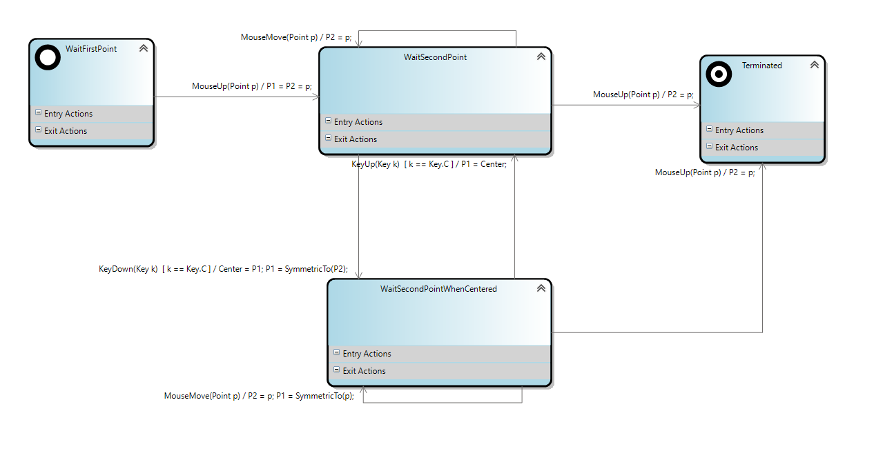

Don’t forget to:

- Save your model.
- Run the custom tool on the text template. You can do this by clicking Transform All Templates in the toolbar of Solution Explorer (in the experimental instance of Visual Studio).

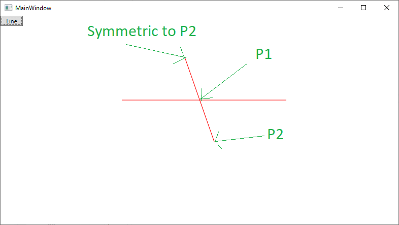

Build your application and run it: Now, when you press the C key, the first point clicked becomes the center. When you release the C key, it comes back. You can now create a line between center and a point.

## Warning about Reliability

We began with an example and created a .tt file based on that example, which is then regenerated. And the transformation of our .sm model into source code is correct, in this example at least.

We have to consider, however, how to deal with all of the cases. Particularly:

- Which entry actions in the initial state should be generated (if any).
- Whether to deal with the automatic transitions:
  - The name of the method should be AutomaticTransition() and not blank.
  - When you have entered in a state for which there are outgoing automatic transitions (without event names), a call should be made to AutomaticTransition() after the transition implementation.
- In addition, it would be necessary to check that the state machine properties are fully satisfied (for instance, that the StateMachine Name is not blank, using the validation methods) and it would not be necessary to generate the source file if the model were not fully valid.

We leave all this as an exercise.

## Summary

Our template lets us generate pretty good state machines without being perfectly generic, but the goal here was to learn the following rather than getting a perfect generator for state machines:

- T4
- Best practices in structuring templates
- The process of getting from boilerplate code to a template

## Converting our T4 template to a Custom Tool for .sm files

We have now created a DSL that lets us enter the models that can be generated by a T4 template. However, we want to be able to provide our users with an improved user experience: create a new _.sm_ type file (they can already), and have a **Custom Tool** automatically added to the properties of this file in the project and have it generate the state machine code once it is validated (just like what happens with _.resx_ resource files, _settings_, etc.).

So we are now going to convert our T4 template into a custom tool.

First, close the experimental instance of Visual Studio, and return to the DSL definition in the main instance.

In the **DslPackage project** of the _LanguageSm_ solution, create a **CustomCode** directory, and a **CodeGeneration** sub-directory.

Right-click in this new directory and request **Add -> Existing** Item. A dialog box opens. Navigate to the _ShapesTest_ directory; in the file filters, ask to view all the files (`*.*`), and select our (LineCreator-Behavior.tt) T4 template. This way we can be sure to have it in our sources! A copy of LineCreator-Behavior.tt appears in the project.

Rename the copy **Sm.t4**. The new file extension means that the build system will not attempt to apply text transformation to it.

In the _Sm.t4_ file properties in the properties window,

- Set the BuildAction to **Embedded Resource**.
- Make sure that the _CustomTool_ property is **blank** (for a .tt file, it is automatically set to TextTemplatingFileGenerator)

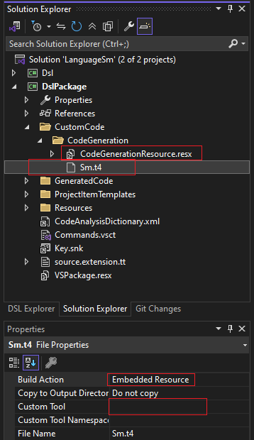

Create a  **CodeGenerationResource.resx** file in the CodeGeneration directory.

Open this resources file and drag _Sm.t4_ from Solution Explorer into the resources file.

In the **CustomCode\CodeGeneration** directory of the DslPackage project, add a **CodeGenerator.cs** file.

Shorten the namespace and add a partial implementation of the _LanguageSmPackage_ class.

``` C#
using Microsoft.VisualStudio.TextTemplating.VSHost;

namespace Company.LanguageSm
{
    public class CodeGenerator : TemplatedCodeGenerator
    {

    }
}
```

Have our _CodeGenerator_ class inherit the _TemplatedCodeGenerator_ class that is located in the namespace _Microsoft.VisualStudio.TextTemplating.VSHost_.

On the **Tools** menu of Visual Studio, click on the **Create GUID** command. Choose the no. 4 format (**registry format**), and **paste** it in a _System.Runtime.InteropServices.Guid_ attribute that precedes the definition of the _CodeGenerator_ class, being sure to remove the {braces} from the copied character string.

Alter the GenerateCode method.

``` C#
    [System.Runtime.InteropServices.Guid("C69C8BA9-F37A-4DA7-A51E-1BD41F0016DE")]
    public class CodeGenerator : TemplatedCodeGenerator
    {
        protected override byte[] GenerateCode(string inputFileName, string inputFileContent)
        {
        }
    }
```

The content of the _GenerateCode_ method will:

- Take the content of the T4 template file that we provided in the resource file.
- Replace the file name (_LineCreator-Behavior.sm_) by using the file path to which the template applies.
- Assign the basic class _TemplatedCodeGenerator_ to ensure the template transformation.
- Return the code that is generated (after some unavoidable code manipulation).

So the complete code is as follows:

``` C#
using Company.LanguageSm.CustomCode.CodeGeneration;
using Microsoft.VisualStudio.TextTemplating.VSHost;
using System;
using System.Collections.Generic;
using System.IO;
using System.Linq;
using System.Text;
using System.Threading.Tasks;

namespace Company.LanguageSm
{
    [System.Runtime.InteropServices.Guid("C69C8BA9-F37A-4DA7-A51E-1BD41F0016DE")]
    public class CodeGenerator : TemplatedCodeGenerator
    {
        protected override byte[] GenerateCode(string inputFileName, string inputFileContent)
        {
            // Replace the supplied file contents with the template we want to run  
            inputFileContent = ASCIIEncoding.UTF8.GetString(CodeGenerationResource.Sm);

            // Substitute the name of the current model file into the template. 
            FileInfo fi = new FileInfo(inputFileName);
            inputFileContent = inputFileContent.Replace("LineCreator-Behavior.sm", fi.Name);
            inputFileContent = inputFileContent.Replace("namespace ShapesTest", "namespace " + FileNamespace);

            // Now just delegate the rest of the work to the base class 
            byte[] data;
            data = base.GenerateCode(inputFileName, inputFileContent);
            byte[] ascii = new byte[data.Length - 3];
            Array.Copy(data, 3, ascii, 0, data.Length - 3);
            return ascii;
        }
    }
}

```

In the DslPackage project, add a new file named “CodeGenerator.pkgdef”, and ensure the following properties:

a. Set **Build Action** to **Content**,  
b. Set **Copy to Output directory** to **Copy if newer**
c. Set **Include in VSIX** to **true**

The content of the file should be the following. Notice that you must change CLSID guid to the GUID that you generated:

``` TEXT
[$RootKey$\Generators] 
[$RootKey$\Generators\{FAE04EC1-301F-11d3-BF4B-00C04F79EFBC}] 
[$RootKey$\Generators\{FAE04EC1-301F-11d3-BF4B-00C04F79EFBC}\SmFileCodeGenerator] 
@="Custom tool that generates C# files for state machines described in .sm files" 
"CLSID"="{C69C8BA9-F37A-4DA7-A51E-1BD41F0016DE}" 
"GeneratesDesignTimeSource"=dword:00000001 
[$RootKey$\CLSID] 
[$RootKey$\CLSID\{C69C8BA9-F37A-4DA7-A51E-1BD41F0016DE}] 
@=" Custom tool that generates C# files for state machines described in .sm files " 
"Class"=" Company.LanguageSm.CodeGenerator" 
"InprocServer32"="$WinDir$\SYSTEM32\MSCOREE.DLL" 
"ThreadingModel"="Both" 
"CodeBase"="$PackageFolder$\ Company.LanguageSm.DslPackage.dll" 
[$RootKey$\Generators\{FAE04EC1-301F-11d3-BF4B-00C04F79EFBC}\.sm] 
@=" SmFileCodeGenerator "
```

This content declares that:

- In C# projects _(FAE04EC1-301F-11d3-BF4B-00C04F79EFBC)_ there is a custom tool named _SmFileCodeGenerator_
- This custom tool has a GUID C69C8BA9-F37A-4DA7-A51E-1BD41F0016DE and a help string "Custom tool that generates C# files for state machines described in _.sm_ files"
- It will be called each time a .sm file is saved.
- It is associated with a class named _Company.LanguageSm.CodeGenerator_
  - Which is a .Net class
  - Located in the DslPackage assembly

- This custom tool named “SmFileCodeGenerator”, will be added automatically in the “Custom Tool” property of the .sm file in the solution explorer, each time we add a new .sm file in a Visual Studio C# projects.

> [!NOTE]
> Note that the project will have 2 pkgdef files (the one generated by the registration attributes of the DSL tools, and this new one). This is fine: they are merged for the pkgdef file that will be used in the VSIX file

Add a Reference to DslPackage: Microsoft.VisualStudio.TextTemplating.Interfaces.10.0

Run your DSL with Debug -> Run without debugging (Ctrl+F5).

In Solution Explorer in the test version of Visual Studio, select the _LineCreator-Behavior.sm_ file, and, in the properties window, set the **Custom Tool** property to **SmFileCodeGenerator**.

The code that is associated with _LineCreator-Behavior.sm_ is generated in _LineCreator-Behavior.sm.cs_.

Remove (or exclude from project) the _LineCreator-Behavior.tt_ template. We do not need it any longer.  

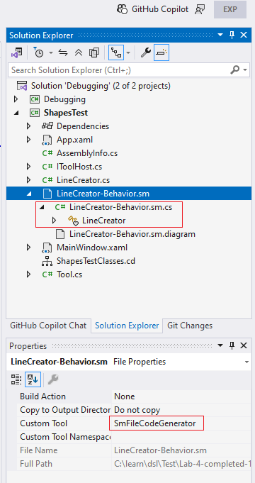

Test your program. It still works!

Now, change the behavior to create a line by using **Click-Drag-Release**, rather than **Click-Click**. (Change the event on the first transition from _MouseUp(Point p)_ to _MouseDown(Point p)_.)

Save your model, compile, and run. It works. You do not have to transform templates any longer.

## A little trick

Making the T4 template a _Designer_ project resource is a good thing if you want to deliver a turn-key solution. On the other hand, in the development phase it is a disadvantage because the template modifications require you to recompile the DSL and re-run it.

To be more responsive and to be able to modify the T4 template in the debugging project, I use the following trick: I create an EXPERIMENT constant for conditional compilation. When EXPERIMENT is defined, we read the template from the file, and not from the resource.

``` C#
// Replace the supplied file contents with the template we want to run  
# if (EXPERIMENT && DEBUG)
string inputFile = @"C:\complete path to the project\DslPackage\CustomCode\Code Generator\Sm.t4";  
// e.g. load the template from a resource file  
StreamReader r = new StreamReader(inputFile, System.Text.ASCIIEncoding.UTF8);
inputFileContent = r.ReadToEnd();
r.Close();
# else
inputFileContent = ASCIIEncoding.UTF8.GetString(CodeGenerationResource.Sm);
# endif
```

So, in our test or debugging project, just add an existing item that has a link: **Add Existing Item**, select the T4 file (to do this, ask to view all the files), then click the combo box next to the **Add** button and choose **Add as Link**. Now you have a copy of the T4 template in your project, and you can modify it and immediately see the effect of the modification on the code that is generated in your solution.

When you are happy with your modifications, delete the definition of the _EXPERIMENT_ constant. Don’t forget to do this before you deliver your DSL (because the resource file will not be available for your clients).

## Code generation conclusion

We have learned to write a T4 code generator, and also to do this by using a CustomTool. We still have a little work to do to improve the user experience:

- Assign default values and validation to the StateMachine properties.
- Improve the model validation.

At this point, you have everything you need to do it.

However, you still need to learn how to **deploy your DSL**. This will be the subject of the next section.
